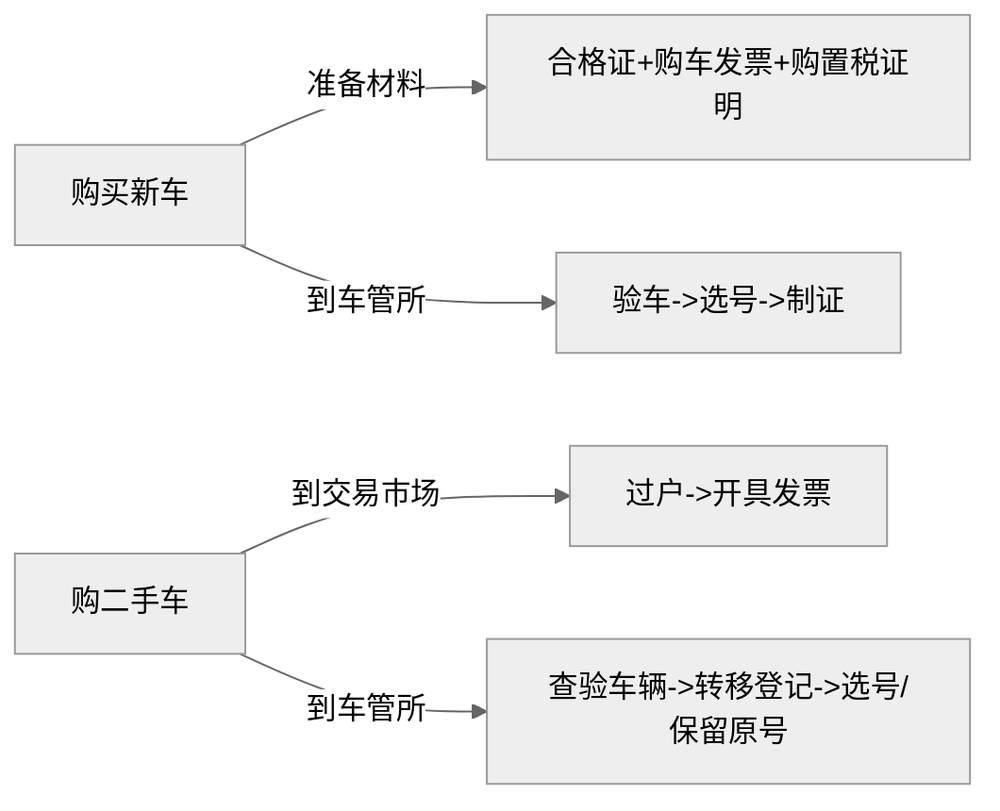

# 1. 新车和二手车购车

## **1.1 材料**

| 材料类型         | 新车上牌                                                     | 二手车上牌                                       |
| :--------------- | :----------------------------------------------------------- | :----------------------------------------------- |
| **车辆来源证明** | 机动车**整车出厂合格证**（国产车） 货物进口证明书/关单（进口车） | **二手车交易发票**（需在正规二手车市场开具）     |
| **所有权证明**   | 购车**发票**（4S店开具）                                     | **机动车登记证书**（俗称“大绿本”，需过户登记）   |
| **交强险凭证**   | 需**新购买**（上牌前生效）                                   | 需**过户或重新购买**（原保险需转移至新车主名下） |
| **购置税证明**   | 需缴纳**新车购置税**（新能源车免征）                         | **无需缴纳**（购置税在首次上牌时已缴清）         |
| **原号牌处理**   | 无                                                           | 可选保留原号牌或重新选号（需符合保留条件）       |

------

## **1.2 流程**

1. **交易与过户（二手车特有）**
   - **二手车**：需先完成交易过户（查验车辆→开具交易发票→转移登记），**再办理上牌**。
   - **新车**：无此环节，直接进入上牌流程。
2. **车辆查验侧重点**
   - **新车**：重点核对车架号、发动机号是否与合格证一致，检查车辆外观是否改装。
   - **二手车**：除基础查验外，还需检查车辆是否与登记信息一致（如是否非法改装、有无事故痕迹等）。
3. **号牌处理方式**
   - **新车**：只能**新选号牌**（随机选号或自编选号）。
   - **二手车**：可选择：
     - 使用**原车号牌**（需满足：原号牌使用满1年以上，过户后1年内申请）；
     - **重新选号**（流程同新车）。

------

## **1.3 费用**

| 费用项目       | 新车上牌            | 二手车上牌            |
| :------------- | :------------------ | :-------------------- |
| **购置税**     | 约车价10%（燃油车） | 无                    |
| **交易服务费** | 无                  | 200-500元（市场收取） |
| **号牌工本费** | 120元（全国统一）   | 120元（全国统一）     |
| **过户费**     | 无                  | 按车辆评估价0.5%-1%   |

> **注**：验车费、拓号费、行驶证/登记证工本费等杂费两地均需缴纳（约100-200元）。

------

## **1.4 注意事项**

- **环保标准**：
  二手车迁入异地时，需符合**当地排放标准**（如国六），新车则默认符合最新标准。
- **临牌办理**：
  新车可凭发票、交强险办理**跨行政辖区临牌**（15-30天）；二手车过户后一般只核发**本地临牌**（7-15天）。
- **时间周期**：
  新车上牌通常**1天内办结**；二手车因涉及过户，需**2-3个工作日**（部分地区可当天办结）。

------

## **1.5 总结流程图**

**建议**：

- 购买二手车时，务必先确认车辆无抵押、违章、证件齐全（登记证、行驶证、原车主身份证复印件）；
- 异地购车需提前查询迁入地环保要求，避免无法上牌；
- 代办服务可节省时间，但需警惕“包过”陷阱（如车辆本身问题无法解决）。

# 2. 二手车交易

### **2.1 必须交付的证件**

1. **车辆登记证书（大绿本）**
   - 需确认已办理过户，并更改为买方姓名。
   - 检查是否有抵押记录（如有，需先解押）。
2. **行驶证**
   - 需过户更新为买方信息，并核对车辆照片、车架号等是否与实际一致。
3. **原车主身份证复印件**
   - 用于过户手续，需与行驶证信息一致（部分地区要求原件，需提前确认）。
4. **车辆购置税完税证明**
   - 若为免税车辆（如新能源车），需提供相关证明。
5. **交强险保单**
   - 确保在有效期内，并办理保险过户（商业险按需过户）。
6. **二手车交易发票**
   - 由二手车交易市场开具，是过户的必要凭证。

------

### **2.2 其他重要文件**

1. **车辆保养/维修记录**
   - 4S店或第三方平台的记录，帮助了解车况。
2. **车辆说明书、保修卡**
   - 尤其是尚在保修期内的车辆。
3. **备用钥匙**
   - 至少两把钥匙（如无钥匙启动需确认遥控器）。
4. **环保标志/排放证明**
   - 部分地区过户需核查排放标准（如国四、国六）。
5. **抵押解除证明（如有贷款）**
   - 贷款结清后需原车主提供解押文件。

------

### **2.3 注意事项**

1. **过户流程**
   - 双方需携带证件到车管所办理过户，并重新选号（部分地区保留原号需符合条件）。
2. **保险处理**
   - 交强险不可退，商业险可退或过户（建议及时变更被保险人）。
3. **违章处理**
   - 交易前需确保原车主处理完毕所有违章罚款。
4. **保留复印件**
   - 卖方建议保留证件交接的书面证明（如过户协议），避免纠纷。

# 3. OBD

## P1110

中国重汽的P1110错误代码通常指示进气温度(IAT)传感器存在短路或开路问题。‌ 这个传感器的作用是将发动机的进气温度以电压信号的形式输送给电子控制单元(ECU)，以便优化燃油喷射和发动机性能‌12。

具体来说，P1110错误代码可能涉及以下几个方面：

‌进气温度传感器故障‌：这可能导致传感器本身、其电路或接头出现问题，进而影响发动机的控制和性能‌12。
‌电子控制模块（ECU）故障‌：如果ECU无法正确接收进气温度信号，也可能触发P1110错误代码‌12。
为了解决P1110错误代码，可以采取以下步骤：

‌检查进气温度传感器‌：检查传感器是否损坏或连接不良，必要时进行更换。‌检查相关线路‌：确保所有连接都牢固无误，没有短路或断路情况。
‌使用诊断工具‌：连接汽车故障诊断仪，读取具体的故障码和数据流，帮助准确诊断问题。

## P0451

P0451故障码，适用于所有汽车制造商，意思是蒸发排放系统压力传感器/开关范围/性能(EvaporativeEmissionSystemPressureSensor/SwitchRange/Performance)。

背景知识：蒸发排放（EVAP）系统将油箱中的汽油蒸气导入装有可以吸收汽油蒸气的活性炭的储罐里。发动机然后会利用新鲜空气将这些汽油蒸气吹扫到发动机燃烧室里。

该故障码的出现是因为油箱压力传感器范围（补偿）的问题。油箱压力传感器输出补偿为正负4.3厘米水柱。如果电子控制单元（ECU）检测到油箱压力在0.1秒之内变化超过36厘米水柱，该故障码会出现。

每当排除汽车故障后，需要清除故障码。进行代码清除的时候，应当严格按照特定车辆型号所指定的故障代码的清除方案来进行，万不可简单随意地用拆除蓄电池负极搭铁线的办法来清除故障代码。

否则，可能会造成以下两个方面的麻烦：第一，导致部份车型的控制电脑失去“历史记录”，很多车主都知道，大部份车型的中央电脑是具有记忆功能的，拆除蓄电池负极搭铁线后，就会丢失随机存储器里面的发动机运行经验数据，这就为什么有些人发现维修清除后，发现很长一段时间性能表现都不咋滴或行驶一段后，又重现已清除掉的故障代码；

## C3E90

C3E90故障码通常由发动机控制模块（ECM）发出，它表示ECM无法准确读取温度传感器的数据。这可能是由多种因素导致的，包括但不限于传感器损坏、线路连接问题或是软件故障。当ECM接收到异常的温度数据时，它会触发C3E90故障码，提醒驾驶员注意发动机可能存在的过热风险。

## C04A0

## C004A

C004A 故障码具有普遍性，适用于各类汽车生产厂商。该故障码的出现意味着刹车片磨损传感器发生了子错误。此传感器的主要职责是追踪刹车片的使用状况，一旦刹车片磨损至预设的临界值，系统便会在仪表盘上发出警示。

处理此故障码的一般流程涵盖了对刹车片的检查与更换，以及故障码的清除。清除故障码时，必须遵循特定车型的指定步骤，切忌直接拆除负极搭铁线，以免引发诸多问题。举例而言，某些车型的控制中心电脑可能因此丧失正常记录能力，导致发动机运行数据丢失，从而影响车辆表现。更为严重的是，还可能导致某些正常功能如音响锁止等失效，需要通过繁琐的修复过程才能复原。