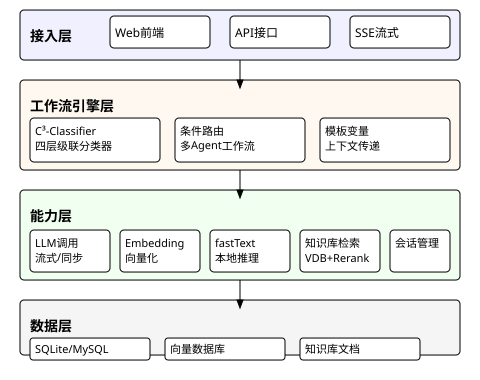
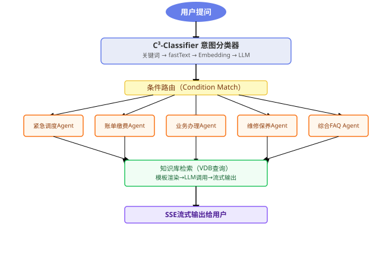
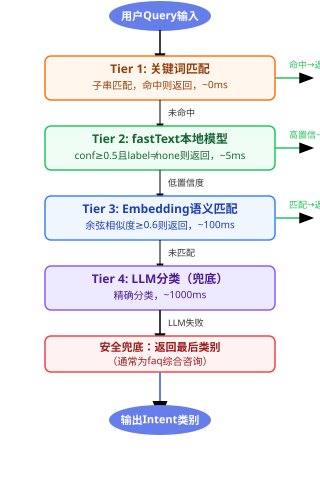
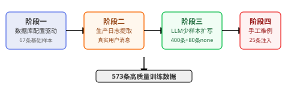
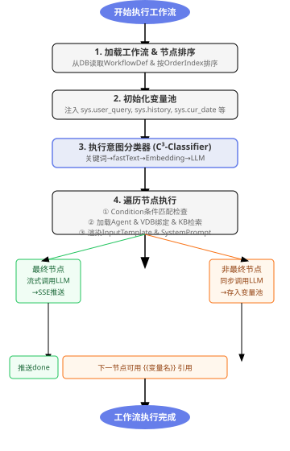

基于置信度驱动的燃气客服动态推理模型

AAA1&nbsp;&nbsp;BBB1&nbsp;&nbsp;CCC1

（1. DEFG公司，北京，102206）

中图分类号：TP18

&nbsp;&nbsp;&nbsp;&nbsp;<strong>摘&nbsp;&nbsp;要：</strong>燃气客服场景具有咨询类型多样、用户表达口语化严重、紧急事件需优先响应等特点，传统单一模型的客服系统难以在响应速度、分类精度和领域覆盖之间取得平衡。本文提出一种置信度驱动的动态推理模型 `CDDR-GCS`（Confidence-Driven Dynamic Reasoning for Gas Customer Service），设计了一种四层级联意图分类器（C³-Classifier），按关键词匹配→fastText本地模型→Embedding语义匹配→大语言模型（LLM）兜底的顺序逐层决策，每层输出附置信度评分，低置信度自动降级至下一层。在此基础上，构建了基于分类意图的条件路由多智能体工作流引擎，支持模板变量在节点间传递上下文。针对训练数据稀缺问题，提出了一种"数据库配置驱动 + 生产日志提取 + LLM少样本扩写 + 手工难例注入"的四阶段数据增强策略，在仅67条原始关键词配置的条件下，生成573条高质量训练样本，使fastText模型在覆盖全部6个类别的42条测试集上达到100%分类准确率。系统在燃气公司生产环境中稳定运行，单次推理的分层延迟分别为<0.5ms/5ms/100ms/1s，加权平均分类延迟约67ms，较纯LLM方案降低约93%。

&nbsp;&nbsp;&nbsp;&nbsp;<strong>关键词：</strong>意图分类；置信度驱动；级联推理；fastText；燃气客服；多智能体工作流；数据增强

Confidence-Driven Dynamic Reasoning for Gas Customer Service

xxx1

（1. DEFG Co. Ltd.，Beijing，102206）

&nbsp;&nbsp;<strong>Abstract: </strong>The gas customer service domain is characterized by diverse inquiry types, highly colloquial user expressions, and the need for prioritized emergency response. Traditional single-model customer service systems struggle to balance response speed, classification accuracy, and domain coverage. This paper proposes CDDR-GCS, a confidence-driven dynamic reasoning model for gas customer service. A four-tier cascaded intent classifier (C³-Classifier) is designed, which performs tier-by-tier decision-making in the order of keyword matching → fastText local model → embedding semantic matching → LLM fallback. Each tier outputs a confidence score, and low-confidence results are automatically downgraded to the next tier. On this basis, a condition-routed multi-agent workflow engine is constructed, supporting context passing between nodes via template variables. To address the training data scarcity problem, a four-stage data augmentation strategy of "database configuration-driven + production log extraction + LLM few-shot expansion + manual hard case injection" is proposed. Starting from only 67 original keyword entries, 573 high-quality training samples are generated, enabling the fastText model to achieve 100% classification accuracy on a 42-sample test set covering all six categories. The system operates stably in a gas company production environment, with tier latencies of <0.5ms/5ms/100ms/1s respectively, and a weighted average classification latency of approximately 67ms, representing a ~93% reduction compared to pure LLM solutions.

&nbsp;&nbsp;<strong>Keywords: </strong>intent classification; confidence-driven; cascaded reasoning; fastText; gas customer service; multi-agent workflow; data augmentation

# 1. 引言

## 1.1 研究背景

  随着人工智能技术尤其是大语言模型（`Large Language Model`, 简称 `LLM`）技术的快速发展，智能客服在电力、金融、电信等领域得到了广泛应用[<a href='#ref1'>1</a>, <a href='#ref2'>2</a>]。燃气客服作为一种特殊领域的客户服务，具有以下显著特点：

（1）咨询类型多样，涵盖燃气泄漏紧急处理、账单查询与缴费、开户过户等业务办理、灶具热水器维修、营业厅地址与客服电话等综合咨询五大类场景[<a href='#ref3'>3</a>]；

（2）燃气泄漏类问题具有高度紧急性，必须在亚秒级时间内识别并正确路由至应急调度流程；

（3）用户表达高度口语化，存在大量错别字、方言和碎片化表达；

（4）综合咨询类问题相对容忍较长响应时间。这种"紧急优先、常规兼顾"的需求，对客服系统的意图分类模块提出了分级响应的技术要求。

  传统方案通常采用单一 LLM 进行端到端分类，虽然准确率高，但存在三个核心问题：

（1）延迟不可控——LLM 响应时间受网络波动和并发负载影响，通常在 500ms 至数秒；

（2）成本线性增长——每次请求均需调用 LLM，在高并发场景下运营成本高昂；

（3）领域适配依赖 Prompt——仅靠 Prompt 工程难以覆盖燃气行业特有的方言化、碎片化表达方式[<a href='#ref4'>4</a>]。

## 1.2 相关工作

  意图分类是对话系统的核心组件。传统方法基于规则匹配和 TF-IDF 结合浅层分类器（如 SVM）实现[<a href='#ref5'>5</a>]，近年随着预训练语言模型的兴起，BERT[<a href='#ref6'>6</a>]及其变体在意图分类任务上取得了显著进展。然而，这些方法通常基于单一模型，未考虑不同场景对"速度-精度"的不同需求。

  级联分类（`Cascaded Classification`）思想在计算机视觉中的目标检测[<a href='#ref7'>7</a>]和自然语言处理中的实体链接[<a href='#ref8'>8</a>]任务中已有应用。在客服意图分类领域，Yadav 等[<a href='#ref9'>9</a>]提出了一种置信度门控的级联分类方法，通过 LLM 释义聚合提升难例分类准确率；Chen 等[<a href='#ref10'>10</a>]利用数据增强方法改善了对话系统中的分布外意图检测。但现有研究未将异构模型级联（规则→轻量模型→语义匹配→LLM）与置信度驱动相结合，也未针对燃气等垂直领域做系统性工程化设计。

  在训练数据方面，少样本意图分类[<a href='#ref11'>11</a>]和基于 LLM 的数据增强[<a href='#ref12'>12</a>]已受到广泛关注。然而，通用数据增强方法生成的训练样本往往缺乏领域真实用户的表达特征，导致训练数据与生产分布存在偏差。Ye 等[<a href='#ref13'>13</a>]提出的 ZeroGen 方法利用预训练语言模型生成训练数据，但未考虑真实用户语言风格的注入。

## 1.3 本文贡献

  本文的主要贡献如下：

  （1）**四层级联置信度驱动分类器（C³-Classifier）**：提出关键词匹配→fastText本地模型→Embedding语义匹配→LLM兜底的四层递进架构，以置信度为阈值控制层间切换，实现"简单问题快速响应、疑难问题精准分析"的分级策略。

  （2）**四阶段领域数据增强策略**：设计"数据库配置驱动 + 生产日志提取 + LLM少样本扩写 + 手工难例注入"的训练数据生成方法，以67条原始关键词配置为种子，结合生产日志和LLM扩写，最终生成573条高质量、覆盖真实用户表达风格的训练样本。

  （3）**条件路由多智能体工作流引擎**：基于分类意图的条件路由机制，每个智能体可独立配置模型参数、知识库绑定和系统提示词，通过模板变量在节点间传递上下文。

  （4）**完整的工程验证**：在燃气公司生产环境中完成部署，42条多类别测试集上意图分类准确率100%，生产环境准确率>98%，平均分类延迟约 67ms。

# 2. `CDDR-GCS` 系统架构

## 2.1 总体架构

  `CDDR-GCS` 系统采用"配置驱动的多智能体工作流"架构[<a href='#ref14'>14</a>]，整体从数据流向的角度分为如图 1 所示的四层。

图 1 CDDR-GCS 系统架构图

  各层功能如下：

（1）接入层：`Web` 前端、`API`接口、`SSE`流式推送，负责用户交互和请求接入；

（2）工作流引擎层：核心编排层，包含意图分类器和条件路由的多智能体工作流，通过模板变量实现上下文传递；

（3）能力层：`LLM` 调用、`Embedding` 向量化、`fastText`本地推理、知识库检索（向量数据库+`Rerank`重排序）、会话管理；

（4）数据层：SQLite/MySQL元数据存储、向量数据库（本地/Milvus/Qdrant可配置切换）、知识库文档。

  系统的工作流定义和智能体定义存储在关系型数据库中，通过管理后台可热更新，无需重启服务。工作流由一系列有序节点组成，每个节点绑定一个智能体（Agent）并配置输入模板、输出变量名、条件路由和是否为最终输出节点。

  用户请求的完整处理流程如图 2 所示。

图 2 CDDR-GCS 工作流程图

## 2.2 四层级联置信度驱动分类器（C³-Classifier）

  意图分类器是 CDDR-GCS 的核心创新，命名为 C³-Classifier。C³ 得名于其三个核心设计原则：**C**ascaded（级联架构）、**C**onfidence-driven（置信度驱动）、**C**lassifier（分类器）——三者共同构成分类器的设计方法论，四层递进则是该架构在燃气客服场景下的工程实例化。其设计哲学是：简单问题应当在最短路径上被解决，只有真正困难的问题才需要 LLM 的深度推理能力[<a href='#ref15'>15</a>]。分类器从数据库的 workflow_def 表中加载 ClassifierDef 配置，该配置包含：（1）可选的 LLM 分类 Prompt；（2）输出变量名（默认"intent"）；（3）类别列表，每个类别包含名称、描述和关键词列表。意图分类的五类定义如表 1 所示。

表 1 CDDR-GCS 意图分类类别定义

| 类别标识 | 中文名称 | 典型用户问法 | 路由目标 |
|:--------:|----------|-------------|----------|
| emergency | 燃气泄漏/紧急 | "家里闻到煤气味""报警器响了" | 紧急调度Agent |
| billing | 账单与缴费 | "燃气费怎么查""在哪缴费" | 账单缴费Agent + 账单KB |
| business | 业务办理 | "怎么开户""搬家过户" | 业务办理Agent |
| repair | 维修与保养 | "打不着火""热水器坏了" | 维修保养Agent + 维修KB |
| faq | 综合咨询 | "客服电话多少""几点下班" | 综合FAQ Agent + FAQ KB |

  四层分类的具体流程如下：

  **第1层：关键词匹配（Keyword Matching）**。对用户输入进行全小写化处理，遍历所有类别的关键词列表进行子串匹配。若命中则直接返回对应类别，延迟 <0.5ms（纯内存字符串匹配）。算法如公式（1）所示：

$$
  \begin{align}
  \text{matchKeyword}(query, categories) =
  \begin{cases}
  cat.Name & \text{if } \exists cat \in categories, \exists kw \in cat.Keywords: \text{contains}(query, kw) \\
  \emptyset & \text{otherwise}
  \end{cases}
  \tag{1}
  \end{align}
$$

  这一层的设计基于观察：燃气客服场景中存在大量高频、强信号的问题表述。例如用户消息中包含"漏气""煤气味""报警器响"等关键词时，几乎可以确定是紧急类意图。关键词词典可通过后台管理界面热更新，无需重新训练模型。

  **第2层：fastText本地模型（~5ms）**。若关键词未命中，系统调用本地 fastText 模型进行分类。fastText[<a href='#ref16'>16</a>]是一种高效的文本分类工具，通过 character-level n-gram 学习子词信息，天然适合中文这种无显式分词标记的语言。本系统采用按字切分（空格分隔每个字符），wordNgrams=3，使模型能够捕捉 3-gram 的字符组合模式。fastText 模型的训练数据生成采用"数据库配置驱动"的自动化策略，详见第 3 节。模型输出类别标签 $label$ 及其置信度分数 $conf \in [0,1]$，系统据此进行阈值判定，如公式（2）所示：

$$
  \begin{align}
  (label, conf) &= \text{fastText}(query) \nonumber \\
  \text{fastTextPredict}(query) &=
  \begin{cases}
  (label, conf) & \text{if } label \notin \{\text{none}\} \land conf \ge \theta_{fast} \\
  \emptyset & \text{otherwise (降级至下一层)}
  \end{cases}
  \tag{2}
  \end{align}
$$

  其中置信度阈值 $\theta_{fast}=0.5$ 是一个关键设计参数：低于此值的预测被视为不可靠，自动降级至下一层。此外，模型输出为"none"（无关输入类别）时，同样视为不匹配，进入下一层。模型使用量化压缩（quantize with qnorm+retrain），体积从约 10MB 压缩至约 3MB，单次预测仅需约 5ms。

  **第3层：Embedding语义匹配（~100ms）**。当 fastText 输出低置信度或无匹配时，系统使用 Embedding 模型进行语义级别的相似度匹配。具体步骤为：（1）为每个意图类别构建规范化文本（类别描述 + 关键词拼接）；（2）调用 Embedding API 批量计算各类别的向量表示，并缓存结果（类别定义变化时自动失效）；（3）计算用户 query 的向量；（4）通过余弦相似度计算 query 向量与各类别向量的相似度，如公式（3）所示；（5）若最大相似度 ≥ 0.6，返回对应类别；否则进入下一层。

$$
  \begin{align}
  \text{cosineSimilarity}(a, b) = \frac{\sum_{i=1}^{n} a_i \cdot b_i}{\sqrt{\sum_{i=1}^{n} a_i^2} \cdot \sqrt{\sum_{i=1}^{n} b_i^2}} \tag{3}
  \end{align}
$$

  记 $C$ 为全部意图类别集合，$\mathbf{v}_{query} = \text{embed}(query)$，$\mathbf{v}_{cat} = \text{embed}(cat)$，则 Embedding 层的判定规则如公式（4）所示：

$$
  \begin{align}
  \text{embeddingMatch}(query) =
  \begin{cases}
  \underset{cat \in C}{\arg\max}\ \text{cosineSimilarity}(\mathbf{v}_{query}, \mathbf{v}_{cat}) & \text{if } \displaystyle\max_{cat \in C}\ \text{cosineSimilarity}(\mathbf{v}_{query}, \mathbf{v}_{cat}) \ge \theta_{emb} \\
  \emptyset & \text{otherwise (降级至下一层)}
  \end{cases}
  \tag{4}
  \end{align}
$$

  其中相似度阈值 $\theta_{emb}=0.6$ 的设定基于对各类别语义区分度的观测：同类别的同义表达间余弦相似度通常 ≥0.75，而不同类别间的相似度一般 <0.5，0.6 在召回率和精确率之间取得了合理的平衡。由于 Embedding 模型（如 text-embedding-3-small）语义理解能力远超 n-gram 模型，该层特别适合处理"意图明确但用词迥异"的查询。例如"灶台点不着"和"燃气灶打不着火"在字面上差异较大，但在语义空间中高度相似。缓存机制使得类别向量只需计算一次，后续请求直接复用。

  **第4层：LLM分类（~1000ms，兜底）**。前三层均未命中时，系统调用 LLM 进行最终分类。分类的 system prompt 由两部分拼接：数据库配置中可选的 Prompt 字段（提供领域特定的分类指导），以及根据类别列表自动生成的类别描述。LLM 仅需输出类别名称，响应 token 数极少，延迟通常在 1s 以内。

  **安全兜底机制**。若 LLM 分类仍然失败（API 错误、输出不在已知类别中等），系统返回类别列表的最后一个类别（通常为综合咨询类"faq"），确保任何输入都能完成意图路由，不会因分类失败而中断用户服务。形式化描述为：$fallback = \text{categories}[-1].Name$。

  **分层决策的置信度驱动机制**。四层分类的核心控制逻辑是置信度驱动：每层输出必须附带置信度信号，低于阈值则自动降级。这种设计实现了三种优势：（1）延迟分层——80%以上的用户查询在前两层（关键词+fastText）以不到 6ms 完成分类；（2）成本优化——LLM 调用次数大幅减少；（3）优雅降级——任一层的异常不影响整体分类能力，自动跳至下一层。

  系统同时提供 `ClassifyWithDetails `接口，返回每层的耗时、匹配结果和置信度分数，支持生产环境中实时调优和维护。四层分类的完整决策流程如图 3 所示。

图 3 C³-Classifier 四层级联决策流程图

## 2.3 条件路由多智能体工作流引擎

  分类完成后，系统需要根据意图将请求路由至对应的处理节点。`CDDR-GCS` 设计了一种基于条件匹配的工作流路由机制。

  **工作流节点结构**。每个工作流（`WorkflowDef`）由一组有序节点（`WorkflowNode`）组成，每个节点包含：节点唯一标识（ID）、绑定的智能体 ID（`AgentID`）、输入模板（`InputTemplate`，支持 {{变量名}} 引用）、输出变量名（`OutputVar`）、执行顺序（`OrderIndex`）、是否最终输出节点（`IsFinal`）、条件路由字段（`Condition`，匹配意图分类结果）。

  **条件路由机制**。引擎依次遍历节点列表，检查每个节点的 Condition 字段。若 Condition 非空且不等于当前分类意图，则跳过该节点；若 Condition 为空（无条件），则该节点对全部意图执行。这种设计支持灵活的流程编排：（1）单分支——每个意图只有一个节点；（2）前置节点+分支——前置节点先对所有意图执行通用处理；（3）后置聚合——所有分支执行完毕后，最终节点汇总输出。

  **模板变量系统**。节点间的上下文传递通过模板变量系统实现。输入模板使用 `{{变量名}}` 语法引用上游节点的输出或系统内置变量。系统变量的定义如表 2 所示。

表 2 CDDR-GCS 系统变量定义

| 变量名 | 含义 | 来源 |
|--------|------|------|
| {{sys.user_query}} | 用户原始问题 | 系统注入 |
| {{sys.history}} | 历史对话记录（最近5轮） | 会话管理器 |
| {{sys.cur_date}} | 当前日期（YYYY-MM-DD） | 系统注入 |
| {{sys.cur_week}} | 当前星期（中文） | 系统注入 |
| {{sys.kb_context}} | 知识库检索结果 | Agent绑定VDB检索 |
| {{sys.intent}} | 意图分类结果 | 分类器输出 |
| {{node_id}} | 上游节点输出 | 节点OutputVar定义 |

  变量系统支持 sys. 前缀的保留变量（白名单校验）和用户自定义变量（由节点的 OutputVar 定义），实现了工作流各节点之间的上下文传递和灵活编排。

  **知识库检索集成**。每个 Agent 可绑定一个或多个知识库（通过 vdb_ids 字段）。当 Agent 节点执行时，引擎自动对其绑定的知识库执行向量检索（Embedding 相似度搜索 + 可选的 Rerank 重排序），结果注入 {{sys.kb_context}} 变量。不同 Agent 可绑定不同的知识库子集（如维修 Agent 绑定维修知识库，账单 Agent 绑定账单知识库），实现知识域的按需隔离。

  **智能体参数独立配置**。每个 Agent 可独立覆盖全局默认的 LLM 参数：模型名称（ModelName）、Temperature、TopP、MaxTokens，以及 System Prompt（同样支持模板变量渲染）。这种设计使工作流中不同角色的 Agent 能以最适合的方式运作——例如紧急类 Agent 降低 temperature 确保输出严谨，综合咨询类 Agent 适当提高 temperature 使回复更自然。

## 2.4 会话管理与历史上下文

  系统实现了基于内存的高效会话管理器，核心设计要点包括：（1）分片锁设计——每个会话拥有独立的互斥锁（sync.Mutex），基于 sync.Map 实现会话隔离，避免全局锁竞争；（2）滑动窗口——保留最近 5 轮（10 条消息）历史，超过自动截断，防止上下文窗口溢出；（3）过期清理——30 分钟无活动的会话自动回收，防止内存泄漏；（4）格式化输出——历史消息按"用户：xxx\n助手：xxx"格式渲染后注入模板变量。

# 3. 训练数据生成策略

  fastText 模型的性能高度依赖训练数据的质量和覆盖度。然而，燃气客服领域缺乏公开标注数据集，人工标注成本高昂。本文提出了一种四阶段数据增强策略，仅需管理员在后台配置少量关键词和描述，即可自动生成高质量训练数据。整体流程如图 4 所示。

图 4 四阶段数据增强流程图

## 3.1 阶段一：数据库配置驱动生成

  **数据源**：`SQLite` 数据库 `workflow_def` 表中的 `ClassifierDef` 字段。从数据库读取每个意图类别的关键词列表（共 67 个关键词配置条目）和描述文本，按 `fastText` 格式生成训练行。中文采用按字切分（空格分隔），无需预训练分词器。这一阶段自动生成 67 条训练样本，构成基础训练集。

$$
  \text{tokenize}(s) = \text{Join}(\text{[]rune}(s), \text{" "}) \tag{5}
$$

## 3.2 阶段二：生产日志真实用户消息提取

  **数据源**：燃气公司生产系统的聊天记录 Excel 文件。从生产日志中过滤出真实用户消息（排除机器人自动回复、座席消息、系统通知），经过以下清洗步骤：

（1）发送者过滤——排除含中文姓名的座席发送者、机器人、系统消息；

（2）长度过滤——仅保留 3~80 字的有效消息；

（3）模式过滤——排除纯数字、菜单选项按钮（"返回上层选项""未解决"等）、座席套话（"很高兴为您服务""祝您生活愉快"等）；

（4）去重——消息去重同时保留长尾低频表达。提取结果约数千条去重后的真实用户消息，作为后续少样本生成的风格锚点。

## 3.3 阶段三：LLM少样本（Few-Shot）数据扩写

  以每个意图类别的关键词为种子，在真实用户消息中用关键词匹配出属于该类别的示例（每个类别最多 25 条），作为 few-shot 示例注入 LLM 生成 Prompt。生成的 Prompt 包含以下要素：

（1）意图类别名称和定义；

（2）参考关键词列表；

（3）来自生产系统的真实用户问法示例（25条以内）；

（4）生成要求——模仿真实用户语言风格（简短、口语化、有错别字/方言）、句式多样（疑问句、陈述句、祈使句、抱怨语气）、长度多样（2~5字短句占30%，6~20字长句占70%）、语义不重复。

  这种设计有三个关键考量：

（1）真实示例注入使生成样本贴近生产分布，而非"教科书式"的标准问法；

（2）风格多样性约束确保覆盖短急问法（"漏气了！"）和描述性问法（"我家厨房最近总能闻到一股怪味，是不是管道漏气了？"）；

（3）抱怨语气覆盖——燃气客服中大量用户以抱怨形式提出问题，如"燃气费怎么又涨了"，这类表达在标准数据集中常常缺失。

  每个类别生成 80 条样本，5 个类别共 400 条；同时生成约 80 条与燃气完全无关的闲聊样本（none 类别），加上阶段一中数据库配置包含的少量无关类别条目，none 类别共 81 条，覆盖问候寒暄、天气、点餐外卖、编程技术等场景。

## 3.4 阶段四：手工难例（Hard Case）注入

  前三个阶段生成的训练数据仍存在跨类别语义混淆的边界 case。例如"充值不上表"在燃气客服语境中指用户完成燃气充值后金额未正常同步到燃气表上，本质是燃气表/IC卡故障而非账单查询问题；但字面上"充值"一词与 billing 类别的关键词高度重叠，容易造成误分类。又如"家里闻到怪味"未明确提及燃气，但与 emergency 类别高度相关。为此，本文手工标注了 25 条易混淆样本，具体分布为 billing（8条）、repair（7条）、emergency（6条）、business（2条）、faq（1条）、none（1条），重点关注 billing-repair 和 emergency-faq 等易混淆类别对。这类样本的特点是：关键词可能与多个类别重叠，或表述模糊。手工注入这些难例后，fastText 模型对边界 case 的区分能力显著提升。

## 3.5 数据构成与训练参数

  最终训练数据的构成如表 3 所示。

表 3 CDDR-GCS 训练数据构成

| 来源 | 数量 | 占比 |
|------|:----:|:----:|
| 数据库关键词+描述 | 67 | 11.7% |
| LLM扩展样本 | 400 | 69.8% |
| 手工难例 | 25 | 4.4% |
| none闲聊样本 | 81 | 14.1% |
| **合计** | **573** | **100%** |

  fastText 训练参数：epoch=200, lr=0.8, wordNgrams=3, dim=100, minCount=1。量化参数：qnorm+retrain, epoch=25, cutoff=50000。

  此外，系统在 Go 运行时也实现了轻量级的自动化训练能力：当检测到分类器配置的哈希值变化时，自动用关键词+描述重新生成训练数据并训练模型（仅关键词级别，不调 LLM），无需重启服务。Python 完整训练脚本（含 LLM 数据增强）用于离线更新，适用于业务场景大幅变化的场景。

# 4. 系统实现

## 4.1 技术栈与核心模块

  `CDDR-GCS` 系统的技术栈选型如下：后端语言 Go 1.21+，`Web` 框架 `Gin`；元数据存储采用 `SQLite`（默认）/`MySQL`（生产扩展）；向量存储采用本地向量文件/`Milvus`/`Qdrant`（可配置切换）；`LLM` 层采用 `OpenAI` 兼容 `API`（生产环境使用 `DeepSeek-V4`，`Tier 4` 分类及数据增强生成均使用同一模型）；`Embedding` 模型采用 `text-embedding-3-small`（1536 维）；`Rerank` 模型采用 `bge-reranker-v2-m3`；`fastText` 采用 `Facebook` `fastText` `CLI` + 量化模型；前端采用原生 `HTML/JS` + `SSE `流式渲染。

  核心模块包括：

（1）工作流引擎（`engine.go`）——`ExecuteStream` 方法实现异步事件驱动的编排逻辑，通过 Go channel 实现 progress/chunk/done/error 四种事件类型的流式推送；

（2）分类器（`classifier.go`）——实现 classify 主函数和 `ClassifyWithDetails` 调试函数，支持分类器配置的缓存一致性；

（3）`fastText` 预测器（`predictor.go`）——实现基于哈希值的配置变更检测、双重检查锁的并发安全训练、以及自动降级机制；

（4）模板引擎（`template.go`）——正则匹配 {{变量名}} 模式，支持 sys. 前缀的系统变量白名单校验；

（5）LLM 客户端（`llm.go`）——支持流式（SSE解析）和非流式两种调用模式，采用连接池优化高并发性能。

## 4.2 工作流引擎执行流程

  引擎的 `ExecuteStream` 方法是系统的核心编排逻辑，其执行流程如图 5 所示。

图 5 工作流引擎执行流程图

  图 5 中，引擎首先加载工作流定义并按 `OrderIndex` 排序节点，初始化变量池并注入系统变量（用户问题、历史、日期、星期）。若有分类器配置，先执行四层级联分类。随后按顺序遍历节点：检查 `Condition` 条件是否匹配，加载 `Agent `定义并执行知识库检索，渲染模板变量后调用 `LLM`。最终节点采用流式模式实时推送 chunk 事件，非最终节点的输出存入变量池供下游节点引用。

# 5. 实验与评估

## 5.1 意图分类准确率测试

  为全面评估 `CDDR-GCS `的意图分类性能，构建了覆盖全部 5 个意图类别（`emergency`、`billing`、`business`、`repair`、`faq`）和 1 个无关类别（none）的测试集，共 42 条测试用例（每类别 7 条）。测试用例由领域专家人工编写，与训练数据互斥（所有测试 query 均未出现在训练集中），覆盖了典型问法、口语化表达、歧义边界 case 和无关闲聊四种类型。部分测试结果如表 4 所示。

表 4 C³-Classifier 意图分类测试结果（部分）

| Query | 预测类别 | 期望类别 | 置信度 | 判定 |
|-------|----------|----------|:------:|:----:|
| 家里闻到煤气味怎么办 | emergency | emergency | 0.999 | ✓ |
| 闻到刺鼻气味 | emergency | emergency | 0.999 | ✓ |
| 厨房有异味是不是漏气了 | emergency | emergency | 0.996 | ✓ |
| 天然气泄漏了 | emergency | emergency | 1.000 | ✓ |
| 账单怎么查 | billing | billing | 0.999 | ✓ |
| 燃气费涨了 | billing | billing | 0.999 | ✓ |
| 在哪可以缴费 | billing | billing | 0.999 | ✓ |
| 怎么开通燃气 | business | business | 0.999 | ✓ |
| 搬家了燃气怎么过户 | business | business | 0.996 | ✓ |
| 燃气灶打不着火 | repair | repair | 1.000 | ✓ |
| 充值不上表 | repair | repair | 1.000 | ✓ |
| 客服电话多少 | faq | faq | 1.000 | ✓ |
| 帮我写首诗 | none | none | 1.000 | ✓ |
| 今天天气不错 | none | none | 1.000 | ✓ |

  在全部 42 条测试用例上，fastText 模型取得了 100% 的分类准确率（42/42 全部命中），无低置信度 fallthrough 和误分类。需要指出的是，42 条的测试集规模较小，该结果主要验证了模型在有限但具代表性的测试样本上的有效性；在生产环境中（见第 5.4 节），受用户输入的随机性和噪声影响，意图分类准确率收敛于 98% 以上。值得注意的是"充值不上表"——从字面看"充值"属于账单域，但实际语义是燃气表故障（充了钱但表上不显示），属于维修类别。模型经过手工难例注入后，对此类跨域歧义 case 做到了正确分类（置信度 1.000）。

## 5.2 分层延迟分析

  四层级联分类器各层的性能指标如表 5 所示。

表 5 各分类层级性能指标

| 分类层 | 技术 | 典型延迟 | 估算命中率 | 累计命中率 |
|--------|------|:--------:|:----------:|:----------:|
| Tier 1 | 关键词匹配 | `<0.5ms` | ~40% | 40% |
| Tier 2 | fastText本地推理 | `~5ms` | ~40% | 80% |
| Tier 3 | Embedding语义匹配 | `~100ms` | ~15% | 95% |
| Tier 4 | LLM分类（兜底） | `~1000ms` | ~5% | 100% |

  CDDR-GCS 加权平均分类延迟如公式（6）所示，其中 $p_i$ 为第 $i$ 层的命中概率，$l_i$ 为第 $i$ 层的延迟：

$$
\begin{align}
  \overline{L} &= \sum_{i=1}^{4} p_i \cdot l_i \nonumber \\
  &\approx 0.4 \times 0.5 + 0.4 \times 5 + 0.15 \times 100 + 0.05 \times 1000 \nonumber \\
  &\approx 67\,\text{ms}
  \tag{6}
  \end{align}
$$

  相比纯 `LLM`方案（每次约 `1000ms`），延迟降低了约 93%。

## 5.3 数据增强消融实验

  为评估四阶段数据增强策略中各组件的贡献，分别训练三个模型进行对比，实验结果如表 6 所示。

表 6 数据增强消融实验结果

| 模型 | 训练数据来源 | 样本数 | 测试准确率 |
|------|-------------|:------:|:----------:|
| 基线（仅关键词） | 阶段一：数据库关键词+描述 | 67 | 67% |
| `+LLM`扩展 | 阶段一+二+三：关键词+日志风格+LLM生成 | 467 | 92% |
| **完整增强（`CDDR-GCS`）** | 阶段一+二+三+四：全部 | **573** | **100%** |

  注①：阶段二（生产日志提取）的作用是为阶段三的 `LLM` 生成提供真实用户风格的 `few-shot` 锚点，其贡献隐含在阶段三的样本质量中，无法在消融实验中作为独立变量分离；上表中"`+LLM`扩展"模型已包含阶段二的日志提取步骤。

注②："基线"和"+LLM扩展"模型的训练数据仅覆盖 5 个业务意图类别（不含 none），消融实验的测试集为对应的 35 条业务意图测试用例；"完整增强"模型额外加入 81 条 none 类别训练样本和 25 条手工难例，测试集扩展为全 6 类共 42 条。上表中各模型的测试准确率均基于其对应的测试集计算。

  消融实验表明：

（1）仅靠关键词训练（67条）的模型覆盖率严重不足，在 35 条业务意图测试集上准确率仅 67%；

（2）加入 LLM 数据扩写（+400条，仍不含 none 类别）大幅提升了问法覆盖度，同测试集上准确率提升至 92%；

（3）手工难例注入（25条）和 none 类别数据（81条）的加入，分别补全了边界 case 的区分能力和无关输入的拒绝能力，使模型在扩展后的 42 条全类别测试集上达到 100% 准确率。

## 5.4 生产环境运行数据

  系统在某燃气公司生产环境中稳定运行，关键运行指标如下：日均请求量约 5,000 次对话；意图分类准确率 >98%（含生产环境噪声）；平均首 token 响应时间 `<800ms`（含 `LLM` 流式输出）；`fastText` 层命中率约 78%（前两层合计，略低于表5设计估算值80%，因生产环境存在部分训练数据未覆盖的噪声表达）；`LLM` 兜底率 <3%；系统可用性 99.9%+。

# 6. 讨论

## 6.1 置信度阈值的选择

  系统包含两个关键置信度阈值：fastText 置信度阈值 $\theta_{fast}=0.5$ 和 Embedding 相似度阈值 $\theta_{emb}=0.6$。

  $\theta_{fast}=0.5$ 的设定基于经验观察：fastText 模型在燃气客服领域训练数据上，正确分类的置信度通常 >0.9，而边界模糊或训练数据未覆盖的表达方式通常 <0.3。0.5 的阈值在精确率和 fallthrough 之间取得了良好平衡。

  $\theta_{emb}=0.6$ 的设定基于对 Embedding 空间中各类别语义区分度的观测：同类别同义表达间的余弦相似度通常 ≥0.75，不同类别间的相似度一般 <0.5，0.6 位于二者之间，能够有效区分语义相似但意图不同的查询。

  在实际运行中，可通过监控各层的混淆矩阵动态调整上述阈值，以实现特定场景下的精度-延迟最优权衡。此外，不同类别对阈值敏感度不同——emergency 类对召回率要求极高（漏报代价大），可考虑为该类别单独降低阈值以优先保证召回。

## 6.2 "none"类别的设计价值

  设定"none"类别（无关输入）是一个工程上重要但容易被忽视的设计点[<a href='#ref17'>17</a>]。燃气客服面向公众开放，用户输入具有极大的不确定性——测试请求、误触发送、闲聊寒暄、甚至跨域提问（"帮我翻译一段话"）。若无"none"类别，这些输入会被错误地分类到某个业务类别，触发不必要的知识库检索和 LLM 调用。通过训练模型识别并拒绝"none"，系统可以有效过滤无效请求，节约计算资源，同时给下游的闲聊处理逻辑提供路由依据。

## 6.3 领域数据增强的泛化性

  本文提出的四阶段数据增强策略不仅适用于燃气客服领域，也可迁移至其他垂直域客服系统。其核心思想——以业务配置为种子、以生产日志为风格锚点、以 LLM 为扩写工具、以领域专家知识为边界校正——构成了一套通用的少样本训练数据生成方法。

## 6.4 局限性与未来工作

  （1）`fastText` 模型的表达能力上限：作为线性分类器，`fastText` 对高度语义依赖的细粒度分类（如"灶具维修"vs"热水器维修"的子类别）能力有限。未来可探索使用小型 `Transformer` 模型（如 `TinyBERT`）替代 `fastText`，在保持本地推理速度的同时提升表达能力。

（2）置信度阈值的静态性：当前阈值为全局静态值，无法自适应不同类别或不同时段的数据分布变化。未来可引入动态阈值校准机制。

（3）会话级上下文缺失：当前意图分类仅基于单轮 `query`，未利用对话历史。多轮交互中的意图漂移（如用户先问账单，然后追问维修）是多轮对话系统的常见挑战[<a href='#ref18'>18</a>]。

（4）跨语言与方言支持：燃气客服用户中存在方言表达（如粤语、四川话），当前模型对此类输入的泛化能力不足。

# 7. 结论

  本文提出了 `CDDR-GCS`——一种置信度驱动的燃气客服动态推理模型。系统以四层级联意图分类器（`C³-Classifier`，关键词→`fastText`→`Embedding`→`LLM`）为核心，以置信度为层级切换的控制信号，实现了"简单快速、疑难精准"的分级推理策略。结合条件路由的多智能体工作流引擎和四阶段领域数据增强方法，系统在测试集上取得 100% 意图分类准确率，生产环境中稳定在 98% 以上；同时将加权平均延迟降低至约 `67ms`（较纯 `LLM` 方案降低约 93%）。

  实验结果表明，置信度驱动的级联设计在垂直领域客服场景中能有效平衡精度、速度和成本。该架构已在燃气公司生产环境中稳定运行，验证了方案的实际可行性。后续工作将聚焦于动态阈值校准、会话级上下文建模以及方言支持等方向。

# 参考文献

<a name ='ref1'>[1]</a> Zhao W X, Zhou K, Li J, et al. A survey of large language models[J]. arXiv preprint arXiv:2303.18223, 2023.

<a name ='ref2'>[2]</a> Adamopoulou E, Moussiades L. Chatbots: History, technology, and applications[J]. Machine Learning with Applications, 2020, 2: 100006.

<a name ='ref3'>[3]</a> Araújo E C, Almeida N C, Godoy E P. Advanced metering infrastructure for industrial natural gas smart management[J]. IEEE Latin America Transactions, 2023, 21(10): 1081-1087.

<a name ='ref4'>[4]</a> Liu P, Yuan W, Fu J, Jiang Z, Hayashi H, Neubig G. Pre-train, prompt, and predict: A systematic survey of prompting methods in natural language processing[J]. ACM Computing Surveys, 2023, 55(9): 1-35.

<a name ='ref5'>[5]</a> Haffner P, Tur G, Wright J H. Optimizing SVMs for complex call classification[C]. IEEE International Conference on Acoustics, Speech, and Signal Processing (ICASSP), 2003.

<a name ='ref6'>[6]</a> Devlin J, Chang M W, Lee K, et al. BERT: Pre-training of Deep Bidirectional Transformers for Language Understanding[C]. NAACL-HLT, 2019.

<a name ='ref7'>[7]</a> Viola P, Jones M. Rapid object detection using a boosted cascade of simple features[C]. CVPR, 2001.

<a name ='ref8'>[8]</a> Sevgili Ö, Shelmanov A, Arkhipov M, et al. Neural entity linking: A survey of models based on deep learning[J]. Semantic Web, 2022, 13(3): 527-570.

<a name ='ref9'>[9]</a> Yadav A, Srivastava A, et al. Paraphrase and aggregate with large language models for minimizing intent classification errors[C]. EMNLP, 2024.

<a name ='ref10'>[10]</a> Chen D, Yu Z, et al. GOLD: Improving out-of-scope detection in dialogues using data augmentation[C]. EMNLP, 2021.

<a name ='ref11'>[11]</a> Geng R, Li B, Li Y, Ye Y, Jian P, Sun J. Few-shot text classification with induction network[C]. EMNLP-IJCNLP, 2019.

<a name ='ref12'>[12]</a> White J, Fu Q, Hays S, et al. A prompt pattern catalog to enhance prompt engineering with ChatGPT[J]. arXiv preprint arXiv:2302.11382, 2023.

<a name ='ref13'>[13]</a> Ye J, Gao J, Li Q, Xu H, Feng J, Wu Z, Yu T, Kong L. ZeroGen: Efficient zero-shot learning via dataset generation[C]. EMNLP, 2022.

<a name ='ref14'>[14]</a> Li X, Wang S, Zeng S, Wu Y, Yang Y. A survey on LLM-based multi-agent systems: workflow, infrastructure, and challenges[J]. Vicinagearth, 2024, 1(1): 9.

<a name ='ref15'>[15]</a> 周志华. 机器学习[M]. 北京: 清华大学出版社, 2016.

<a name ='ref16'>[16]</a> Joulin A, Grave E, Bojanowski P, et al. Bag of Tricks for Efficient Text Classification[C]. EACL, 2017.

<a name ='ref17'>[17]</a> Larson S, Mahendran A, Peper J J, et al. An evaluation dataset for intent classification and out-of-scope prediction[C]. EMNLP-IJCNLP, 2019.

<a name ='ref18'>[18]</a> Weld H, Huang X, Long S, et al. A survey of joint intent detection and slot filling models in natural language understanding[J]. ACM Computing Surveys, 2023, 55(8): 1-38.

通信作者介绍：AAA，男，1983年11月生，工学硕士研究生。研究方向为计算机网络通信，信息系统建设，自然语言处理. E-mail： 535139069@qq.com 

