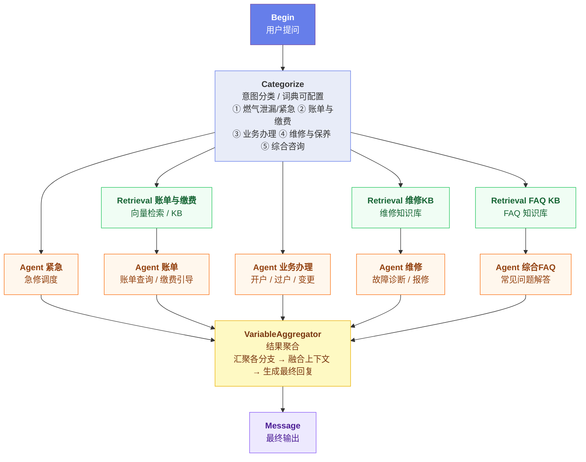

```mermaid
flowchart TB
    Begin["<b>Begin</b><br/>用户提问"]

    Begin --> Categorize["<b>Categorize</b><br/>意图分类 / 词典可配置<br/>① 燃气泄漏/紧急 ② 账单与缴费<br/>③ 业务办理 ④ 维修与保养 ⑤ 综合咨询"]

    Categorize --> A1["<b>Agent 紧急</b><br/>急修调度"]
    Categorize --> R2["<b>Retrieval 账单与缴费</b><br/>向量检索 / KB"]
    Categorize --> A3["<b>Agent 业务办理</b><br/>开户 / 过户 / 变更"]
    Categorize --> R4["<b>Retrieval 维修KB</b><br/>维修知识库"]
    Categorize --> R5["<b>Retrieval FAQ KB</b><br/>FAQ 知识库"]

    R2 --> A2["<b>Agent 账单</b><br/>账单查询 / 缴费引导"]
    R4 --> A4["<b>Agent 维修</b><br/>故障诊断 / 报修"]
    R5 --> A5["<b>Agent 综合FAQ</b><br/>常见问题解答"]

    A1 --> Agg["<b>VariableAggregator</b><br/>结果聚合<br/>汇聚各分支 → 融合上下文 → 生成最终回复"]
    A2 --> Agg
    A3 --> Agg
    A4 --> Agg
    A5 --> Agg

    Agg --> Msg["<b>Message</b><br/>最终输出"]

    style Begin fill:#667eea,color:#fff,stroke:#764ba2
    style Categorize fill:#e8ecf8,color:#333,stroke:#667eea
    style A1 fill:#fff7ed,color:#92400e,stroke:#f97316
    style A2 fill:#fff7ed,color:#92400e,stroke:#f97316
    style A3 fill:#fff7ed,color:#92400e,stroke:#f97316
    style A4 fill:#fff7ed,color:#92400e,stroke:#f97316
    style A5 fill:#fff7ed,color:#92400e,stroke:#f97316
    style R2 fill:#f0fdf4,color:#166534,stroke:#22c55e
    style R4 fill:#f0fdf4,color:#166534,stroke:#22c55e
    style R5 fill:#f0fdf4,color:#166534,stroke:#22c55e
    style Agg fill:#fef9c3,color:#78350f,stroke:#eab308
    style Msg fill:#ede9fe,color:#4c1d95,stroke:#8b5cf6
```
