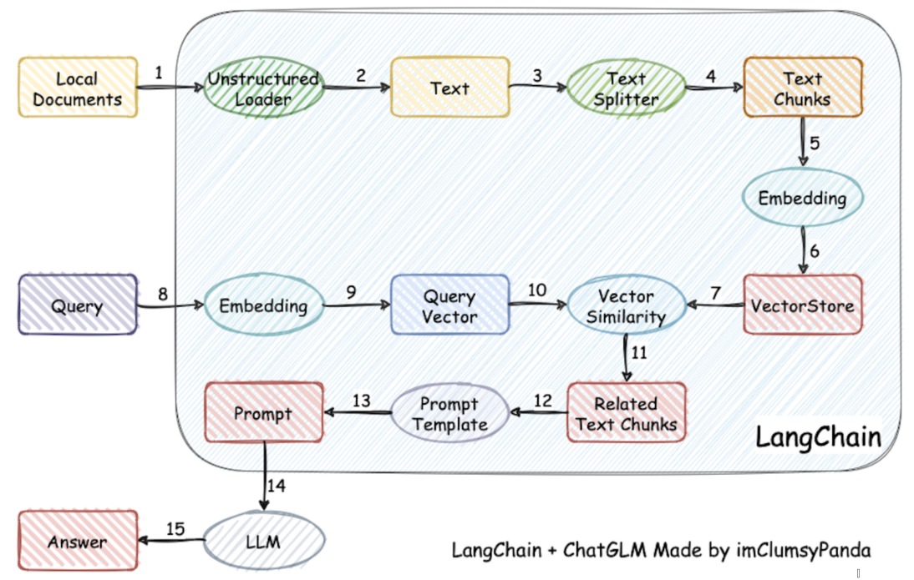

<center><span style='font:48px Verdana;font-weight:bold;'>LLM in Action</span></center>

<span style='font:32px Verdana;font-weight:bold;margin-left:150px'> —A Programer's Perspective</span>


[TOC]

# 前言

LLM （Large Language Model，大语言模型），是使用大量数据（文本、视频）进行训练，能够接收自然语言作为输入，并输出自然语言的模型。具备一定的知识理解能力，并且能够在一定的知识集合中对已有的知识重新组织。

考虑一个场景，某个组织或个人有很多数据（文件、word、txt、或者数据库数据等），这些数据会不定期更新，需要随时从这些文档和数据库中查询出信息并组织为可以直接阅读的文字，同时这些信息又不便于公布在公共互联网上。这种场景就该进行私有化大模型部署，并在其基础上进行二次开发形成自定义的的信息系统了。

# 1. LLM 部署

LLM （Large Language Model，大语言模型），如目前的 ChatGPT、DeepSeek等。目前已比较成熟，可进行模块化部署运行，即使没有GPU，也可以通过CPU 运行demo进行学习。

以下代码演示基于 Ubuntu 22.04 LTS，Python 3.10 、Ollama 0.5.6 环境。

##  1.1 ollama

**（1）download**

首先拉取 ollama， ollama 相当于大模型界的 docker, 用于运行、管理大模型，详见 https://ollama.com/download。

可以进行离线下载， 下载地址详见  https://github.com/ollama/ollama/releases/,  旧设备可以找到一些早期的历史版本。

**（2）start ollama**

下载了 ollama-linux-amd64.tgz 之后，在 Terminal 中执行如代码段1-1 所示的脚本， Windows环境安装Ollama后会自行启动。

```sh
curl -LO https://ollama.com/download/ollama-linux-amd64.tgz
cp ollama-linux-amd64.tgz /usr/local
cd /usr/local
sudo tar -zxf ollama-linux-amd64.tgz
# 相应文件解压至 /usr/local/bin 和 /usr/local/lib 两个文件夹中
# 启动服务
nohup ollama serve > ollama.log 2>&1 &
```

<center><b>代码段 1-1  启动ollama</b><center> 


此时服务已经运行了， 可通过在浏览器中输入  http://127.0.0.1:11434/ 查看，显示 “Ollama is running”

**（3）config ollama**

ollama 修改模型存储路径，可以通过修改环境变量 OLLAMA_MODELS 来实现

```sh
sudo vi /etc/profile
export OLLAMA_MODELS=/data/.ollama
```

检查配置是否生效

```sh
source /etc/profile
echo $OLLAMA_MODELS
# kill 已启动的服务，重启ollama读取环境变量
ollama serve &
```

其他环境变量配置选项如代码段 1-2 所示。

```sh
OLLAMA_DEBUG：					是否开启调试模式，默认为 false。
OLLAMA_FLASH_ATTENTION：			是否闪烁注意力，默认为 true。
OLLAMA_HOST：					Ollama 服务器的监听地址，默认 http://127.0.0.1:11434。
OLLAMA_KEEP_ALIVE：				保持连接的时间，默认为 5m。
OLLAMA_LLM_LIBRARY：				LLM 库，默认为空。
OLLAMA_MAX_LOADED_MODELS：		最大加载模型数，默认为 1。
OLLAMA_MAX_QUEUE：				最大队列数，默认为空。
OLLAMA_MAX_VRAM：				最大虚拟内存，默认为空。
OLLAMA_MODELS：					模型目录，默认为空。
OLLAMA_NOHISTORY：				是否保存历史记录，默认为 false。
OLLAMA_NOPRUNE：					是否启用剪枝，默认为 false。
OLLAMA_NUM_PARALLEL：			并行数，默认为 1。
OLLAMA_ORIGINS：					允许的来源，默认为空。
OLLAMA_RUNNERS_DIR：				运行器目录，默认为空。
OLLAMA_SCHED_SPREAD：			调度分布，默认为空。
OLLAMA_TMPDIR：					临时文件目录，默认为空。Here is the optimized list in the desired format:
OLLAMA_DEBUG：					是否开启调试模式，默认为 false。
OLLAMA_FLASH_ATTENTION：			是否闪烁注意力，默认为 true。
CUDA_VISIBLE_DEVICES:			 用于控制哪些GPU对CUDA 可见， 例如 CUDA_VISIBLE_DEVICES=0,1 表示编号为0,1 的 GPU 对CUDA 可见
								 GPU 编号可通过 nvidia-smi命令输出的 GPU 列查看。也可以配置 GPU 的 UUID， UUID 通过 nvidia-smi -L获取
```

<center><b>代码段 1-2  OLLAMA主要环境变量清单</b><center> 


**（4）开启远程访问**

```sh
# 监听所有网卡
export OLLAMA_HOST=0.0.0.0
# 修改默认监听端口
export OLLAMA_HOST=0.0.0.0:11435
```


##  1.2 下载LLM镜像

**（1）模型清单**

各个模型的参数大小以及文件大小详见  https://github.com/ollama/ollama#model-library， 如表1-1所示。


<center><b>表 1-1  LLM 主流模型清单</b><center> 

| Model              | Parameters | Size  | note                                                     | Download & Run                   |
| ------------------ | ---------- | ----- | -------------------------------------------------------- | -------------------------------- |
| DeepSeek-R1        | 7B         | 4.7GB |                                                          | `ollama run deepseek-r1`         |
| DeepSeek-R1        | 671B       | 404GB |                                                          | `ollama run deepseek-r1:671b`    |
| Llama 3.3          | 70B        | 43GB  |                                                          | `ollama run llama3.3`            |
| Llama 3.2          | 3B         | 2.0GB |                                                          | `ollama run llama3.2`            |
| Llama 3.2          | 1B         | 1.3GB |                                                          | `ollama run llama3.2:1b`         |
| Llama 3.2 Vision   | 11B        | 7.9GB |                                                          | `ollama run llama3.2-vision`     |
| Llama 3.2 Vision   | 90B        | 55GB  |                                                          | `ollama run llama3.2-vision:90b` |
| Llama 3.1          | 8B         | 4.7GB |                                                          | `ollama run llama3.1`            |
| Llama 3.1          | 405B       | 231GB |                                                          | `ollama run llama3.1:405b`       |
| Phi 4              | 14B        | 9.1GB | 微软推出,号称最先进的小型大模型,擅长数学等领域的复杂推理 | `ollama run phi4`                |
| Phi 3 Mini         | 3.8B       | 2.3GB |                                                          | `ollama run phi3`                |
| Gemma 2            | 2B         | 1.6GB | Google DeepMind团队发布                                  | `ollama run gemma2:2b`           |
| Gemma 2            | 9B         | 5.5GB |                                                          | `ollama run gemma2`              |
| Gemma 2            | 27B        | 16GB  |                                                          | `ollama run gemma2:27b`          |
| Mistral            | 7B         | 4.1GB |                                                          | `ollama run mistral`             |
| Moondream 2        | 1.4B       | 829MB | 轻量级的视觉语言模型，可以理解图像                       | `ollama run moondream`           |
| Neural Chat        | 7B         | 4.1GB |                                                          | `ollama run neural-chat`         |
| Starling           | 7B         | 4.1GB |                                                          | `ollama run starling-lm`         |
| Code Llama         | 7B         | 3.8GB | Meta推出的代码生成大模型                                 | `ollama run codellama`           |
| Llama 2 Uncensored | 7B         | 3.8GB | 提供未经过滤的回答版本,参数和大小与Llama 2相同           | `ollama run llama2-uncensored`   |
| LLaVA              | 7B         | 4.5GB | Large Language and Visual Assistant，图像生成、图像编辑  | `ollama run llava`               |
| Solar              | 10.7B      | 6.1GB | 韩国Upstage AI公司搞出的大模型                           | `ollama run solar`               |

**（2）拉取并运行模型**

可拉取的模型如  https://ollama.com/models 所示。

```sh
# 拉取大模型镜像
ollama pull llama3.1:8b
# 运行大模型
ollama run llama3.1:8b
# 需要 1.3GB 的磁盘空间
ollama pull llama3.2:1b
```

Ollama 启动的默认地址为http://127.0.0.1:11434，通过设置环境变量 OLLAMA_HOST来修改默认监听地址和端口，若需要远程调用API时可以修改配置。

```sh
# 设置监听地址及端口
OLLAMA_HOST 127.0.0.1:11434
# 设置跨域， * 表示支持所有域， 也可设置成 www.googe.com 表示只支持来自此域的访问请求
OLLAMA_ORIGINS *
# 设置模型存储地址
OLLAMA_MODELS /data/ollama
```

**（3）API 调用**

```sh
curl -X POST http://127.0.0.1:11434/api/generate -d '{
        "model": "deepseek-r1:7b",
        "prompt": "你的提示词",
        "stream":false
}' | jq
```

调用时，无需提前在server端运行 `ollama run xxxx`，model 写具体的模型名称，prompt 写提示词， stream 设置是否为流式输出。

##  1.3 cmd

ollama 主要命令清单如代码段 1-3 所示。

```sh
## 启动Ollama服务
ollama serve
## 从模型文件创建模型
ollama create
## 显示模型信息
ollama show
## 运行模型
ollama run model_name
## 从注册表中拉取模型
ollama pull model_name
## 将模型推送到注册表
ollama push
## 列出模型
ollama list
## 复制模型
ollama cp
## 删除模型
ollama rm model_name
## 获取有关Ollama任何命令的帮助信息
ollama help
```

<center><b>代码段 1-3  ollama 主要命令清单</b><center> 


常用 API 如代码段 1-4 所示。

```sh
# 获取模型列表
/models

# 获取模型清单
/v1/models | jq
# 获取详细的模型清单
/api/tags

# 生成文本
/api/generate 

# 进行多轮对话
/api/chat

# 运行中的模型，相当于 ollama ps 命令
/api/ps

# 查看某个模型的信息，相当于 ollama show llama3.1 命令
/api/show
```

<center><b>代码段 1-4  常用 API 清单</b><center> 


​    

##  1.4 Modelfile

 `Modelfile` 的作用类似于 `Dockerfile`，完整的 `modelfile` 如下所示 ，可通过命令 `ollama show --modelfile modelname > modelname.modelfile` 获取， 如代码段 1-5 所示。

```dockerfile
# Modelfile generated by "ollama show"
# To build a new Modelfile based on this one, replace the FROM line with:
# FROM llama2:latest

FROM /usr/share/ollama/.ollama/models/blobs/sha256:8934d96d3f08982e95922b2b7a2c626a1fe873d7c3b06e8e56d7bc0a1fef9246
TEMPLATE """[INST] <>{{ .System }}<>

{{ .Prompt }} [/INST]
"""
PARAMETER temperature 1.0
PARAMETER top_k 100
PARAMETER top_p 1.0
PARAMETER stop "[INST]"
PARAMETER stop "[/INST]"
PARAMETER stop "<>"
PARAMETER stop "<>"
SYSTEM """
You are a helpful assistant that answers all questions asked of it in 
the style of a 1930's mafia mobster
"""
```

<center><b>代码段 1-5  Modelfile 文件内容示例</b><center> 


（1）**FROM**。FROM 指令是定义在创建时使用的基础模型的指令，是强制性的，是 Modelfile 中必须要有的部分。


（2）**TEMPLATE**。`TEMPLATE` 指令描述了要传递给模型的完整提示模板的格式。它可能包括（可选地）系统消息、用户消息和模型的响应。在这个例子中，它只包括系统提示和用户提示。

（3）**PARAMETER**。`PARAMETER` 指令定义了在模型运行时可以设置的一个或多个参数。这里，它设置了要使用的停止序列。当遇到此模式时，LLM将停止生成文本并返回接受提示。我们将添加额外的PARAMETERS来定制我们的模型。

（4）**SYSTEM**。SYSTEM 不是 LLM 本身的自然语言理解或生成能力的一部分，而是控制LLM运行系统的命令。我希望LLM以1930年代黑手党暴徒的风格回应提示。我们如何做到这一点？很简单，只需将该指令放入SYSTEM指令中。

（5）**temperature**。 temperature 可以设置为区间 [0, 1] 内的任何数字。0 意味着模型对问题给出可预测的、可重复的、事实性的答案。1 意味着它可以对其答案更加自由。默认值是 0.8。我们将把它设置为 1.0。

（6）**top_k**。top_k 参数是一个整数值，通常设置在区间 [0,100] 之间。较低的 top_k 值降低了 LLM 生成无意义内容的概率。它的默认值是 40，但我们将把它设置为 100。

（7）**top_p**。top_p 参数是一个位于区间 [0,1] 之间的浮点值。较高的值，即 1.0 意味着 LLM 被允许考虑更广泛的可能下一个 token 范围，从而允许更多的创造力。我们将把它设置为 1.0。

```sh
# 减少内存占用，尚未验证
llama-server --flash-attn --ctx-size 0 --model MODEL.gguf
```


# 2. LLM导入导出

## 2.1 导出

LLM数据导出代码如代码段 2-1 所示。

```sh
# 查看模型信息, 获得类似信息 FROM /Users/m2max/.ollama/models/blobs/sha256-87f26aae09c7f052de93ff98a2282f05822cc6de4af1a2a159c5bd1acbd10ec4
ollama show --modelfile llama3.1:8b > llama3_1_8b.modelfile
# 导出模型至 /data/model/，保存为文件 lama3_1_8b.gguf
cp /Users/m2max/.ollama/models/blobs/sha256-*******     /data/model/lama3_1_8b.gguf

vi llama3_1_8b.modelfile 
# 将 “From” 后面的内容修改为  /data/model/lama3_1_8b.gguf
```

<center><b>代码段 2-1 LLM数据导出脚本代码示例</b><center>


## 2.2 导入

执行以下语句导入模型， 导入模型的时候，确保硬盘可用空间至少为模型大小的2倍以上，如代码段 2-2 所示。

```sh
# 确保 “From” 读取的文件位置存在
ollama create llama3.2:1b -f llama3_2_1b.Modelfile
```

<center><b>代码段 2-2 LLM数据导入脚本代码示例</b><center>


查看已经导入的模型， 脚本代码如代码段 2-3 所示。 

```sh
# 查看模型清单
ollama list
NAME           ID              SIZE      MODIFIED           
llama3.2:1b    5a11cd5011e6    1.3 GB    About a minute ago
# 查看模型存储位置
ollama show --modelfile llama3.2:1b
# Modelfile generated by "ollama show"
# To build a new Modelfile based on this, replace FROM with:
# FROM llama3.2:1b

FROM /data/.ollama/blobs/sha256-ea3e27****
TEMPLATE {{ .Prompt }}
```

<center><b>代码段 2-3 查看已导入的LLM模型脚本示例</b><center>

## 2.3 set context length limit

Setting the context size， context_size 单位是 token， 例如设置 `PARAMETER num_ctx 4096` 表示可处理约 3000 字的上下文

```sh
FROM <some model>
PARAMETER num_ctx <context_size>
```

# 3. LLM API

部署好环境后，进行 llama3.2vision:11B 模型的测试。

**（1）环境**。测试环境如表 3-1 所示。


<center><b>表 3-1 模型测试环境配置清单</b><center>

| No.  | key        | value                        |
| ---- | ---------- | ---------------------------- |
| 1    | OS         | macOS Mojave Version 10.14.6 |
| 2    | CPU        | Intel Core i5 4Core 2.6 GHz  |
| 3    | Memory     | 8 GB 1600 MHz DDR3           |
| 4    | 显卡       | Intel Iris 1536 MB           |
| 5    | 服务器类型 | 2015年的旧台式机             |

**（2）测试结果**。测试结果如代码段 3-1 所示。

```sh
>>> hi
How's it going? Is there something I can help you with or would you like to chat?

>>> 我在哪儿？
很高兴看到你在使用中文！我可以用中文和你聊天。看起来你想问的是“我在哪里”吗？或者是有其他问题需要帮助？

```

<center><b>代码段 3-1 模型测试结果代码段</b><center>


运行起来之后，内存占用7GB，CPU利用率400%。

**（3）API编程**

1） 通过 Langchain 调用 Ollama API，首先需要安装组件

```python
# 安装 langchain 相关开发组件
pip3 install langchain

# Ubuntu
# python 部分组件安装需要依赖 gcc g++进行对应C语言库的编译， python是对操作系统相关C语言库的封装，形成高级抽象应用层，地层还得用C相关动态库
sudo apt-get install gcc g++
#安装python开发包
sudo apt-get install python3-dev

#CentOS
sudo yum install gcc
sudo yum install gcc-c++
sudo yum install python3-devel
```

调用代码如代码段 3-2 所示。

```python
#! /usr/bin/python3
from langchain_ollama import OllamaLLM
# 如果是本机调用，则 base_url可以省略
llm = OllamaLLM(model="deepseekR1:7B", base_url='http://127.0.0.1:11435')
answer = llm.invoke("why is the sky blue")
print(answer)
```

<center><b>代码段 3-2 Ollama API 调用代码段示例</b><center>


2） curl 调用。 Windows 环境可以通过安装 Cygwin 组建构建类 linux 命令行环境。


```sh
#  获取模型清单
curl -k --tlsv1 -X GET  'https://{your_ollama_host}:{port}/v1/models' -H 'Authorization: Bearer <API Key>'
# 获取模型清单
curl -X GET http://127.0.0.1:11434/v1/models | jq
# 详细的模型清单
curl -X GET http://127.0.0.1:11434/api/tags

# 生成文本
curl -X POST http://127.0.0.1:11434/api/generate -d '{
	"model": "deepseek-r1:7b",
	"prompt": "你好啊",
	"stream":false
}'
# 需配置 export OLLAMA_HOST=0.0.0.0
curl -X POST http://192.168.1.124:11434/api/generate -d '{
        "model": "deepseek-r1:7b",
        "prompt": "你好啊",
        "stream":false
}'

# 多轮对话
curl  -X POST http://127.0.0.1:11434/api/chat -d '{
    "model": "llama3.1",
    "messages": [
        {"role": "system", "content": "你现在是一名合格的助理"},
        {"role": "user", "content": "你好，我想订一张机票。"},
        {"role": "assistant", "content": "好的，请问您要去哪里？"},
        {"role": "user", "content": "我要去北京。"},
        {"role": "user", "content": "有哪些航班可选？"}
        ],
    "stream":false
}'


# chat
curl -s --noproxy '*' -X POST http://127.0.0.1:11434/api/chat -d '{
    "model": "llama3.1:8b",
    "messages": [
    	{"role": "system", "content": " You are a helpful assistant with tool calling capabilities.\r\n\r\nWhen you receive a tool call response, use the output to format an answer to the orginal user question."},
        {"role": "user", "content": "你好，我想订一张机票。"}
        ],
    "stream":false
}' | jq

curl -s --noproxy '*' -X POST http://127.0.0.1:11434/api/chat -d '{
    "model": "llama3.1:8b",
    "messages": [
        {"role": "user", "content": "你好，我想订一张机票。"}
        ],
    "stream":false
}' | jq

# tools 调用
curl -s --noproxy '*' -X POST http://127.0.0.1:11434/api/chat -d '{
	"model": "llama3.1:8b",
  	"messages": [{"role": "user", "content": "查北京天气"}],
  	"tools": [{
    	"type": "function",
    	"function": {"name": "get_weather"}
  	}]
}'

# 相当于 ollama ps 命令
curl -X GET http://127.0.0.1:11434/api/ps

# 相当于 ollama show llama3.1 命令
curl http://localhost:11434/api/show -d '{
  "name": "llama3.1"
}'
```

3）兼容 OpenAI SDK 调用(OpenAI compatibility)

```python
client = OpenAI(api_key="sk-123456789",
                    base_url="https://my_api_/v1",
                    http_client=httpx.Client(verify=False))
response = client.chat.completions.create(
    model="deepseek-r1",
    messages=[
        {"role": "system", "content": "You are a helpful assistant"},
        {"role": "user", "content": "Hello"},
    ],
    stream=False
)
```


# 4. RAG简介

##  4.1 基本概念

检索增强生成（Retrieval-Augmented Generation，`RAG`）是一种结合检索和生成技术的模型。它通过引用外部知识库的信息来生成答案或内容，具有较强的可解释性和定制能力，适用于问答系统、文档生成、智能助手等多个自然语言处理任务中。

`RAG` 模型的优势在于通用性强、可实现即时的知识更新，以及通过端到端评估方法提供更高效和精准的信息服务。

`RAG` 中有五个关键阶段，这些阶段将成为您构建的任何更大应用程序的一部分。这些阶段是如下所示。

**（1）加载**。这指的是从数据所在的地方（无论是文本文件、PDF、另一个网站、数据库还是API）获取您的数据，将其引入您的管道。LlamaHub 提供了数百个可供选择的连接器。

**（2）索引**。这意味着创建一个允许查询数据的数据结构。对于LLMs，这几乎总是意味着生成`矢量嵌入`，这是您的数据意义的数字表示，以及许多其他元数据策略，使其易于准确找到上下文相关的数据。

**（3）存储**。一旦您的数据被索引，您几乎总是希望存储您的索引，以及其他元数据，以避免必须重新索引它。

**（4）查询**。对于任何给定的索引策略，您可以使用`LLMs`和`LlamaIndex`数据结构以多种方式进行查询，包括子查询、多步查询和混合策略。

**（5）评估**。在任何管道中，检查其相对于其他策略或在进行更改时的有效性是一个关键步骤。评估提供了有关您对查询的响应的准确性、忠实度和速度的客观度量。

目前可用于`RAG`的比较成熟的框架有  `LlamaIndex`、`LangChain`  等。

##  4.2 基本功能

LLM 面临的主要问题有以下几个， 可以通过 RAG 来逐个解决。

**（1）信息偏差/幻觉。**LLM 有时会生成与客观事实不符的信息，导致用户接收到不准确的信息（通俗来讲，就是感觉大模型在一本正经地胡说八道）。RAG 通过检索数据源辅助模型生成过程，确保输出内容的精确性和可信度，减少信息偏差。

**（2）知识更新滞后性。**LLM 基于静态数据集训练，可能导致知识更新滞后，无法及时反映最新信息动态（通俗来讲，大模型只知道在它训练的时候的知识集，对于之后发生的事情完全不知道）。RAG 通过实时检索最新数据，保持内容的时效性，确保信息的持续更新和准确性。

**（3）内容不可追溯。**LLM 生成的内容往往缺乏明确的信息来源，影响内容的可信度（通俗来讲，就是大模型说的话感觉有道理，但用户无法知道其知识来源，其可信度存疑，类似于发表而一篇文章，其中引用了别人的文献，但又没有列出参考文献）。RAG 将生成内容与检索到的原始资料建立链接，增强内容的可追溯性，提升用户对生成内容的信任度。

**（4）领域专业知识能力欠缺。**LLM 在处理特定领域的专业知识时，效果可能不理想，影响回答质量（通俗来讲，大模型的知识面很广，感觉是个万事通先生（Mr. Known all,），但总是泛泛而论，聚焦到某个具体的领域，其知识深度往往比较欠缺）。RAG 通过检索特定领域的相关文档，为模型提供丰富的上下文信息，提升专业领域内的问题回答质量和深度。

**（5）推理能力限制。**面对复杂问题时，LLM 可能缺乏必要的推理能力，影响问题理解和回答（通俗来讲，下象棋只能推测到下一步的走法，接下来的两三步推测不出来）。RAG 结合检索到的信息和模型的生成能力，通过提供额外的背景知识和数据支持，增强模型的推理和理解能力。

**（6）应用场景适应性受限。**LLM 需在多样化应用场景中保持高效和准确，但单一模型可能难以全面适应所有场景（通俗来讲，唱歌跳舞弹琴主持节目貌似都行，但干某一行就感觉差点意思）。RAG 使得 LLM 能够通过检索对应应用场景数据，灵活适应问答系统、推荐系统等多种应用场景。

**（7）长文本处理能力较弱。**LLM 在理解和生成长篇内容时受限于有限的上下文窗口，处理速度随着输入长度增加而减慢（通俗来讲，就是给他简单地说几句话大模型能够理解，但如果给他说一大段话的话，大模型的理解能力就受限了）。RAG 通过检索和整合长文本信息，强化模型对长上下文的理解和生成，有效突破输入长度限制，降低调用成本，提升整体处理效率。

## 4.3 工作原理

RAG 的工作流程的数据流如图 4-1 所示（网络盗图，仅供参考），可以简单地分为以下四个阶段。

（1）数据处理。收集和预处理相关数据（`数据1`），以确保信息的质量和可用性。将非结构化的离散的文本处理成结构化数据（`数据2`），以供大模型使用。

（2）检索阶段。从知识库中检索与用户查询相关的信息，确保获取最新和最相关的数据。当用户输入内容（`数据0`）时，首先在`数据2`中进行相关检索，输出数据至`数据3`。

（3）增强阶段。将检索到的信息（`数据2`）与用户输入内容（`数据0`）结合，为模型提供丰富的上下文（`数据3`）。

（4）生成阶段。基于增强的信息，使用大型语言模型生成最终的回答或内容。即将`数据3` 输入大模型，由大模型输出 `数据4`。


<center><b>图 4-1  RAG 工作过程数据流</b><center> 


以  LangChain 为例，其工作流程如图 4-2 所示（网络盗图，仅供参考）。



<center><b>图 4-2  LangChain 工作流程示意图</b><center>


#  5. RAG

##   5.1 langchain

###   5.1.1 环境准备

#### 5.1.1.1 langchain

python基础组件信息如代码段 5-1 所示， 建议安装 python 的版本至少3.9以上，否则与langchain 相关的部分组件可能无法安装。

```python
python3 -V
# CentOS 测试环境
Python 3.9.6
# Ubuntu 测试环境
Python 3.10.12


pip3 -V
# Ubuntu 测试环境
pip 22.0.2 from /usr/lib/python3/dist-packages/pip (python 3.10)
# CentOS 测试环境
pip 20.2.4 from /usr/lib/python3.9/site-packages/pip (python 3.9)

langchain-cli --version
langchain-cli 0.0.35

# torch 组件版本信息
>>> import torch
>>> print(torch.__version__)
2.5.1+cu124
```

<center><b>代码段 5-1  python 基础组件信息</b><center>


另外，中文文本向量化需要分词嵌入式模型，例如 bge-large-zh-v1.5（详见 https://huggingface.co/BAAI/bge-large-zh-v1.5）等。由于国内网络环境科学上网的问题，也可以通过 https://modelscope.cn/models/BAAI/bge-large-zh-v1.5 获取。

安装langChain组件， 如代码段 5-2 所示。

```sh
pip3 install langchain
pip3 install langchain_community
# 会安装依赖的 torch***.whl(900MB),以及 nvidia-cusparse***。whl(200MB), nvidia-cuda
pip3 install sentence-transformers
# 部分包涉及到 编译和管理 Rust 代码的扩展
pip3 install setuptools_rust
pip3 install langchain-huggingface
pip3 install langchain-ollama
```

<center><b>代码段 5-2  langChain 组件信息</b><center>
#### 5.1.1.2 nltk

如果需要解析  Word 文档，还需要执行以下操作， 如代码段 5-3 所示。

```sh
pip3 install langchain-unstructured
pip3 install python-docx
pip3 install nltk
# 还需要下载 nltk_data， 详见 https://www.nltk.org/nltk_data/， 大概700MB，下载之后解压
#在python中执行 
>>>import nltk
>>>nltk.find('.')， 出现
Attempted to load ./

  Searched in:
    - '/home/rd/nltk_data'
    - '/usr/nltk_data'
    - '/usr/share/nltk_data'
    - '/usr/lib/nltk_data'
    - '/usr/share/nltk_data'
    - '/usr/local/share/nltk_data'
    - '/usr/lib/nltk_data'
    - '/usr/local/lib/nltk_data'
 #获取python查找 nltk_data的路径后，选择其中之一
 # 将 nltk_data.zip 解压缩后， 将 nltk_data-gh-pages/packages 整个文件夹拷贝至 /usr/local/lib，并将 packages 重命名为 nltk_data，接着执行一下操作
 cd /usr/local/lib/nltk_data/tokenizers
 unzip punkt_tab.zip
 unzip punkt.zip
 cd /usr/local/lib/nltk_data/taggers
 # 若需要其他语言，也一并解压
 unzip unzip averaged_perceptron_tagger_eng.zip
```

<center><b>代码段 5-3  word文档解析相关组件信息</b><center>


如果需要解析  PDF 文档，还需安装额外的依赖包，如代码段 5-4 所示。

```python
# 会下载依赖的 torch-2.6.0-cp310-*.whl(766.7MB)
pip3 install "unstructured[pdf]"
```

<center><b>代码段 5-4  PDF 文档解析相关组件信息</b><center>

###   5.1.2 本地文档向量化

将本地文档向量化，形成向量数据库，存储在本地， 如代码段 5-5 所示。其中使用到 FAISS 向量数据库的地方，若机器上有 GPU ，则可以首先安装 cuda（详见参考文献<sup>[8]</sup>）, 然后执行 `pip install faiss-gpu`。

```python
#!/usr/bin/env python3
# -*- coding: utf-8 -*-

from langchain_community.document_loaders import TextLoader
from langchain_text_splitters import CharacterTextSplitter
from langchain_huggingface import HuggingFaceEmbeddings
from langchain_community.vectorstores import FAISS
from langchain.chains import RetrievalQA

import logging
import logging.config
 
# 加载配置
logging.config.fileConfig('logging.conf')
 
# 创建 logger
logger = logging.getLogger()

# 加载知识库文件
logger.info("load doc")
loader = TextLoader("./data.csv",encoding='utf8')
documents = loader.load()

# 将文档分割成块
logger.info("split doc")
text_splitter = CharacterTextSplitter(chunk_size=1000, chunk_overlap=0)
texts = text_splitter.split_documents(documents)

# 加载Embedding模型，进行自然语言处理
logger.info("load embedding model")
# bge-large-zh-v1.5 中文分词模型，国内环境可以通过 https://modelscope.cn/models/BAAI/bge-large-zh-v1.5 下载
embeddings = HuggingFaceEmbeddings(model_name="../bge-large-zh-v1.5", cache_folder='./bge-cache')

# 创建向量数据库
logger.info("build vector db")
db = FAISS.from_documents(texts, embeddings)
# 保存向量存储库至本地，save_local() 方法将生成的索引文件保存到本地，以便之后可以重新加载
logger.info("save vector db to local file")
db.save_local("./faiss_index")
logger.info("vector db saved to local file")
```

<center><b>代码段 5-5 本地文档向量化代码段</b><center>


###   5.1.3 检索参数增强演示

通过检索参数曾将，可以在调用大模型时，返回关于本地私有知识的内容，如代码段 5-6 所示。

```python
#!/usr/bin/env python3
# -*- coding: utf-8 -*-

from langchain_community.vectorstores import FAISS
from langchain.chains import RetrievalQA
from langchain_huggingface import HuggingFaceEmbeddings
from langchain_ollama import OllamaLLM

import logging
import logging.config

# 加载配置
logging.config.fileConfig('logging.conf')

# 创建 logger
logger = logging.getLogger()

# for test purpose only, read index from local file
embeddings = HuggingFaceEmbeddings(model_name="../bge-large-zh-v1.5", cache_folder='./bge-cache')
logger.info("try to load index from local file")
loaded_index = FAISS.load_local('./faiss_index', embeddings, allow_dangerous_deserialization=True)
logger.info("load index from local file finish")

# 创建远程 Ollama API代理
logger.info("get remote llm agent")
llm = OllamaLLM(model="deepseekR1:7B")

# 创建检索问答链
logger.info("build retrieval")
qa = RetrievalQA.from_chain_type(llm=llm, chain_type="stuff", retriever=loaded_index.as_retriever())

# 提问
query = "请查询xxxxx"
logger.info("invoke retrieval")
result = qa.invoke(query)
logger.info(result)
```

<center><b>代码段 5-6 检索参数增强代码段</b><center>


##    5.2 LLama-Index

LLama-Index是另外一种进行 RAG 的框架，此处不再详细叙述。首先续安装 python 组件，如代码段 5-7 所示。

```sh
pip install llama-index-llms-ollama 
pip install llama-index
pip install llama-index-embeddings-huggingface
```

<center><b>代码段 5-7 LLama-Index扩展组件</b><center>


运行如代码段 5-8 所示的代码（本文中没有进行测试其可用性，仅供参考）。

```python
from llama_index.llms.ollama import Ollama
from llama_index.embeddings.huggingface import HuggingFaceEmbedding
from llama_index.core import Settings
from llama_index.core import SimpleDirectoryReader, VectorStoreIndex

# 加载 LLM
Settings.llm =Ollama(model="gemma:2b", request_timeout=30.0)
# 加载Embedding模型，进行自然语言处理, 需要事先下载 bge-large-zh-v1.5 模型（2～3GB）,可自行网络搜索 
Settings.embed_model = HuggingFaceEmbedding(
    model_name="D:/models/bge-large-zh-v1.5"
)

documents = SimpleDirectoryReader(
    input_dir="data/",
).load_data()  

index = VectorStoreIndex.from_documents(  
    documents=documents
)

engine = index.as_query_engine()
output = engine.query("投保人是否可以变更?")  
print(output)
```

<center><b>代码段 5-8 LLama-Index RAG示例代码</b><center>


## 5.3 RAGFlow

详见 https://ragflow.io/docs/dev/build_docker_image 。可以在图形化界面中配置工作流，与AI 模型调用进行集成。

安装步骤详见 https://github.com/infiniflow/ragflow


```sh
http {
    include       /etc/nginx/mime.types;
    default_type  application/octet-stream;

    log_format  main  '$remote_addr - $remote_user [$time_local] "$request" '
                      '$status $body_bytes_sent "$http_referer" '
                      '"$http_user_agent" "$http_x_forwarded_for"';

    access_log  /var/log/nginx/access.log  main;
    
    # 新增这两项
    proxy_ssl_server_name on;
    proxy_ssl_session_reuse on;
    
    sendfile        on;
    #tcp_nopush     on;

    keepalive_timeout  65;

    #gzip  on;
    client_max_body_size 1024M;

    include /etc/nginx/conf.d/ragflow.conf;
}

```


## 5.3 haystack

详见 https://github.com/deepset-ai/haystack

## 5.4 langflow

source:  https://github.com/langflow-ai/langflow， 

deploy: https://docs.langflow.org/deployment-docker

# 6. 矢量数据库

矢量数据库用于存储模型，以及训练数据集， 如上文代码段中使用到的 FAISS， 以及SQLite-VSS等。

# 7. Hugging Face

Hugging Face 通常被称为机器学习的 GitHub。可以通过 Hugging Face 获取训练好的机器模型，例如自然语言处理应用构建的 transformers 库。

`huggingface-cli` 是 Hugging Face 官方提供的命令行工具，类似于github 的git命令。可以通过 `pip install huggingface_cli` 进行安装。

国内环境无法访问 Hugging Face, 可以访问  https://www.modelscope.cn/home， 或者 https://hf-mirror.com ，下载相关模型。

# 8. ONNX

ONNX（ Open Neural Network Exchange，开放神经网络交换），一种通用的机器学习训练模型存储格式。模型文件存储的是网络拓扑（图）的和拓扑结构中每条边的权重。

由于不同的机器学习框架往往采用不同的模型存储结构，导致模型无法在不同的模型框架之间通用，而 ONNX 解决的就是这种通用性的问题。ONNX 提供的计算图是通用的，格式也是开源的。

# 9. AI 智能体（agent）

AI 智能体通过一套工作流及其相应的框架（framework），对输入信息和最终的输出所要经过的工作流进行规划和设计，使最终的输出能够达到用户的预期。

本文中以 `LangGraph` 为例， 介绍智能体的基本开发途径。LangGraph 是 LangChainAI 开发的一个工具库，用于创建代理和多代理智能体工作流， 可以减少Agent智能体开发者的工作量。 langgraph 官方文档详见 https://github.com/langchain-ai/langgraph， https://langchain-ai.github.io/langgraph/。

##  9.1 env 准备

需要安装以下python组件。

```sh
pip3 install -U langgraph
# 用于画图，将状态图、工作流配置导出为可阅读的图片，例如PNG图片
pip3 install mermaid
```

LangGraph的StateGraph是一种状态机，包含了节点和边，节点一般是定义好的函数，边用于连接不同的节点，用于表示图的执行顺序。使用LangGraph构建工作流的步骤如下：初始化模型和工具、定义图的状态信息、定义图节点、定义图的入口节点和边关系、编译图执行图。

##  9.2 demo

智能体演示如代码段 9-1 所示。

```python
#! /usr/bin/python3
from typing import Annotated
from typing_extensions import TypedDict
from langgraph.graph import StateGraph, START, END
from langgraph.graph.message import add_messages
from langchain_ollama import OllamaLLM

# 初始化模型
llm = OllamaLLM(model="deepseekR1:7B")

# 定义图的状态信息
class State(TypedDict):
    # Messages have the type "list". The `add_messages` function
    # in the annotation defines how this state key should be updated
    # (in this case, it appends messages to the list, rather than overwriting them)
    messages: Annotated[list, add_messages]
    
# 定义图节点
def chatbot(state: State):
    return {"messages": [llm.invoke(state["messages"])]}
# 创建一个 StateGraph 对象
graph_builder = StateGraph(State)
# 定义图的入口和边
graph_builder.add_node("chatbot", chatbot)
graph_builder.add_edge(START, "chatbot")
graph_builder.add_edge("chatbot", END)

# 编译图
graph = graph_builder.compile()

# 执行图
user_input = '介绍你自己'
for event in graph.stream({"messages": [("user", user_input)]}):
    for value in event.values():
        print("Assistant:", value["messages"])
```

<center><b>代码段 9-1 智能体代码段</b><center>


## 9.3 图的可视化

详见文档 https://langchain-ai.github.io/langgraph/how-tos/visualization/?h=graph#mermaid，介绍了3种方法，本文只验证了其中2种。

**（1）使用 Mermaid.ink API**。无需本地安装附加包，但需要联网进行API请求（httsp://mermaid.ink/img/），若为离线环境则本方法不可用，如代码段 9-2 所示。

```python
# Define a new graph
workflow = StateGraph(TypedDict)
workflow.add_node("first_tool_call", first_tool_call)
# Compile the workflow into a runnable
app = workflow.compile()
print("draw the graph")
from IPython.display import Image, display
from langchain_core.runnables.graph import MermaidDrawMethod
# produce image
img = Image(
app.get_graph().draw_mermaid_png(
draw_method=MermaidDrawMethod.API,
)
)
# save image to local as a PNG file
with open("demo.png", "wb") as f:
f.write(img.data)
```

<center><b>代码段 9-2 在线调用 Mermaid.ink API 输出图片</b><center>


**（2）使用 graphviz。**可离线使用，需要安装相应的开发包，适合于无法直接连接公共互联网的封闭环境。


```sh
# python package graphviz 所依赖的底层C库
#ubuntu
sudo apt-get install graphviz libgraphviz-dev
#centos
yum install graphviz
yum install python39-devel

pip3 install graphviz
pip3 install pygraphviz
```

demo 如代码段 9-3 所示。

```python
#! /usr/bin/python3
from langgraph.graph import StateGraph, START, END
from langchain_ollama import OllamaLLM

# 初始化模型
from langgraph.graph.state import CompiledStateGraph

# 本地部署可以省略 base_url参数
llm = OllamaLLM(model="llama3.1", base_url='http://127.0.0.1:11434')

# 定义图节点
def chatbot(d):
    return {"messages": [llm.invoke(d)]}


def get_graph() -> "CompiledStateGraph":
    # 创建一个 StateGraph 对象
    graph_builder = StateGraph(dict)
    # 定义图的入口和边
    graph_builder.add_node("chatbot", chatbot)
    graph_builder.add_edge(START, "chatbot")
    graph_builder.add_edge("chatbot", END)

    # 编译图
    graph = graph_builder.compile()
    return graph


if __name__ == "__main__":
    my_graph = get_graph()
    print("save graph as png file to local")
    my_graph.get_graph().draw_png("agent.png")

    user_input = '介绍你自己'
    print("execute graph for user input: {}".format(user_input))
    for event in my_graph.stream(user_input):
        for value in event.values():
            print("Assistant:", value["messages"])

```

<center><b>代码段 9-3 离线调用本地库 graphviz 输出图片</b><center>


## 9.4 SQL Agent演示

详细见  https://langchain-ai.github.io/langgraph/tutorials/sql-agent/。目前demo代码中调用的模型需要支持Tools （工具调用功能）。事实上，也可以采用不支持 tools 工具调用的模型。

支持 Tools 的模型，如 `deepseek-coder:33b`（代码生成场景）或 `llama3:70b`（通用场景）‌。目前比较优秀的TextToSQL 大模型有 SQLCoder， 详见  https://github.com/defog-ai/sqlcoder（本文中尚未验证）。

确保系统内存 ≥32GB（推荐 64GB）‌。若使用 GPU，需 ≥12GB 显存并更新 NVIDIA 驱动‌， 当然了，如果没有显卡，只有 CPU ，那就选一个大小小于自己最大可用内存的模型进行调用即可，无非就是响应时间较长。

SQL Agent 演示如代码段 9-4 所示， 大部分采用了官网给出的 demo，但官网 demo 是基于在线调用 Chat-GPT的示范，在国内环境下访问较为困难，另外还需要通过 Jupyter notebook 以及 conda 等库才能流畅运行，代码段 9-4 可直接在 terminal 中运行，无需使用其他大模型生态的工具，更加具有可操作性。

```python
#! /usr/bin/python3

from langchain_community.agent_toolkits import SQLDatabaseToolkit
from langchain_community.utilities import SQLDatabase
from typing import Any
from langchain_core.messages import ToolMessage
from langchain_core.runnables import RunnableLambda, RunnableWithFallbacks
from langgraph.prebuilt import ToolNode
from langchain_core.tools import tool
from langchain_core.prompts import ChatPromptTemplate
from typing import Annotated, Literal
from langchain_core.messages import AIMessage
from langchain_ollama import ChatOllama
from pydantic import BaseModel, Field
from typing_extensions import TypedDict
from langgraph.graph import END, StateGraph, START
from langgraph.graph.message import AnyMessage, add_messages


# Define the state for the agent
class State(TypedDict):
    messages: Annotated[list[AnyMessage], add_messages]

# Describe a tool to represent the end state
class SubmitFinalAnswer(BaseModel):
    """Submit the final answer to the user based on the query results."""

    final_answer: str = Field(..., description="The final answer to the user")

def create_tool_node_with_fallback(tools: list) -> RunnableWithFallbacks[Any, dict]:
    """
    Create a ToolNode with a fallback to handle errors and surface them to the agent.
    """
    return ToolNode(tools).with_fallbacks(
        [RunnableLambda(handle_tool_error)], exception_key="error"
    )


def handle_tool_error(state) -> dict:
    error = state.get("error")
    tool_calls = state["messages"][-1].tool_calls
    return {
        "messages": [
            ToolMessage(
                content=f"Error: {repr(error)}\n please fix your mistakes.",
                tool_call_id=tc["id"],
            )
            for tc in tool_calls
        ]
    }

@tool
def db_query_tool(query: str) -> str:
    """
    Execute a SQL query against the database and get back the result.
    If the query is not correct, an error message will be returned.
    If an error is returned, rewrite the query, check the query, and try again.
    """
    result = db.run_no_throw(query)
    if not result:
        return "Error: Query failed. Please rewrite your query and try again."
    return result

def create_tool_node_with_fallback(tools: list) -> RunnableWithFallbacks[Any, dict]:
    """
    Create a ToolNode with a fallback to handle errors and surface them to the agent.
    """
    # print("input_in_create_tool_node_with_fallback", tools)
    create_tool_node_with_fallback_result = ToolNode(tools).with_fallbacks(
        [RunnableLambda(handle_tool_error)], exception_key="error"
    )
    # print("output_in_create_tool_node_with_fallback", create_tool_node_with_fallback_result)
    return create_tool_node_with_fallback_result


def handle_tool_error(state) -> dict:
    error = state.get("error")
    tool_calls = state["messages"][-1].tool_calls
    return {
        "messages": [
            ToolMessage(
                content=f"Error: {repr(error)}\n please fix your mistakes.",
                tool_call_id=tc["id"],
            )
            for tc in tool_calls
        ]
    }

# Add a node for the first tool call
def first_tool_call(state: State) -> dict[str, list[AIMessage]]:
    # print("input_in_first_tool_call:", state)
    first_tool_call_result= {
        "messages": [
            AIMessage(
                content="",
                tool_calls=[
                    {
                        "name": "sql_db_list_tables",
                        "args": {},
                        "id": "tool_abcd123",
                    }
                ],
            )
        ]
    }
    # print("output_in_first_tool_call:", first_tool_call_result)
    return first_tool_call_result

# def node_test(state: State) -> dict[str, list[AIMessage]]:
#     print("########state_in_node_is######## {}".format(state))
#     return {"messages": ["this is a test message"]}

def model_get_schema_call(state: State) -> dict[str, list[AIMessage]]:
    # print("input_in_model_get_schema_call:", state)
    # Add a node for a model to choose the relevant tables based on the question and available tables
    model_get_schema = ChatOllama(model="llama3.2:3B", temperature=0).bind_tools(
        [get_schema_tool]
    )
    # print('model_get_schema_invoke({})'.format(state["messages"][2].content))
    model_get_schema_call_result = {
        "messages": [model_get_schema.invoke(state["messages"][2].content)]
    }
    # print("output_in_model_get_schema_call:", model_get_schema_call_result)
    return model_get_schema_call_result

def model_check_query(state: State) -> dict[str, list[AIMessage]]:
    """
    Use this tool to double-check if your query is correct before executing it.
    """
    return {"messages": [query_check.invoke({"messages": [state["messages"][-1]]})]}

def query_gen_node(state: State):
    message = query_gen.invoke(state)

    # Sometimes, the LLM will hallucinate and call the wrong tool. We need to catch this and return an error message.
    tool_messages = []
    if message.tool_calls:
        for tc in message.tool_calls:
            if tc["name"] != "SubmitFinalAnswer":
                tool_messages.append(
                    ToolMessage(
                        content=f"Error: The wrong tool was called: {tc['name']}. Please fix your mistakes. Remember to only call SubmitFinalAnswer to submit the final answer. Generated queries should be outputted WITHOUT a tool call.",
                        tool_call_id=tc["id"],
                    )
                )
    else:
        tool_messages = []
    return {"messages": [message] + tool_messages}

# Define a conditional edge to decide whether to continue or end the workflow
def should_continue(state: State) -> Literal[END, "correct_query", "query_gen"]:
    messages = state["messages"]
    # print("messages_in_should_continue: {}".format(messages))
    last_message = messages[-1]
    return END;
    # If there is a tool call, then we finish
    # if getattr(last_message, "tool_calls", None):
    #     return END
    # if last_message.content.startswith("Error:"):
    #     return "query_gen"
    # else:
    #     return "correct_query"

if __name__ == "__main__":
    # use SQLite DB
    db = SQLDatabase.from_uri("sqlite:///test2.db")

    # use MySQL DB
    # db_user = "test"
    # db_password = "test"
    # db_host = "127.0.0.1"
    # db_name = "test"
    # db = SQLDatabase.from_uri("mysql+pymysql://{}:{}@{}/{}".format(db_user, db_password, db_host, db_name))
    print("db dialect is: {}".format(db.dialect))
    print("db tables is: {}".format(db.get_usable_table_names()))
    db.run("SELECT * FROM customer_info LIMIT 10;")

    toolkit = SQLDatabaseToolkit(db=db, llm=ChatOllama(model="llama3.2:3B"))
    toolkit_tools = toolkit.get_tools()

    list_tables_tool = next(tool for tool in toolkit_tools if tool.name == "sql_db_list_tables")
    get_schema_tool = next(tool for tool in toolkit_tools if tool.name == "sql_db_schema")

    # for test list_tables_tool
    # print("test list_tables_tool")
    # print(list_tables_tool.invoke(""))

    #for test get_schema_tool
    # print("test get_schema_tool")
    # print(get_schema_tool.invoke("customer_info"))

    # for test db_query_tool
    # print("test db_query_tool")
    # print(db_query_tool.invoke("SELECT * FROM customer_info LIMIT 3;"))

    query_check_system = """You are a SQLite expert with a strong attention to detail.
    Double check the SQLite query for common mistakes, including:
    - Using NOT IN with NULL values
    - Using UNION when UNION ALL should have been used
    - Using BETWEEN for exclusive ranges
    - Data type mismatch in predicates
    - Properly quoting identifiers
    - Using the correct number of arguments for functions
    - Casting to the correct data type
    - Using the proper columns for joins
    
    If there are any of the above mistakes, rewrite the query. If there are no mistakes, just reproduce the original query.
    
    You will call the appropriate tool to execute the query after running this check."""

    query_check_prompt = ChatPromptTemplate.from_messages(
        [("system", query_check_system), ("placeholder", "{messages}")]
    )
    query_check = query_check_prompt | ChatOllama(model="llama3.2:3B", temperature=0).bind_tools(
        [db_query_tool], tool_choice="required"
    )

    # for test purpose query_check only
    # q_c_r = query_check.invoke({"messages": [("user", "SELECT * FROM customer_info LIMIT 10;")]})
    # print("test query_check: {}".format(q_c_r))

    # Define a new graph
    workflow = StateGraph(State)
    workflow.add_node("first_tool_call", first_tool_call)

    # Add nodes for the first two tools
    workflow.add_node(
        "list_tables_tool", create_tool_node_with_fallback([list_tables_tool])
    )

    # a test node for check node status
    # workflow.add_node("node_check_call", node_test)


    workflow.add_node("get_schema_tool", create_tool_node_with_fallback([get_schema_tool]))


    workflow.add_node("model_get_schema",model_get_schema_call)

    # Add a node for a model to generate a query based on the question and schema
    query_gen_system = """You are a SQLite database expert with a strong attention to detail.
    
    Given an input question, output a syntactically correct SQLite query to run, then look at the results of the query and return the answer.
    
    DO NOT call any tool besides SubmitFinalAnswer to submit the final answer.
    
    When generating the query:
    
    Output the SQL query that answers the input question without a tool call.
    
    Unless the user specifies a specific number of examples they wish to obtain, always limit your query to at most 5 results.
    You can order the results by a relevant column to return the most interesting examples in the database.
    Never query for all the columns from a specific table, only ask for the relevant columns given the question.
    
    If you get an error while executing a query, rewrite the query and try again.
    
    If you get an empty result set, you should try to rewrite the query to get a non-empty result set. 
    NEVER make stuff up if you don't have enough information to answer the query... just say you don't have enough information.
    
    If you have enough information to answer the input question, simply invoke the appropriate tool to submit the final answer to the user.
    
    DO NOT make any DML statements (INSERT, UPDATE, DELETE, DROP etc.) to the database."""
    query_gen_prompt = ChatPromptTemplate.from_messages(
        [("system", query_gen_system), ("placeholder", "{messages}")]
    )
    query_gen = query_gen_prompt | ChatOllama(model="llama3.2:3B", temperature=0).bind_tools(
        [SubmitFinalAnswer]
    )

    workflow.add_node("query_gen", query_gen_node)

    # Add a node for the model to check the query before executing it
    workflow.add_node("correct_query", model_check_query)

    # Add node for executing the query
    workflow.add_node("execute_query", create_tool_node_with_fallback([db_query_tool]))

    # Specify the edges between the nodes
    workflow.add_edge(START, "first_tool_call")
    workflow.add_edge("first_tool_call", "list_tables_tool")

    # for test purpose
    # workflow.add_edge("list_tables_tool", "node_check_call")
    # workflow.add_edge("node_check_call", "model_get_schema")

    workflow.add_edge("list_tables_tool", "model_get_schema")
    workflow.add_edge("model_get_schema", "get_schema_tool")
    workflow.add_edge("get_schema_tool", "query_gen")
    workflow.add_conditional_edges(
        "query_gen",
        should_continue,
    )
    workflow.add_edge("correct_query", "execute_query")
    workflow.add_edge("execute_query", "query_gen")

    # Compile the workflow into a runnable
    app = workflow.compile()
    img_name = "sql_agent_demo.png"
    print("draw the graph to local file {}".format(img_name))
    from IPython.display import Image, display
    from langchain_core.runnables.graph import MermaidDrawMethod
    # display image in Jupyter
    # display(
    #     Image(
    #         app.get_graph().draw_mermaid_png(
    #             draw_method=MermaidDrawMethod.API,
    #         )
    #     )
    # )

    # save file to local file
    # img = Image(
    #     app.get_graph().draw_mermaid_png(
    #         draw_method=MermaidDrawMethod.API,
    #     )
    # )
    # with open(img_name, "wb") as f:
    #     f.write(img.data)

    user_question = "查询姓名为 Manoj 的客户地址"
    print("invoke question: {}".format(user_question))
    messages = app.invoke(
        {"messages": [("user", user_question)]}, {"recursion_limit":100 }
    )
    # json_str = messages["messages"][-1].tool_calls[0]["args"]["final_answer"]
    json_str = messages["messages"][-1].content
    print("answer is : {}".format(json_str))

    # for event in app.stream(
    #         {"messages": [("user", user_question)]}, {"recursion_limit":10 }
    # ):
    #     print(event)

```

<center><b>代码段 9-4 SQL Agent 演示代码段</b><center>


# 10. CUDA

## 10.1 GPU

在Ubuntu 22.04 LTS 系统的主机上接入显卡硬件后，从 ubuntu系统中的 Additional Drivers 中可以获取到相应的驱动安装即可。

```sh
# Ubuntu 22.04 LTS 安装550 版本的，更高版本（580）的可能会导致系统出现问题，如无线网卡驱动失效等其他错序
# Using NVIDIA driver metapackage From nvidia-driver-550 (proprietary)
# 查看可见的 GPU
nvidia-smi
```

Windows 10 系统的主机上，接入显卡硬件后，需要从 Nvidia 官网下载对应的显卡驱动，可在设备管理器中看到相应的显卡，也可以在控制台中输入 `nvidia-smi` 查看相应的显卡。

nvidia-smi 各指标含义如下所示。

```sh
GPU: Graphics Processing Unit（图形处理单元），指的是显卡或图形处理器。
Persistence-M: 持久模式（Persistence Mode）。这个模式确保即使没有活动的应用程序使用GPU，驱动程序也不会卸载GPU上下文，从而减少启动延迟并提高性能。
Bus-Id: 总线ID（Bus Identifier），标识GPU在系统中的位置，通常由PCI总线编号、设备编号和功能编号组成。
Disp.A: 显示激活（Display Active），表示显示器是否连接到该GPU并启用。
Volatile Uncorr. ECC: 易失性不可纠正ECC错误（Volatile Uncorrectable ECC Errors），表示当前会话中发生的无法自动纠正的内存错误数量。
Fan: 风扇转速百分比（Fan Speed Percentage），表示风扇当前的转速相对于其最大转速的百分比。
Temp: 温度（Temperature），表示GPU当前的温度。
Perf: 性能状态（Performance State），表示GPU当前的工作状态等级。P0通常代表最高性能级别，P12通常代表最低功耗状态。
Pwr:Usage/Cap: 功率使用/容量（Power Usage/Capacity），表示当前功耗以及最大功率限制。
Memory-Usage: 内存使用情况（Memory Usage），表示已使用的显存和总显存的数量。
GPU-Util: GPU利用率（GPU Utilization），表示GPU在计算任务上的使用百分比。
Compute M.: 计算模式（Compute Mode），表示GPU当前的计算模式。默认模式允许所有进程访问GPU，而其他模式可能会限制访问权限。
MIG M.: Multi-Instance GPU模式（Multi-Instance GPU Mode），表示是否启用了MIG功能。MIG允许将一个物理GPU分割成多个逻辑实例，每个实例都可以独立运行不同的工作负载。
```

监控 GPU

```sh
# gpu monitoring tool for AMD Intel and Nvidia
sudo apt-get install nvtop

#简单监控
watch -n 1 nvidia-smi
```


## 10.2 CUDA

ubuntu 系统执行

```sh
# setup,较大，下载1GB，安装完占盘 4GB
sudo apt install nvidia-cuda-toolkit
# get version
nvcc -V
nvcc: NVIDIA (R) Cuda compiler driver
Copyright (c) 2005-2021 NVIDIA Corporation
Built on Thu_Nov_18_09:45:30_PST_2021
Cuda compilation tools, release 11.5, V11.5.119
Build cuda_11.5.r11.5/compiler.30672275_0
```

## 10.3 cuDNN

cuDNN 与本文无关，不过若需要进行深度学习，例如在 GPU 上运行深度学习框架（如 TensorFlow、PyTorch），则安装 cuDNN 可以加速学习过程。详见官方文档 https://developer.nvidia.com/cudnn。

## 10.4 docker 中使用  GPU的问题

Docker无法调用GPU问题，需安装nvidia-container-toolkit, 详见  https://docs.nvidia.com/datacenter/cloud-native/container-toolkit/latest/install-guide.html

官方版本，报错

```sh
curl -fsSL https://nvidia.github.io/libnvidia-container/gpgkey | sudo gpg --dearmor -o /usr/share/keyrings/nvidia-container-toolkit-keyring.gpg && curl -s -L https://nvidia.github.io/libnvidia-container/stable/deb/nvidia-container-toolkit.list | sed 's#deb https://#deb [signed-by=/usr/share/keyrings/nvidia-container-toolkit-keyring.gpg] https://#g' | sudo tee /etc/apt/sources.list.d/nvidia-container-toolkit.list

```

替换国内镜像

```sh
curl -fsSL https://mirrors.ustc.edu.cn/libnvidia-container/gpgkey | sudo gpg --dearmor -o /usr/share/keyrings/nvidia-container-toolkit-keyring.gpg
curl -s -L https://mirrors.ustc.edu.cn/libnvidia-container/stable/deb/nvidia-container-toolkit.list | \
  sed 's#deb https://nvidia.github.io#deb [signed-by=/usr/share/keyrings/nvidia-container-toolkit-keyring.gpg] https://mirrors.ustc.edu.cn#g' | \
  sudo tee /etc/apt/sources.list.d/nvidia-container-toolkit.list
```

执行

```sh
# 安装nvidia-container-toolkit
sudo apt-get update
sudo apt-get install -y nvidia-container-toolkit
# 验证
nvidia-container-cli --version
# 配置 Docker 使用 NVIDIA 容器工具包
sudo systemctl restart docker
# docker run 添加  --gpus all 选项
```


## 10.5 环境变量

cuda 环境变量详见  https://pytorch.org/docs/stable/notes/cuda.html#environment-variables

# 11. flask

大模型系统目前主要使用 Python 和 C++ 进行编程，为了实现与其他编程语言的信息系统进行互联互通。考虑通过暴露 API 的方式提供 AI 大模型的相应能力，考虑采用flask 框架, 详见 

[Flask 说明文档]: ./flask.md	"。通过暴露相应 API 后，其他信息系统可以通过 API 调用直接使用 RAG 以及SQL Agent 的能力。"


# 12.Open-WebUI

如果觉得通过命令行的方式使用起来不太友好，可以通过WebUI来调用Ollama的 API ，进行用户请求的调用以及结果的展示。

（1）拉取镜像

```sh
docker pull ghcr.io/open-webui/open-webui:git-75b18f9-cuda
```

（2）运行

```sh
docker run -d -p 3000:8080 -e OLLAMA_BASE_URL=http://192.168.1.124:11434 -v open-webui:/app/backend/data --name open-webui --restart always ghcr.io/open-webui/open-webui:git-75b18f9-cuda
```

# 13. Fine tune

https://blog.csdn.net/Alex_StarSky/article/details/146300013

https://www.bilibili.com/video/BV1utKKe6EfM/?vd_source=55b9aeb861b2e101362b5ca97bebf9d9

所需要的内存预估方法， 以60亿规模参数为例，根据以下公式计算：

模型参数 + 梯度参数 + 优化器参数 = 6B * 1bytes + 6GB + 2*6GB = 24GB

## 13.1 train

```python
from transformers import AutoModelForCausalLM, AutoTokenizer, TrainingArguments, Trainer
from datasets import load_dataset
 
# 加载本地模型和分词器
model = AutoModelForCausalLM.from_pretrained("你的模型路径")
tokenizer = AutoTokenizer.from_pretrained("你的模型路径")
 
# 加载训练数据
dataset = load_dataset("csv", data_files="train_data.csv")
 
# 设置训练参数
training_args = TrainingArguments(
    output_dir="./results",
    num_train_epochs=3,
    per_device_train_batch_size=2,
    learning_rate=3e-5,
    save_total_limit=2,
)
 
# 开始训练
trainer = Trainer(
    model=model,
    args=training_args,
    train_dataset=dataset["train"],
)
 trainer.train()
```

## 13.2 test


```python
 from transformers import pipeline
 
 generator = pipeline('text-generation', model='D:/article_trainer/results')
 result = generator("请写一篇xxxx的文章：", max_length=300)
 print(result[0]['generated_text'])
```

调整参数

```python
generator = pipeline(
     'text-generation',
     model='你的模型路径',
     temperature=0.9,  # 创意度（0.1-1.0）
     top_p=0.9,  # 多样性控制
     max_length=500  # 最大长度
)
```

# 14. 其他大模型运行工具

## 14.1 intro

除了Ollama之外，其他可以运行大模型的工具(LLM inference and serviceing, servicing framework for LLM)有， SGLang、VLLM、LLaMA.cpp等。vLLM 在模型支持和应用生态方面具有优势，而 SGLang 在推理性能优化表现相对出色。性能上，SGLang 在顺序请求和并发请求场景中始终优于 vLLM。在并发负载下，差异尤其明显，SGLang 保持稳定吞吐量的能力凸显了其卓越的可扩展性和鲁棒性。这些发现表明，对于需要高并发和高效处理大量请求的应用程序来说，SGLang 是更好的选择

（1）入门级轻量部署：Ollama, LM Studio, GPT4All；

（2）高性能推理：Llama.cpp  LLM TGI, TensorRT-LLM；

（3）本地微调：LoRA + PEFT, Axolotl, DeepSpeed；

（4）企业级 API 部署：FastChat, OpenWebUI

## 14.2 vLLM

vLLM (Virtual Large Language Model) 是一款专为大语言模型推理加速而设计的框架，其依靠卓越的推理效率和资源优化能力在全球范围内引发广泛关注。来自加州大学伯克利分校 (UC Berkeley) 的研究团队于 2023 年提出了开创性注意力算法 PagedAttention，其可以有效地管理注意力键和值。与 Hugging Face Transformers 相比，其吞吐量提升了 24 倍，而且这一性能提升不需要对模型架构进行任何更改。

### 14.2.1 start service

（1）start a vLLM service

```sh
# pip install vllm
# tensor-parallel-size ，需要的显卡数量
vllm serve ../DeepSeek-R1-Distill-Qwen-7B \
    --dtype auto \
    --tensor-parallel-size 1 \
    --max-model-len 32768 \
    --enforce-eager \
    --port 8000 \
    --gpu-memory-utilization 0.9 \
    --served-model-name DeepSeek-R1 \
    --api-key "your-secret-key"  # 启用API Key验证
```
各种数据类型的说明如表 14-1 所示。

<div align='center'><strong>表 14-1 dtype 数据类型说明</strong></div>

| No.  | dtype的值 | 说明           | 显存占用（每参数） | 推荐场景                           |
| ---- | --------- | -------------- | ------------------ | ---------------------------------- |
| 1    | auto      | 默认，自适应   | 自适应             | 通用推荐                           |
| 2    | float16   | 半精度浮点数   | 2 字节             | 兼容性好，属于传统的通用半精度格式 |
| 3    | bfloat16  | 脑浮点数       | 2 字节             | 训练/推理推荐                      |
| 4    | float32   | 单精度浮点数   | 4 字节             | 最高质量                           |
| 5    | half      | float16 的别名 | 2字节              | 同 float16                         |
| 6    | int8      | 8位整数        | 1字节              | 节省显存                           |
| 7    | int4      | 4位整数        | 0.5字节            | 极限压缩                           |

其中，`bfloat16` 是“为机器学习而生的 `float32` 精简版”，而 `float16` 是传统的通用半精度格式。


（2）request service

```sh
# vllm listen 8000 for default
curl http://127.0.0.1:8000/v1/models
```


```python
# pip install vllm
from vLLM import LLM
llm = LLM(model="huggingface/your-model-name",
          offload_weights=True,
          offload_activations=True,
          dtype="fp16",
          max_batch_size=1,
          max_new_tokens=50)
output = llm.generate("Hello, my name is")
print(output)
```

asr

```sh
CUDA_LAUNCH_BLOCKING=1 CUDA_DEVICE_ORDER=PCI_BUS_ID CUDA_VISIBLE_DEVICES=1 \
vllm serve whisper-large-v3-turbo \
--tensor-parallel-size 1 \
--max-model-len 448 \
--gpu-memory-utilization 0.7 \
--enforce-eager \
--swap-space 0 \
--device cuda
```

### 14.2.1 vLLM 解决的问题

| No.  | 瓶颈问题                     | vLLM 技术解决方案      | 成果                       |
| ---- | ---------------------------- | ---------------------- | -------------------------- |
| 1    | KV 缓存内存管理低效          | PagedAttention         | 提高内存利用率，减少碎片   |
| 2    | 并行采样和束搜索中的内存冗余 | KV 缓存共享机制        | 降低内存使用，提升并行能力 |
| 3    | 批处理请求中的内存碎片化     | 细粒度批处理与动态调度 | 提升吞吐量，减少延迟       |

## 14.3 SGLang

SGLang load and run a LLM as service

```python
# pip install sglang[all]
python3 -m sglang.launch_server --model deepseek-ai/DeepSeek-R1-Distill-Qwen-32B --trust-remote-code --tp 2
```

# 15. 多模态模型

ABCD 4种类型的多模态模型架构， 详见 https://doi.org/10.48550/arXiv.2405.17927。  本地论文详见 [./pdf/2405.17927v1.pdf]

多模态模型的架构设计需要考虑两个关键因素：融合方式和融合阶段。融合方式决定了不同模态信息的交互方式,主要包括连接（Concatenation）、元素级乘法（Element-wise multiplication）、注意力机制（Attention）等。融合阶段则指多模态交互发生的位置,可以是模型的输入层、中间层或输出层。论文基于这两个维度,提出了一种新颖的多模态架构分类法,将现有模型归纳为四大类：Type A，B，C，D。

Type A 和 B 的核心思想是在模型的内部层实现多模态信息的交互融合。

Type C 和D 是在模型的输入阶段实现多模态信息的融合，区别在于融合的粒度和方式。\

# 16. 优秀工具

## 16.1 原型工具

 figma 

https://readdy.ai/

https://v0.app/

# 17. 消费级显卡可行的应用

我目前使用的是 671B 的DeepSeek，通过bce-large构建embedding知识库，然后进行文档创作，感觉质量还行。

如果我把算力切换为我本地的RTX 3090Ti,部署DeepSeek 8B，同时本地启动bce-large- embedding构建知识库，来进行文档创作，请问对输出效果会有影响吗？

## 17.1 核心结论

**效果会有明显影响，但不一定是“变差”，而是“不同”。** 主要变化会从“强大的通用能力+精准知识检索”模式，转向“更专注、更可控但通用能力稍弱”的模式。对于特定领域的文档创作，如果设置得当，本地8B模型的效果可能非常出色，甚至更贴合你的需求。

------

## 17.2 详细对比分析

| 特性                    | 当前方案 (DeepSeek-V3 671B API + BCE-Large)                  | 拟切换方案 (DeepSeek-Coder 8B Local + BCE-Large)             | 对输出效果的影响分析                                         |
| :---------------------- | :----------------------------------------------------------- | :----------------------------------------------------------- | :----------------------------------------------------------- |
| **模型规模与能力**      | **671B**， 巨人模型，拥有极强的通用知识、逻辑推理和语言生成能力。 | **8B**， 属于“小”模型，但在代码和指令跟随方面经过精调，能力很强。 | **通用性和知识广度下降：** 8B模型在处理非常复杂、需要多步骤推理或涉及广泛世界知识的任务时，会明显弱于671B模型。但对于结构清晰、领域专注的文档创作，影响可能不大。 |
| **知识库依赖度**        | **较低。** 模型本身知识渊博，知识库主要起补充、验证和提供特定细节的作用。即使检索稍有偏差，大模型也能一定程度上纠正。 | **极高。** 模型本身知识有限，输出质量几乎完全依赖于知识库检索的准确性和完整性。如果问题超出知识库范围或检索失败，效果会急剧下降。 | **输出与知识源的一致性更高，但容错性更差。** 本地8B方案更像一个“知识库的朗读器与整合器”，结果更可控。而671B方案则像一个“有知识库辅助的专家”，创造性更强，但也可能“自由发挥”。 |
| **专业性（代码/文档）** | 通用模型，能力均衡。DeepSeek-V3在代码和中文上表现很好，但非专门化。 | **极度专门化。** DeepSeek-Coder系列是为代码任务专门优化的，在理解代码逻辑、生成技术文档、API说明等方面可能**反而优于**通用巨模型。 | **对于技术文档创作，8B专门模型可能效果更好！** 它更懂技术术语、代码结构和开发者的意图，生成的文档可能更准确、专业。 |
| **可控性与延迟**        | 通过API调用，受网络和服务器队列影响，延迟较高。可控性取决于API提供的参数。 | **延迟极低，可控性极强。** 你可以在本地随意调整生成参数（如temperature），快速迭代，没有使用限制和费用担忧。 | **创作体验提升。** 你可以快速进行多次生成、比较结果，从而更容易得到满意的输出，这对创作流程非常有益。 |
| **成本**                | API调用按tokens收费，长期使用成本可观。                      | **一次性的硬件投资**，后续推理成本几乎为零。                 | 经济上非常划算，让你可以毫无压力地频繁使用。                 |

------

## 17.3 切换后的效果预期与建议

**1. 效果可能更好的方面：**

- **技术准确性：** 对于代码解释、API文档生成等任务，DeepSeek-Coder 8B很可能比通用的671B模型更精准。
- **内容一致性：** 输出内容会严格围绕你构建的知识库，不易出现“编造”或偏离主题的情况。
- **写作风格：** 如果你在知识库中提供了优质的文档范例，8B模型更容易模仿并保持一致的文风。

**2. 效果可能变差的方面：**

- **创造性总结与升华：** 当需要模型基于知识库内容进行高层次的洞察、对比或提出创新性建议时，671B模型的强大能力是8B模型难以比拟的。
- **处理复杂查询：** 如果用户的查询非常复杂，需要串联多个知识点的深层逻辑，8B模型可能会力不从心。
- **知识库未覆盖的问答：** 对于知识库完全没有涉及的问题，8B模型几乎无法给出有意义回答，而671B模型还能依靠自身知识应对。

## 17.4 关键建议：优化知识库构建

切换到小模型方案后，**知识库的质量直接决定天花板**。你必须更加精细地构建和优化你的embedding知识库：

1. **数据清洗与预处理：** 确保输入知识库的文本是干净、结构化的。去除无关字符、广告、重复内容。
2. **智能分块（Chunking）：** 这是**最关键的一步**。不要简单按固定长度分块。
   - 尝试使用**递归分块**，优先按段落、标题等语义边界进行分割。
   - 对于代码文档，可以按函数、类、模块进行分块，保持上下文的完整性。
   - 调整块大小和重叠区，找到最佳平衡点。
3. **检索策略优化：**
   - 使用**多查询检索**或**重排序（Re-Ranker）** 技术，提高检索精度。BCE-Large本身支持重排序，一定要用上。
   - 实验不同的相似度计算方式（如cosine, L2等）。

## 17.5 总结

（1）可以切换，而且对于技术文档创作这个特定场景，很可能是性价比极高甚至效果更优的选择。

（2）你的RTX 3090 Ti完全有能力流畅运行DeepSeek-Coder 8B的量化版本（如4bit或8bit量化），并获得极快的响应速度。

（3）行动路线：

1. 先在本地部署好DeepSeek-Coder 8B的推理环境（推荐使用`vLLM`或`Ollama`等工具）。

2. 用你的知识库和一批典型的文档创作任务，同时测试**671B API方案**和**本地8B方案**。

3. 对比生成结果的质量、准确性和流畅度，根据实际效果做出最终决定。

对于主要依赖本地文档撰写可行性研究报告的场景，切换到本地DeepSeek 8B + BCE embedding的方案不仅可行，而且是一个极具性价比和可控性的优秀选择。

它的最大优势在于**将输出质量的控制权交给了知识库的质量和你的提示词设计**，而非一个你无法完全掌控的巨型黑盒模型。只要你愿意在构建高质量知识库和精心设计Prompt上投入时间，这个组合完全能够产出专业、准确、结构严谨的可行性研究报告。

   **建议你立即用一个小型试点项目进行测试**，比如只生成报告中的“技术方案”这一小节，亲身体验一下效果，你会发现它的潜力

# 18. DeepAgents

通过 DeepAgents 进行任务分解， 执行子智能体，最终形成输出的结果

# 19. Reference

[1] Hugging Face Documentation. https://huggingface.co/docs;

[2] LangChain Documentation. https://python.langchain.com/docs/modules/data_connection/text_embedding/;

[3] Wolf, T., et al. (2020). Transformers: State-of-the-Art Natural Language Processing. ArXiv, abs/1910.03771;

[4] Spring-AI, https://docs.spring.io/spring-ai/reference/api/functions.html;

[5] Ollama 官网. https://ollama.com/models;

[6] bge-large-zh-v1.5,  https://huggingface.co/BAAI/bge-large-zh-v1.5;

[7] bge-large-zh-v1.5, https://modelscope.cn/models/BAAI/bge-large-zh-v1.5;

[8] NVIDIA CUDA Installation Guide for Linux, https://docs.nvidia.com/cuda/cuda-installation-guide-linux/index.html;

[9] cuDNN, https://developer.nvidia.com/cudnn;

[10] SGLang VS vLLM, https://zhuanlan.zhihu.com/p/18942501855;

[11]  vLLM, https://github.com/vllm-project/vllm;

[12] https://github.com/Zeyi-Lin/LLM-Finetune;

[13] LLM 微调， https://mp.weixin.qq.com/s/NAJo7S7V2kYnCdQLBHd6Zw

[14] 消费级显卡上进行模型微调, https://blog.csdn.net/m0_59596990/article/details/135983983

[15] https://github.com/tamiminaser/llm-single-gpu/blob/main/qlora_mistral_7b.ipynb

[16] https://arxiv.org/pdf/2403.06504

[17] MCP, https://github.com/modelcontextprotocol/servers

[18] Microsoft AI app, https://blogs.microsoft.com/blog/2025/04/22/https-blogs-microsoft-com-blog-2024-11-12-how-real-world-businesses-are-transforming-with-ai/

[19] DeepAgents, https://docs.langchain.com/oss/python/deepagents/quickstart

# 20. 附录

文中所涉及到的代码 demo,详见  https://github.com/liuyngchng/llm_test。
