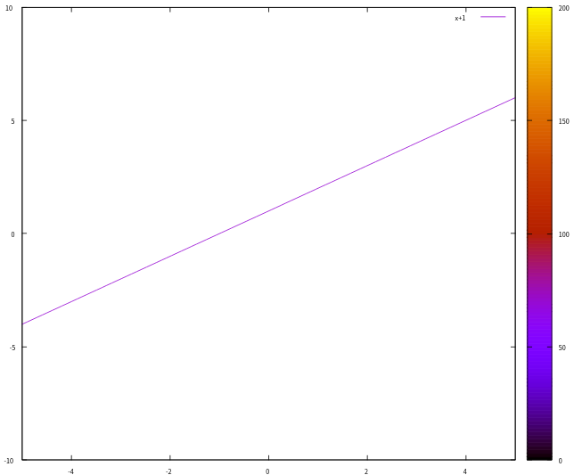
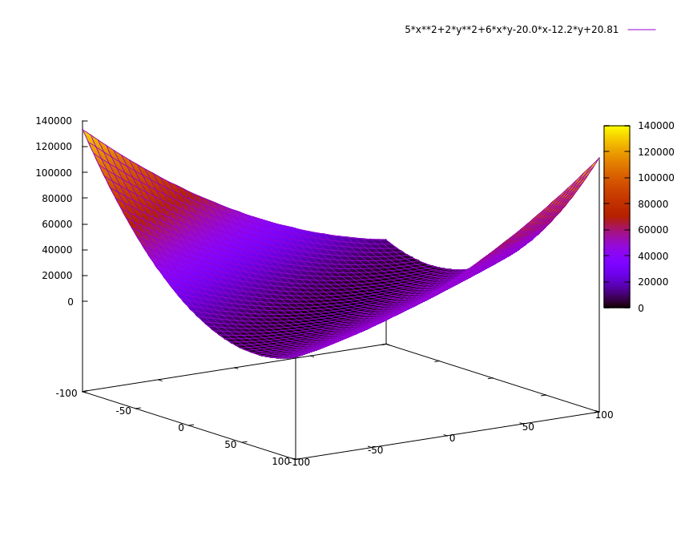
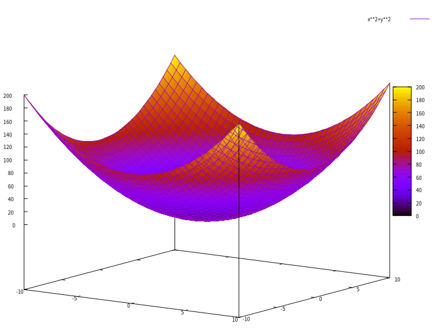
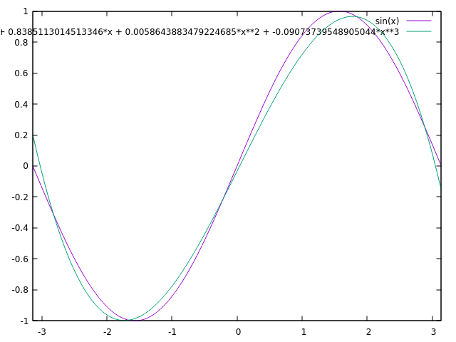

# 1. 基本思想

##  1.1 问题数学描述

有一组样本数据 ,假定为 $n$ 组， 如样本集1-1所示。

```python
x = [1.0, 2.0, 3.0, 4.0, 5.0, 6.0, 7.0, 8.0, 9.0 , 10.0]
y = [2.0, 4.1, 6.3, 7.9, 9.8, 11.5, 14.3, 16.6, 18.1, 21]
```

<div align='center'><b>样本集 1-1</b></div>

即：
$$
x_1 = 1.0,  x_2=2.0,...\\
y_1 = 2.0, y_2 = 4.1,....
$$
 需要推断一个函数，能够满足这一组样本值的特征，这个推断的过程叫做**机器学习**。

从 $[x, y]$ 的散点图来看，感觉是个一元一次方程（即采用了**线性模型**），如图 1所示。



<div align='center'><b>图1 二维线性函数图像</b></div>

假定图1 中的二维线性函数为公式 1-1：
$$
y=wx+b \tag {1-1}
$$
只要能计算出公式1-1 中的 w, b，那么就得到了这个函数，同时从数据分布来看，公式（1-1）为一条直线，对于某个给定的值$x_i$，计算出的值 $y'_i$ 跟样本集中对应的实际值 $y_i$ 是有误差的 。通常通过均方差（**最小二乘法**）来评价这种误差，如公式 1-2 所示。
$$
loss = \sum^{n}_{i=1}(y'_i-y_i)^2\tag {1-2}
$$
公式（1-2）在机器学习中称之为**损失函数**。需要求解的就是公式1-1中的参数组合，如公式1-3所示。
$$
[w, b]\tag {1-3}
$$
使得公式（1-2）中的函数值 $loss$ 达到其最小值。为了便于说明问题，将公式（1-1）代入公式（1-2），如公式1-4 所示。
$$
\begin{align}
loss &= \sum^{n}_{i=1}(y'_i-y_i)^2\\
&=\sum^{n}_{i=1}(wx_i+b-y_i)^2
\tag {1-4}
\end{align}
$$
公式（1-4）中，$n,x_i, y_i$ 都是由样本集决定的，即为已知参数。$w, b$ 为未知参数。在样本集1-1 中 n=10。

##  1.2 简化计算

为了简化问题方便推导，只使用样本集1-1中的 2个样本值，即 $n = 2$，在公式（1-4）中代入样本数据，计算 $loss$ 的值，如公式1-5所示。 
$$
\begin{align}
loss &= (w\times1.0 + b -2.0)^2+(w\times2.0 + b -4.1)^2\\
&=(w+b-2)^2+(2w+b-4.1)^2\\
&=(推导省略...）\\
&=10w^2+4b^2+12wb-40.08w-24.4b+41.62
\end{align}\tag{1-5}
$$
问题转化为求公式（1-5）这个函数的最小值了，将公式（1-5）中的$loss$ 换成 $z$,  $w,b$分别换成 $x, y$,（只是为了方便理解而已，数学函数中的变量一般为x,y, z），如公式1-6所示。
$$
z=10x^2+4y^2+12xy-40.08x-24.4y+41.62\tag{1-6}
$$
目前需要求公式（1-6）的函数最小值。公式（1-6）函数达到其最小值时其自变量 $x,y$ 的值，即公式（1-5）中的 $w, b$ 的值，就是符合2个样本值（$n=2$）的拟合函数的待定系数。公式（1-6）中函数的三维图像如图2所示。



<div align='center'><b>图 2 函数三维图像</b></div>

# 2. 梯度下降法

##  2.1 导数含义

公式（1-5）求解的过程中，引入了**梯度下降法**的思想，下面通过例子予以说明。公式（1-4）是一个关于 $w, b$ 的二元一次方程，如公式2-1所示。
$$
\begin{align}
loss &=\sum^{n}_{i=1}(wx_i+b-y_i)^2
\tag {2-1}
\end{align}
$$
对于给定的样本集，$n, x_i,y_i$ 都是已知的参数，$w,b $ 是自变量， $loss$ 是关于 $w,b$ 的函数。

梯度下降法的基本思想是沿着函数斜率下降的方向前进，直到到达斜率为 $0$ 的点，则该点就是函数的最小值点，前提是函数存在最小值。那么什么是斜率呢？斜率就是函数对自变量进行求导，例如，对于一元（元，即自变量的个数）二次（二次，即函数的最高次幂）函数 $f(x)=x^2$ ，对于函数曲线上的任何一个点 $x$ , 此处的斜率为 $f(x)$ 对 $x$ 求导，如公式 2-2 所示。 
$$
\frac{df(x)}{dx} = \frac{d(x^2)}{dx} = 2x \tag {2-2}
$$
以此类推，对于二元二次函数 $f(x, y)=x^2 + y^2$, 则是求偏导。$f(x,y)$是一个三维空间的曲面，如图 3 所示。



<div align='center'><b>图 3 函数 $f(x, y)=x^2 + y^2$的三维图像</b></div>

偏导就是在曲面上某个点的切面和坐标轴所在面的交叉线方向的斜率，例如，在 $[x,y, z]$ 点对自变量 $x$ 求偏导，就是函数的曲面上该点的切面与 $z$ 轴和 $x$ 轴形成的平面的交叉线的斜率。由于函数曲面的切面上有很多方向，偏导就是指定了某一个方向。

##  2.2 求导

公式（2-1）对自变量 $w$ 求导，如公式 2-3 所示。
$$
\begin{align}
\frac{d(loss)}{dw} &=\frac{d[\sum^{n}_{i=1}(wx_i+b-y_i)^2]}{dw}\\
&=\sum^{n}_{i=1}\frac{d[(wx_i+b-y_i)^2]}{dw}\\
&= 2\sum_{i=1}^n (wx_i + b - y_i) \cdot x_i\\
\tag 5
\end{align} \tag {2-3}
$$

公式（2-1）对自变量 $b$ 求导，如公式 2-4 所示。
$$
\begin{align}
\frac{d(loss)}{db} &=\frac{d[\sum^{n}_{i=1}(wx_i+b-y_i)^2]}{db}\\
&=\sum^{n}_{i=1}\frac{d[(wx_i+b-y_i)^2]}{db}\\
&=2\sum^{n}_{i=1}(wx_i + b - y_i)
\end{align} \tag {2-4}
$$

# 3. 实践

在掌握以上理论的基础上，接下来将结合函数拟合、梯度下降法进行时间。

以 pytorch 官网 https://pytorch.org/tutorials/beginner/pytorch_with_examples.html 的 $sin(x)$ 函数拟合为例，进行实践。代码段详见 **[grand.py](./py/pytorch/grand.py)**。

##  3.1 样本数据

```python
x = np.linspace(-math.pi, math.pi, 2000)
y = np.sin(x)
```

x, y 为 2000组样本数据，作为进行函数拟合的输入

##  3.2 目标函数

采用的目标函数为

```sh
y_pred = a + b * x + c * x ** 2 + d * x ** 3
```

如公式（3-1）所示。
$$
y=a + bx+cx^2+dx^3\tag {3-1}
$$
对于任意一个 $x_i$, 按照拟合函数计算的函数值为 $y'$, 记为 $y'$ 是为了和样本数据 $y_i$ 进行区别，如公式（3-2）所示。
$$
y'=a+bx_i+cx_i^2+dx_i^3\tag {3-2}
$$


##  3.3 损失函数

将均方差函数作为损失函数  $loss$， 即

```sh
 loss = np.square(y_pred - y).sum()
```

如公式（3-3）所示。
$$
\begin{align}
loss&=\sum_{i=0}^{2000}{(y'-y_i)^2}\\
&=\sum_{i=0}^{2000}{(a+bx_i+cx_i^2+dx_i^3-y_i)^2}
\end{align} \tag {3-3}
$$
其中 $a, b, c, d$ 为未知的参数, $x_i, y_i$ 为样本数据， 当 $loss$ 达到其最小值时的 $a, b, c, d$ 即为最佳的参数，于是问题转化为求公式（3-3）的最小值。

##  3.4 求梯度

###  3.4.1 多项式求导数的一般性规律

为简化后面的计算，首先计算 $f(a,b) = (a+bx_i-y_i)^2$ 分别对 $a, b$  求偏导，寻找一般性规律， 如公式（3-4）所示。
$$
\begin{align}
f(a,b)&=(a+bx_i-y_i)^2\\&=a^2+(bx_i-y_i)^2+2a(bx_i-y_i)\\
&=a^2+b^2x_i^2+y_i^2-2bx_iy_i+2abx_i-2ay_i\\
&=a^2+b^2x_i^2+y_i^2+2abx_i-2bx_iy_i-2ay_i\tag{3-4}
\end{align}
$$
接下来分别求函数$f(a,b)$ 对自变量 $a, b$ 的偏导，对 $a$ 求偏导， $b,x_i, y_i$ 均为常数（常数的导数为 0 ），如公式（3-5）所示。
$$
\begin{align}
\frac{\partial{f(a,b)}}{\partial{a}}&=\frac{\partial{(a^2+b^2x_i^2+y_i^2+2abx_i-2bx_iy_i-2ay_i)}}{\partial{a}}\\
&=2a+2bx_i-2y_i\\
&=2(a+bx_i-y_i)\tag{3-5}
\end{align}
$$
对 $b$ 求偏导， $a,x_i, y_i$ 均为常数（常数的导数为 0 ），如公式（3-6）所示。
$$
\begin{align}
\frac{\partial{f(a,b)}}{\partial{b}}&=\frac{\partial{(a^2+b^2x_i^2+y_i^2+2abx_i-2bx_iy_i-2ay_i)}}{\partial{b}}\\
&=2bx_i^2+2ax_i-2x_iy_i\\
&=2x_i(a+bx_i-y_i)\tag{3-6}
\end{align}
$$
综合公式（3-4）、（3-5）、（3-6），可以得到公式（3-7）和公式（3-8）。
$$
\begin{align}
\frac{\partial{[(a+bx_i-y_i)^2]}}{\partial{a}}=2(a+bx_i-y_i)\tag{3-7}
\end{align}
$$

$$
\begin{align}
\frac{\partial{[(a+bx_i-y_i)^2]}}{\partial{b}}=2x_i(a+bx_i-y_i)\tag{3-8}
\end{align}
$$

从公式（3-4）、（3-5）中寻找一般性规律（这个数据学上是可以推导出来的，感兴趣的可以一步一步推导），依次类推，可以得到公式 3-9。
$$
\begin{align}
\frac{\partial{[(a+bx_i+cx_i^2-y_i)^2]}}{\partial{c}}=2x_i^2(a+bx_i-y_i)\tag{3-9}
\end{align}
$$


###  3.4.2 求导公式

导数公式（可导函数和的导数等于各个函数分别求导的和），即：
$$
[f(x)+g(x)]'=f'(x)+g'(x) \tag{3-10}
$$

###  3.4.3 求梯度

```python
grad_a = grad_y_pred.sum()
```

含义为求函数 $loss$ 对 $a$ 的偏导（将 $b, c, d$ 都看作是常数），求解 $loss$ 对 $a$ 的偏导，利用公式（3-7）的一般性规律以及公式（3-10），可以得到公式 3-11。
$$
\begin{align}
grad\_a=\frac{\partial{loss}}{\partial{a}}
&=\frac{\partial{\sum_{i=0}^{2000}{(a+bx_i+cx_i^2+dx_i^3-y_i)^2}}}{\partial{a}}\\
&=\sum_{i=0}^{2000}\frac{\partial{(a+bx_i+cx_i^2+dx_i^3-y_i)^2}}{\partial{a}}\\
&=\sum_{i=0}^{2000}2(a+bx_i+cx_i^2+dx_i^3-y_i)\\
&=2\sum_{i=0}^{2000}a+bx_i+cx_i^2+dx_i^3-y_i\\
\end{align} \tag {3-11}
$$
将公式（3-2）代入公式 3-11，得到公式 3-12。
$$
\begin{align}
grad\_a=\frac{\partial{loss}}{\partial{a}}

&=2\sum_{i=0}^{2000}(y'-y_i)\\
\end{align} \tag {3-12}
$$

```python
grad_b = (grad_y_pred * x).sum()
```

即求函数 $loss$ 对 $b$ 的偏导（将 $a, c, d$ 都看作是常数），利用公式（3-7）、（3-8）、（3-9）的一般性规律以及公式（3-10），可以得到公式 3-13。
$$
\begin{align}
grad\_b=\frac{\partial{loss}}{\partial{b}}
&=\frac{\partial{\sum_{i=0}^{2000}{(a+bx_i+cx_i^2+dx_i^3-y_i)^2}}}{\partial{b}}\\
&=\sum_{i=0}^{2000}\frac{\partial{(a+bx_i+cx_i^2+dx_i^3-y_i)^2}}{\partial{b}}\\
&=\sum_{i=0}^{2000}2(a+bx_i+cx_i^2+dx_i^3-y_i)\\
&=2\sum_{i=0}^{2000}x_i(a+bx_i+cx_i^2+dx_i^3-y_i)\\
&=2\sum_{i=0}^{2000}x_i(y'-y_i)
\end{align} \tag {3-13}
$$
推而广之，

```python
grad_c = (grad_y_pred * x ** 2).sum()
grad_d = (grad_y_pred * x ** 3).sum()
```

即求函数 $loss$ 对自变量 $c,d$ 的偏导, 对  $c$ 求偏导， 如公式（3-14）所示。
$$
\begin{align}
grad\_c=\frac{\partial{loss}}{\partial{c}}
&=\frac{\partial{\sum_{i=0}^{2000}{(a+bx_i+cx_i^2+dx_i^3-y_i)^2}}}{\partial{c}}\\
&=2\sum_{i=0}^{2000}x_i^2(y'-y_i)
\end{align} \tag {3-14}
$$
对 $d$ 求偏导， 如公式（3-15）所示。
$$
\begin{align}
grad\_d=\frac{\partial{loss}}{\partial{d}}
&=\frac{\partial{\sum_{i=0}^{2000}{(a+bx_i+cx_i^2+dx_i^3-y_i)^2}}}{\partial{d}}\\
&=2\sum_{i=0}^{2000}x_i^3(y'-y_i)
\end{align} \tag {3-15}
$$

##  3.5 梯度下降法

对于一个类似于图 3 的凹函数（凹函数是一个数学概念，其形状类似于一个小山谷），沿着梯度下降的方向前进（沿着山坡的斜坡向下走），总能找到一个局部或全局的最低点（山谷谷底）。

最初的 $a,b,c,d$ 的值是随意给的，见代码

```python
a = np.random.randn()
b = np.random.randn()
c = np.random.randn()
d = np.random.randn()
```

对应的物理意义是公式（3-3）中的损失函数 $loss$ 的曲面上随机地找了一个点，这个点的坐标为 $[a_0,b_0,c_0,d_0]$。

```python
learning_rate = 1e-6
```

即  $learning\_rate=10^{-6}$

```python
a -= learning_rate * grad_a
b -= learning_rate * grad_b
c -= learning_rate * grad_c
d -= learning_rate * grad_d
```

即表示步进至下一个点$[a_1,b_1, c_1, d_1]$, 其中
$$
\begin{align}
a_1&=a_0-learning\_rate * grad\_a\\
&=a_0-learning\_rate \times 2\sum_{i=0}^{2000}(y'-y_i)\\
&=a_0-10^{-6} \times 2\sum_{i=0}^{2000}(a_0+b_0x_i+c_0x_i^2+d_0x_i^3-y_i)\tag {3-16}
\end{align}
$$
公式（3-16）中的所有变量均有值，$a_1$是可以求出来的，同理：
$$
\begin{align}
b_1&=b_0-10^{-6} \times 2\sum_{i=0}^{2000}x_i(a_0+b_0x_i+c_0x_i^2+d_0x_i^3-y_i)\tag {3-17}\\
c_1&=c_0-10^{-6} \times 2\sum_{i=0}^{2000}x_i^2(a_0+b_0x_i+c_0x_i^2+d_0x_i^3-y_i)\tag {3-18}\\
d_1&=d_0-10^{-6} \times 2\sum_{i=0}^{2000}x_i^3(a_0+b_0x_i+c_0x_i^2+d_0x_i^3-y_i)\tag {3-19}\\
\end{align}
$$
计算出下一个点的坐标 $[a_1, b_1, c_1, d_1]$ 后，再计算损失函数 $loss$ 的值（计算损失函数的值称为**前向传播**），依次类推，直到到达损失函数 $loss$ 对各个变量的导数为0 （到达了山谷谷底）。

##  3.6 运行结果

运行程序，该程序中一共迭代了 2000 次，可以看到 loss呈逐步减小的趋势，最终得到了拟合的函数

```sh
Result: y = -0.016946000556052058 + 0.8039868283288965*x + 0.00292346707858539*x**2 + -0.08582658982914065*x**3
```

对函数进行图形化描述，可以看到，其跟 $sin(x)$ 在给定的区间上是比较接近的，如图 4 所示。



<center>图4  拟合曲线对比示意图</center>

图 4 中， 粉色的曲线为 sin(x) 的函数， 绿色的是通过参数拟合生成的曲线，可以看到二者是比较接近的。

# 4. 重要的概念

## 4.1 梯度下降法

梯度下降法是一种用于寻找函数最小值的迭代优化算法。它的核心思想是：

1. **梯度方向**：函数在某一点的梯度指向该点函数值增长最快的方向
2. **负梯度方向**：梯度的反方向指向函数值下降最快的方向
3. **学习率**：控制每次更新的步长大小
4. **迭代更新**：重复计算梯度并更新参数，直到收敛

梯度下降法的数学表示为：
$$
\theta_{t+1} = \theta_t - \eta \cdot \nabla_\theta J(\theta)
$$
其中：

- $\theta$ 是待优化的参数
- $\eta$ 是学习率
- $\nabla_\theta J(\theta)$ 是损失函数 $J$ 关于参数 $\theta$ 的梯度

## 4.2 目标函数

目标函数（也称为假设函数或模型函数）是我们试图学习的函数形式。在本文的例子中：

- 简单线性回归：$y = wx + b$
- 多项式回归：$y = a + bx + cx^2 + dx^3$

目标函数的选择取决于我们对数据关系的先验知识。在深度学习中，目标函数通常是复杂的神经网络结构。

## 4.3 损失函数

损失函数（也称为代价函数或误差函数）衡量模型预测值与真实值之间的差异。常见的损失函数包括：

1. **均方误差（MSE）**：均方差一般用于回归问题，公式如下所示。
   $$
   loss = \sum (y' - y)^2
   $$

2. **交叉熵损失**：用于分类问题，二分类交叉熵（Binary Cross-Entropy, BCE）公式如下所示：
   $$
   BCE = - (1/n) * Σ_{i=1}^{n} [ y_i * log(ŷ_i) + (1 - y_i) * log(1 - ŷ_i) ]
   $$

损失函数的选择取决于具体问题和数据类型。

## 4.4 前向传播

前向传播是指数据从输入层经过网络各层计算，最终得到输出的过程。具体步骤：

1. **输入层**：接收原始数据
2. **隐藏层**：逐层进行线性变换和非线性激活
3. **输出层**：得到最终预测结果
4. **损失计算**：比较预测结果与真实标签，计算损失值

在本文的简单例子中，前向传播就是计算：
$$
y′=a+bx+cx2+dx3*y*′=*a*+*b**x*+*c**x*2+*d**x*3
$$
然后计算损失：

loss=∑(y′−y)2*l**oss*=∑(*y*′−*y*)2

## 4.5 后向传播

反向传播是梯度下降法中计算梯度的有效算法。它利用链式法则，从输出层向输入层反向传播误差，计算每个参数对总损失的贡献。

反向传播的步骤：

1. **前向传播**：计算预测值和损失
2. **计算输出层梯度**：$\frac{\partial loss}{\partial y'}$
3. **反向传播梯度**：利用链式法则计算每层的梯度
4. **更新参数**：$\theta \leftarrow \theta - \eta \cdot \frac{\partial loss}{\partial \theta}$

在本文的例子中，我们手动推导了每个参数的梯度：

- $\frac{\partial loss}{\partial a} = 2\sum (y' - y)$
- $\frac{\partial loss}{\partial b} = 2\sum x(y' - y)$
- $\frac{\partial loss}{\partial c} = 2\sum x^2(y' - y)$
- $\frac{\partial loss}{\partial d} = 2\sum x^3(y' - y)$

## 4.6 学习率的重要性

学习率 $\eta$ 是梯度下降法中最重要的超参数之一：

- **学习率过大**：可能导致振荡甚至发散，无法收敛
- **学习率过小**：收敛速度慢，可能陷入局部最小值
- **自适应学习率**：实践中常使用 Adam、RMSprop 等自适应优化算法

## 4.7 批量大小的影响

在实际应用中，我们通常使用批量梯度下降：

1. **批量梯度下降**：使用全部数据计算梯度，收敛稳定但计算慢
2. **随机梯度下降**：每次使用一个样本，收敛快但不稳定
3. **小批量梯度下降**：折中方案，通常使用 32、64、128 等批量大小

## 4.8 正则化

为了防止过拟合，我们常在损失函数中加入正则化项：

1. **L1 正则化（Lasso）**：$\lambda \sum |\theta_i|$
2. **L2 正则化（Ridge）**：$\frac{\lambda}{2} \sum \theta_i^2$
3. **弹性网络**：L1 和 L2 正则化的结合

这些概念构成了现代深度学习的基础。虽然本文的例子相对简单，但其中包含的思想和方法可以推广到更复杂的神经网络模型中。

在实际应用中，我们通常使用成熟的深度学习框架（如 PyTorch、TensorFlow）来处理这些复杂的计算，但理解其背后的数学原理对于设计有效的模型和调试训练过程至关重要。
