<div align='center'><h1>Python in Action</h1></div>

## 1. 概述

### 1.1 语言与环境搭建

Python是一种高级、解释型、通用的编程语言，由吉多·范罗苏姆（Guido van Rossum，荷兰籍计算机科学家）于1991年首次发布。它以其清晰、易读的语法和强大的功能而闻名，设计哲学强调代码的可读性和简洁性，尤其适合初学者入门。Python支持多种编程范式，包括面向对象、命令式、函数式和过程式编程，拥有一个庞大而活跃的社区以及丰富的标准库和第三方库，使其在Web开发、数据分析、人工智能、科学计算、自动化运维等众多领域都有广泛应用。

要开始学习`Python`，首先需要在计算机上安装Python解释器。访问 [Python官方网站](!https://www.python.org/) 的下载页面，选择与您的操作系统（Windows、macOS或Linux）相对应的最新稳定版本进行下载。对于`Windows`用户，在安装过程中务必勾选"Add Python to PATH"选项，这将允许您在系统的任何命令行窗口中直接运行Python。

Windows 下载 python 3.12.3, https://www.python.org/downloads/release/python-3123/ , [Windows installer (64-bit)](https://www.python.org/ftp/python/3.12.3/python-3.12.3-amd64.exe)

安装完成后，可以通过打开命令行终端（如`Windows`的命令提示符或`PowerShell`，`macOS`/Linux的终端）并输入

```sh
python --version
python3 --version
```

验证安装是否成功。该命令将返回已安装的Python版本号。

环境配置的另一个重要环节是选择和使用合适的开发工具。对于初学者，可以从简单的代码编辑器开始，例如`Visual Studio Code`（`VS Code`）或 `PyCharm Community Edition`。 

VS Code是一款轻量级但功能强大的编辑器，通过安装 `Python`扩展可以获得代码高亮、智能提示、调试等支持。`PyCharm` 则是专为Python开发的集成开发环境（`IDE`, Integrated Development Environment），提供了更全面的项目管理、代码分析和调试工具。

配置开发环境通常包括设置Python解释器路径和安装必要的插件。

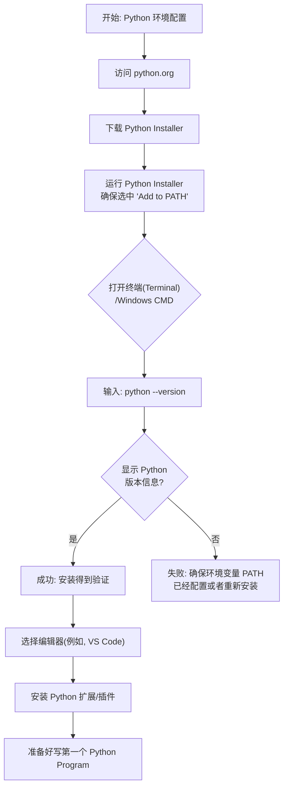

完成环境搭建后，就可以编写并运行第一个Python程序了。传统上，我们从一个简单的"Hello,
World!"程序开始。

打开您选择的编辑器，创建一个新文件，将其保存为"hello.py"（.py是Python源文件的标准扩展名）。在文件中输入以下代码：print("Hello,World!")。保存文件后，在终端中导航到该文件所在的目录，输入命令

 ```sh
 python hello.py
 ```

并按下回车。如果一切正常，您将在终端屏幕上看到输出的"Hello,World!"字样。这个简单的过程验证了您的Python环境工作正常，并完成了从编写代码到执行输出的完整流程。

通过这个起点，您将正式踏上Python编程的学习之旅。

### 1.2 基本语法与数据类型

在Python中，变量是存储数据的容器，可以将其理解为数据的标签或名称。Python的变量命名需要遵循一定的规则：变量名由字母、数字和下划线组成，但不能以数字开头；变量名区分大小写，例如`age`和`Age`是两个不同的变量；同时，应避免使用Python内置的关键字（如`if`、`for`、`while`等）作为变量名。良好的命名习惯是使用描述性的单词，并使用下划线分隔以提高可读性，例如`student_name`或`total_count`。

Python拥有多种基本数据类型，用于表示不同种类的数据。

**（1）`int`**。整数（int）用于表示没有小数部分的数字，如`10`或`-5`；

**（2）`float`**。浮点数（float）用于表示带小数点的数字，如`3.14`或`2.0`；

**（3）`str`**。字符串（str）用于表示文本信息，由单引号、双引号或三引号包围，如`"Hello"`或`'Python'`；

**（4）`bool`**。布尔型（`bool`）只有两个值：`True`和`False`，常用于逻辑判断。我们可以使用`type()`函数来查看任何变量或值的数据类型，例如`type(42)`会返回`<class'int'>`。

**（5）运算符**。运算符用于对数据进行各种运算。

1）算术运算符。算术运算符包括加（+）、减（-）、乘（\*）、除（/）、取模（%）和幂运算（\*\*）。

2）比较运算符。比较运算符如等于（==）、不等于（!=）、大于（\>）、小于（\<）等，它们返回布尔值。

3）赋值运算符。赋值运算符（=）用于给变量赋值，而复合赋值运算符如（+=）则结合了运算和赋值。

4）逻辑运算符。逻辑运算符包括与（and）、或（or）、非（not），用于组合多个布尔条件。

**（6）表达式**。表达式则是值、变量和运算符的组合，Python解释器可以计算表达式并得到一个结果。

输入与输出是程序与用户交互的基础。使用`input()`函数可以获取用户的键盘输入，该函数会等待用户输入并返回一个字符串。例如，`name= input("请输入你的名字:")`会将用户输入的内容存入变量`name`。使用`print()`函数可以将内容输出到屏幕，它可以打印字符串、变量值以及用逗号分隔的多个项目。例如，`print("你好，",name)`会输出组合后的信息。理解这些基本语法和数据类型是编写任何Python程序的第一步。

```python
# 控制台会显示”请输入你的名字:“，然后等待用户的输入，用户输入信息后按回车键
name= input("请输入你的名字:")
print("你好，",name)
```

接下来展示一个算术运算程序

```python
my_number = 10
print(type(my_number))
result = my_number + 5 * 2
if result > 15:
	print('Result is large!')
else:
	print('Result is small.')
```

执行过程如下。

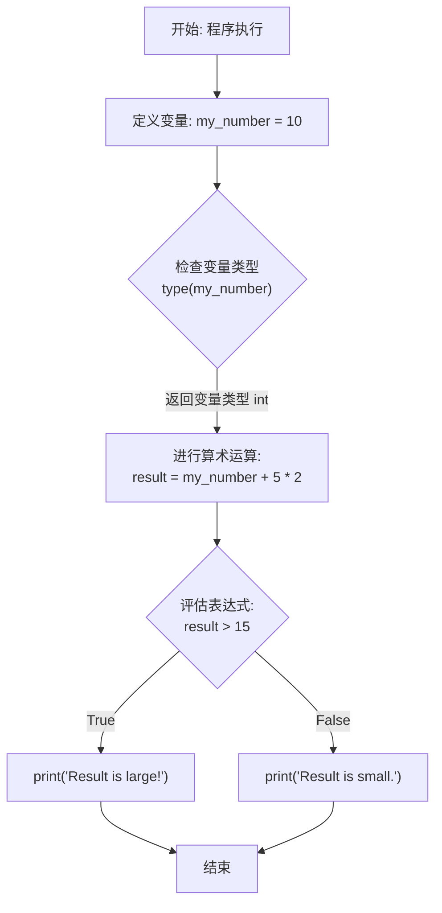

上图展示了一个简单的数据处理流程：程序从定义变量开始，随后检查其数据类型，接着进行算术运算和逻辑比较，最后根据比较结果打印不同的信息。这个过程清晰地体现了变量、数据类型、运算符和输入输出函数的协同工作。

### 1.3 流程控制语句

流程控制语句是编程语言中用于控制程序执行顺序的结构。在`Python`中，流程控制主要包括条件判断和循环，它们使得程序能够根据不同的情况执行不同的代码块，或者重复执行特定的任务，从而让程序逻辑更加灵活和强大。

**（1）条件判断**。条件判断语句允许程序根据给定的条件决定执行哪部分代码。`Python`中使用`if`、`elif` 和 `else`关键字来实现条件判断。其基本结构是：首先用`if`语句检查一个条件，如果该条件为真（True），则执行其下方的代码块；如果为假（False），则可以接着使用一个或多个`elif`（`else if`的缩写）语句检查其他条件；最后，可以使用`else`语句提供一个默认的执行路径，当所有`if`和`elif`的条件都不满足时，程序将执行`else`块中的代码。每个条件判断后的代码块需要通过缩进来定义，这是Python语法的一个重要特点。

通过嵌套使用if语句，可以构建更复杂的多分支逻辑判断。

**（2）循环语句**。循环语句用于重复执行一段代码。Python提供了两种主要的循环结构：`while`循环和`for`循环。while循环会在给定条件为真时反复执行其代码块。程序员需要确保循环条件最终会变为假，否则可能陷入无限循环。for循环则常用于遍历一个可迭代对象（如列表、字符串、元组、字典或range对象）中的每个元素，并对每个元素执行相同的操作。

与条件语句类似，循环体也是通过缩进来定义的。在循环内部，可以使用break语句立即终止整个循环，或者使用continue语句跳过当前迭代的剩余代码，直接进入下一次循环。这些控制语句增强了循环的灵活性。

为了更直观地理解程序流程，我们可以用流程图来展示一个包含条件判断和循环的简单逻辑。例如，一个程序需要检查用户输入的数字是否是正数，如果是则累加，直到累加和超过100为止。代码如下

```python
sum_total = 0
while sum_total <= 100:
    # 获取用户输入的数字
    user_input = input("请输入一个正数（当前总和：{}）: ".format(sum_total))
    try:
        # 尝试将输入转换为数字
        num = float(user_input)
        # 检查 num > 0 吗？
        if num > 0:
            # sum = sum + num
            sum_total = sum_total + num
            print("已添加 {}，当前总和：{}".format(num, sum_total))
        else:
            # 输出 "请输入正数"
            print("请输入正数！")
            
    except ValueError:
        print("输入无效，请输入一个数字！")
# 输出最终的 sum
print("\n最终的总和是：{}".format(sum_total))
```


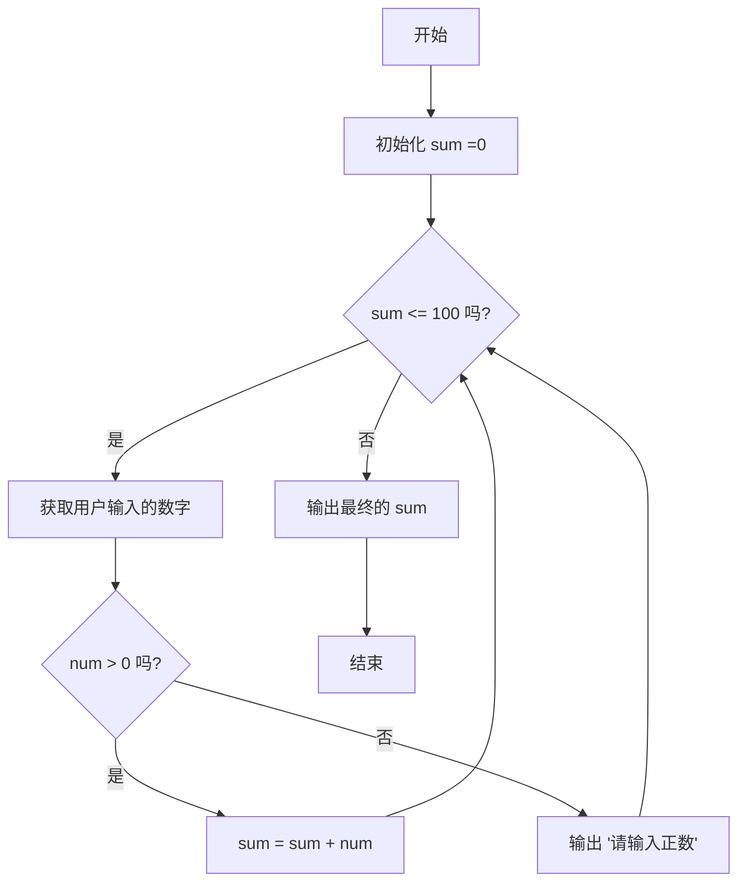

上图描述了一个典型流程：程序从初始化累加和开始，然后进入一个循环判断。只要累加和未超过100，就会持续要求用户输入。每次获得输入后，会先进行条件判断，检查数字是否为正数。如果是正数，则将其加入累加和；如果不是，则提示用户输入正数，然后不进行累加直接进入下一轮循环询问。当累加和超过100时，循环条件不再满足，程序退出循环，打印最终结果并结束。这个例子综合展示了while循环、if条件判断以及用户输入输出的结合使用。

掌握流程控制是编写实用程序的基础。通过组合条件判断和循环，可以解决许多实际问题，例如数据过滤、重复任务自动化等。建议学习者通过编写具体的实例来加深理解，例如编写一个判断成绩等级的程序或一个打印九九乘法表的程序，在实践中巩固对流程控制概念和语法的掌握。

## 2. 数据结构

### 2.1 列表（List）

列表是Python中最基本、最常用的数据结构之一。它是一个有序的可变集合，可以容纳任意数量、任意类型的元素，并且允许重复。列表在Python编程中无处不在，无论是存储数据、处理序列还是构建复杂数据结构，都离不开列表的参与。
列表的创建非常简单，最常见的方式是使用方括号`[]`，并在其中用逗号分隔各个元素。例如，

```python
my_list= [1, 2, 3,"hello"]
```

就创建了一个包含整数和字符串的混合列表。此外，也可以使用list()构造函数将其他可迭代对象（如字符串、元组）转换为列表。对列表的基本操作主要包括访问、修改、添加和删除元素。列表中的元素通过索引（下标）来访问，索引从0开始。例如，list[0]访问第一个元素。Python支持负索引，list[-1]表示最后一个元素。要修改列表中的元素，可以直接通过索引赋值，如list[1]= "new value"。

```python
# 访问第1个元素
my_list[0]
# 给第2个元素赋值， 本来 my_list[1] 的值是 2, 现在变成了 "new value"
my_list[1]= "new value"
# 访问最后一个元素, "hello"
my_list[-1]
```

向列表添加元素有两种常用方法：`append`()方法在列表末尾添加单个元素；`insert`()方法在指定索引位置插入元素。删除元素可以使用`del`语句、`pop`()方法（移除并返回指定索引的元素，默认为最后一个）或remove()方法（移除第一个匹配到的指定值）。

列表切片是另一个强大功能，它允许我们获取列表的一个子集。语法为`list[start:stop:step]`。start是起始索引（包含），stop是结束索引（不包含），step是步长。省略start则从开头开始，省略stop则到末尾结束。例如，list[1:4]获取索引1到3的元素，list[::-1]则返回一个反向的列表副本。
列表推导式提供了一种更简洁、更高效的方式来创建或转换列表。其基本语法为


为了帮助理解列表的基本操作流程，下面这个流程图展示了向列表中添加一个新元素的典型决策过程。

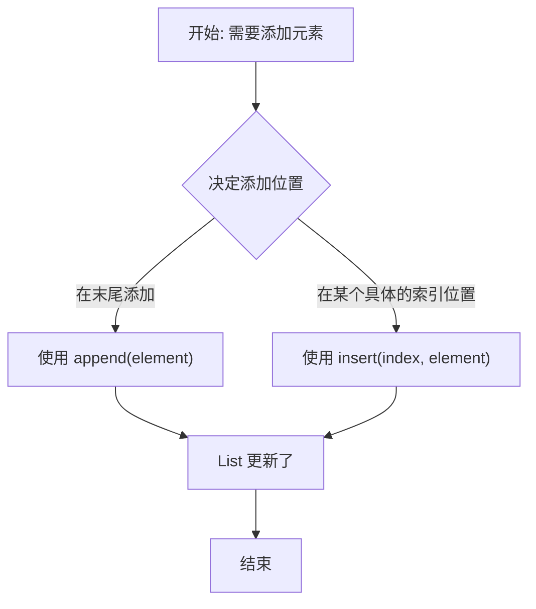

掌握列表的创建和基本操作是学习Python数据结构的第一步。列表的灵活性和丰富的内置方法使其成为处理有序数据集合的首选工具。在实际编程中，应熟练运用索引、切片和各种方法来高效地操作列表数据。

### 2.2 元组（Tuple）

元组（Tuple）是Python中一种重要的不可变序列数据结构，用于存储一系列有序的元素。与列表（List）最大的区别在于，元组一旦创建，其内容就不能被修改、添加或删除。这种不可变性使得元组在某些场景下比列表更安全、更高效，例如作为字典的键或函数返回多个值时。

元组的创建非常简单，主要使用圆括号 `()`将元素括起来，元素之间用逗号分隔。值得注意的是，即使元组只包含一个元素，也需要在元素后面加上逗号，例如
`(5,)`，以区别于普通的括号运算表达式。实际上，逗号才是元组的关键标识符，圆括号在某些情况下可以省略，例如

````python
my_tuple = 1, 2, 3
````

同样创建了一个元组。由于元组是不可变的，其操作相比列表要少很多。主要支持的操作包括：索引访问、切片、连接（`+`）和重复（`\*`）。可以使用索引（从0开始）来获取元组中的特定元素，也可以使用切片来获取一个子元组。两个元组可以通过加号连接成一个新的元组，一个元组可以通过乘号重复多次生成新的元组。

元组的不可变性带来了显著的优势。首先，它保证了数据的安全，防止程序意外修改不应改变的数据集合。其次，由于内容固定，Python解释器可以对元组进行一些优化，使得其在内存占用和迭代速度上通常优于列表。因此，元组的典型应用场景包括：作为常量集合使用；作为字典的键（因为键必须是不可变类型）；函数需要返回多个值时，通常会打包成一个元组返回；在格式化字符串时，参数也常以元组形式传递。

理解元组的打包（Packing）与解包（Unpacking）机制非常重要。打包是指将多个值赋给一个元组变量。解包则是将元组中的元素分别赋给多个变量。例如，

```python
# 元组打包
coordinates= (10, 20)
# 元组解包
x, y = coordinates
```

这个特性让代码非常简洁，尤其在交换两个变量的值时，可以简单地写成
`a, b = b, a`。 下面通过一个流程图展示创建和使用元组的典型过程：

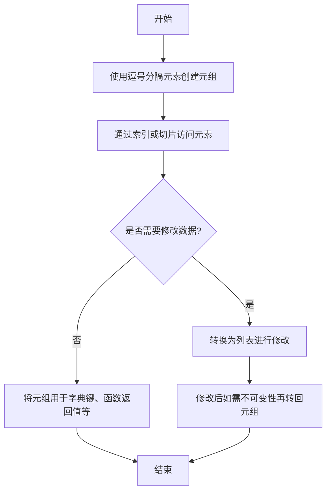
 在处理需要临时修改数据的场景时，可以先通过 `list()`函数将元组转换为列表，修改完成后再通过 `tuple()`函数转换回元组。

虽然元组本身不可变，但如果它包含可变元素（如列表），那么这些内部的可变对象是可以被修改的。这提醒我们，元组的不可变性是"浅"不可变。总而言之，元组是Python中用于表示固定数据集合的理想工具。它的不可变性既是限制也是优势，在确保数据完整性和提升性能方面扮演着关键角色。熟练掌握元组的创建、访问、打包与解包操作，是有效利用Python进行编程的基础之一。

### 2.3 字典（Dictionary）

字典（Dictionary）是Python中一种非常重要且灵活的数据结构，它用于存储键值对（Key-Value
Pair）的集合。与通过偏移位置（索引）访问元素的列表不同，字典通过唯一的键来访问对应的值。这种映射关系使得字典在需要快速查找、关联和存储非顺序数据的场景中非常高效。

字典的创建方式非常直观。最常用的方法是使用花括号{}，并在其中放置用逗号分隔的键值对，键和值之间用冒号分隔。例如，

```python
student= {"name": "Alice", "age": 20, "major": "Computer Science"}
```

就创建了一个包含学生信息的字典。也可以使用内置的`dict()`函数来创建字典，例如

```python
student= dict(name="Alice",age=20)
```

字典的键必须是不可变类型，如字符串、数字或元组，而值可以是任何Python对象，包括列表、另一个字典等。访问字典中的元素主要通过键来实现。使用方括号语法，如

```python
student["name"]
```

即可获取键"name"对应的值"Alice"。如果键不存在，这种访问方式会引发`KeyError` 异常。为了避免这种情况，可以使用`get()`方法，例如

```python
student.get("grade","N/A")
```

它会在键不存在时返回指定的默认值（这里是"N/A"），而不是抛出异常。字典提供了丰富的内置方法来管理其内容。`keys()`方法返回字典中所有键的视图，`values()`方法返回所有值的视图，而`items()`方法返回所有键值对的视图。这些视图是动态的，会反映字典的后续变化。要添加或修改元素，可以直接使用赋值语句，如

```python
student["grade"]="A"
```

update()方法可以将另一个字典或键值对序列合并到当前字典中。删除元素可以使用`del`语句、`pop(key)`方法（删除并返回指定键的值）或`popitem()`方法（删除并返回最后插入的键值对）。`clear()`方法则会清空整个字典。

字典推导式提供了一种优雅且高效的方式来创建新字典。其语法与列表推导式类似，但使用花括号并包含键值表达式。例如，`{x:x**2 for x in range(5)}`会生成一个映射数字到其平方的字典`{0: 0, 1:
1, 2: 4, 3: 9, 4: 16}`。推导式中也可以加入条件判断。

理解字典的底层工作原理有助于更有效地使用它。Python字典的实现基于哈希表（Hash Table），这是一种通过哈希函数将键映射到存储位置的数据结构，使得查找、插入和删除操作的平均时间复杂度接近O(1)。下图简要说明了使用键访问值的流程：

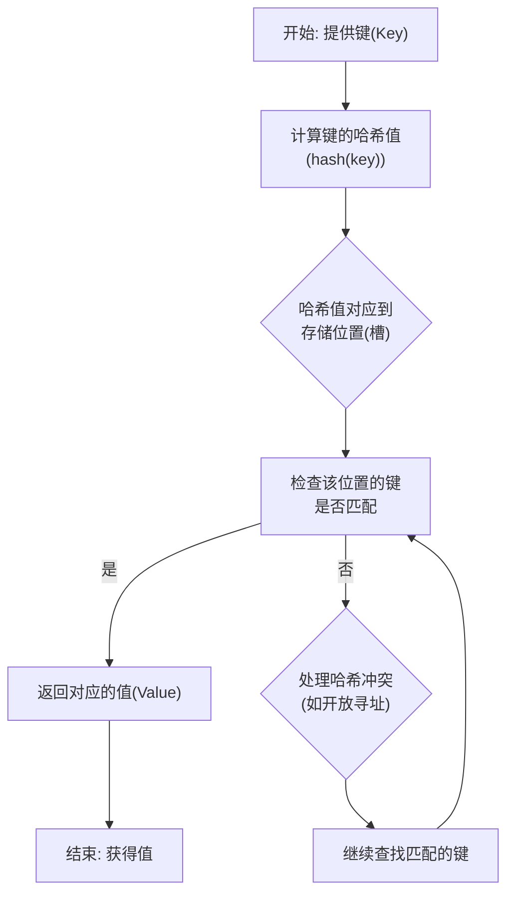

在实际应用中，字典的用途极为广泛。它可以作为轻量级的记录来存储对象属性，可以用于计数（例如统计单词频率），可以作为缓存（`Memoization`）来存储函数计算结果以提升性能，也是实现`JSON`数据格式在`Python`中自然表达的基础结构。掌握字典的操作和特性，是编写高效、清晰Python代码的关键一步。

### 2.4 集合（Set）

集合（Set）是Python中一种重要的内置数据结构，用于存储无序且不重复的元素集合。集合基于数学中的集合概念，支持并集、交集、差集等数学运算，在处理唯一性数据、成员关系测试和数据去重等场景中非常高效。

集合的创建非常简单，可以使用大括号{}或set()函数。需要注意的是，创建空集合必须使用set()，因为{}表示的是空字典。例如

```python
# 第 1 种创建结合的方法
my_set= {1, 2, 3}
# 第 2 种创建结合的方法
another_set = set([4, 5,6])
```

集合中的元素必须是不可变类型，如整数、浮点数、字符串或元组，因此列表或字典不能作为集合元素。集合本身是无序的，这意味着元素没有固定的位置，也不能通过索引访问。

集合的核心特性是元素的唯一性。当你向集合中添加已存在的元素时，操作不会产生任何效果。这使得集合成为数据去重的理想工具。例如，将一个包含重复项的列表转换为集合，重复项会自动被移除。

集合支持丰富的数学运算。并集（union）操作返回包含两个集合所有元素的集合，可以使用union()方法或\|运算符。交集（intersection）返回两个集合共有的元素，使用intersection()方法或&运算符。差集（difference）返回存在于第一个集合但不在第二个集合中的元素，使用difference()方法或-运算符。对称差集（symmetric_difference）返回仅存在于其中一个集合中的元素，使用symmetric_difference()方法或`^`运算符。这些操作不仅可以通过方法调用，也支持对应的运算符，使代码更加简洁。

此外，集合还提供了一系列实用的方法用于更新和测试。update()方法可以添加多个元素；add()方法添加单个元素；remove()和discard()方法用于移除元素，区别在于当元素不存在时，remove()会引发KeyError而discard()不会。pop()方法随机移除并返回一个元素。issubset()和issuperset()方法用于判断子集和超集关系。

为了更直观地理解集合的基本操作流程，例如检查成员、添加元素和进行运算，可以参考以下流程图。

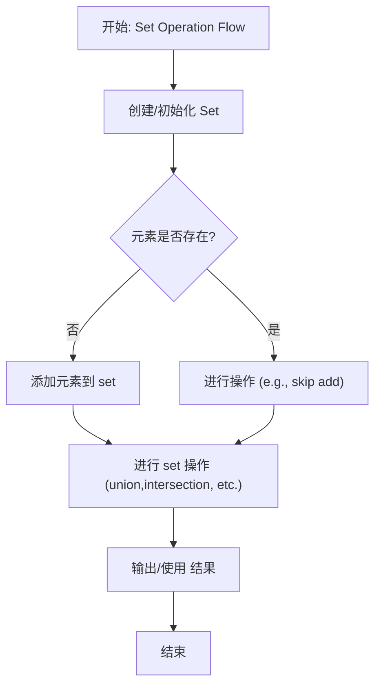

集合推导式提供了一种简洁创建集合的方式，其语法类似于列表推导式，但使用大括号。例如，

```python
{x**2 for x in range(10)}
```

会生成一个包含0到9平方的集合。这种写法在处理可迭代对象并需要去重时非常方便。在实际应用中，集合常用于快速成员测试（in运算符），其平均时间复杂度为O(1)，远快于列表的O(n)。它也常用于从序列中去除重复项，或找出两个数据集的差异与共同点。理解并熟练运用集合及其运算，能有效提升Python程序的效率和可读性。

## 3. 函数与模块

### 3.1 函数的定义与使用

函数是Python编程中实现代码复用和模块化的核心机制。一个函数是一段被命名的、可重复使用的代码块，它接受输入参数，执行特定任务，并可以返回一个结果。使用函数可以将复杂程序分解为多个小而专一的任务，从而提高代码的可读性、可维护性和可测试性。

在Python中，使用`def`关键字来定义函数，其基本语法结构为：`def函数名(参数列表):`，后面跟着一个缩进的代码块作为函数体。函数名应遵循标识符命名规则，通常使用小写字母和下划线组合以提高可读性。参数列表是函数接收外部数据的接口，可以是零个、一个或多个参数，参数之间用逗号分隔。函数体内部可以包含任意合法的Python语句。当函数需要向调用者返回数据时，使用`return`语句；如果函数没有`return`语句或`return`语句后没有跟表达式，则函数默认返回`None`。

函数的调用非常简单，通过函数名后跟圆括号即可，如果函数定义了参数，则需要在括号内传入相应的实际参数值。调用函数时，程序执行流程会跳转到函数定义处，执行完函数体内的所有语句或遇到`return`语句后，再返回到调用点继续执行。下面是一个简单的流程图，展示了函数定义与调用的基本过程：

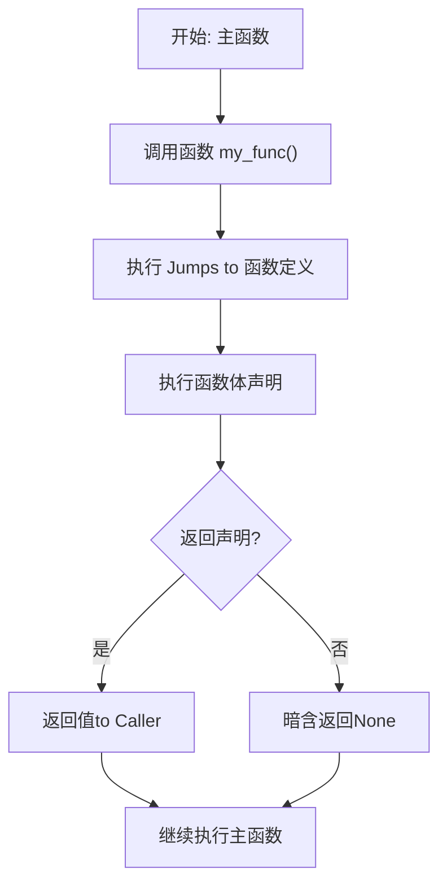

参数传递是函数使用的关键。Python中的参数传递本质上是"对象引用传递"。对于不可变类型（如整数、字符串、元组），在函数内部修改形参的值不会影响外部的实参。对于可变类型（如列表、字典），在函数内部通过方法修改形参所指向对象的内容，则会影响到外部的实参。

函数参数可以有多种形式：必备参数要求调用时必须以正确顺序传入；关键字参数允许调用时通过参数名指定值，无需关注顺序；默认参数在定义时为参数指定一个默认值，调用时可省略；不定长参数（`*args`用于接收任意数量的位置参数并打包成元组，`**kwargs`用于接收任意数量的关键字参数并打包成字典）提供了极大的灵活性。

函数的另一个重要概念是作用域。它定义了变量在程序中的可访问范围。Python有四种作用域：局部作用域（在函数内部定义）、嵌套作用域（在嵌套函数的外层函数中定义）、全局作用域（在模块顶层定义）和内置作用域（Python内置名称）。当在函数内部访问一个变量时，Python会按照 "局部-> 嵌套 -> 全局 ->内置" 的顺序进行查找，这被称为`LEGB`规则。理解作用域对于避免变量命名冲突和编写正确的程序至关重要。

### 3.2 模块与包

在Python中，模块和包是组织代码、实现代码复用的核心机制。一个模块就是一个包含Python定义和语句的.py文件，其文件名就是模块名。通过模块，你可以将相关的代码组织在一起，使项目结构更清晰，也便于在其他程序中重用。例如，你可以将一组数学计算函数保存在名为"math_utils.py"的文件中，这个文件就构成了一个模块。

要使用一个模块中的代码，你需要先将其导入。Python提供了几种导入方式。最基本的导入方式是使用`import`语句，例如`import math`。导入后，你可以使用点号`.`来访问模块内的属性，如`math.sqrt(4)`。如果你只需要模块中的特定部分，可以使用`from ... import ...`语句，例如`from math import sqrt`，这样可以直接使用`sqrt(4)`而无需前缀。你还可以使用`from math import *`来导入模块中的所有名称（通常不推荐，可能导致命名冲突）。

```python
from math import sqrt

a = math.sqrt(4)
print(a)
```

为了简化长模块名的引用，可以使用`as`关键字创建别名，如`import numpy as np`。
当多个模块组织在一起，就形成了包。包是一种用"带点号的模块名"来构造Python模块命名空间的方法。从文件系统来看，包就是一个包含了一个特殊文件`__init__.py`的目录。这个文件可以是空的，也可以包含包的初始化代码或定义`__all__`列表。包允许你将相关的模块分组，形成层次结构。例如，一个名为"graphics"的包可以包含"primitive"、"format"等子包，分别对应"graphics/primitive/"和"graphics/format/"目录，其下的模块可以通过`import graphics.primitive.line`这样的点分路径来导入。

Python的强大之处在于其丰富的标准库和第三方库生态。标准库是随Python解释器一同发布的一组模块，涵盖了文件处理、系统交互、网络通信、数据序列化等广泛领域，如os、 sys、 json、 datetime等。对于标准库未涵盖的功能，庞大的第三方库生态系统提供了解决方案。这些库通过Python包索引PyPI进行分发和管理。

管理第三方库的主要工具是pip。它是一个命令行工具，用于从PyPI下载和安装包（Windows 下安装了 Python 会自动安装 pip）。基本用法包括使用`pip install package_name`来安装最新版本，使用`pip install package_name==1.0.4`安装指定版本，以及使用`pip list`查看已安装的包，使用`pip uninstall package_name`进行卸载。

在实际项目中，通常使用"requirements.txt"文件来记录所有依赖包及其版本，通过`pip install -r
requirements.txt`可以一键安装所有依赖，这有利于团队协作和项目部署。

下面这个流程图展示了从编写模块到在另一个程序中使用它的典型流程。

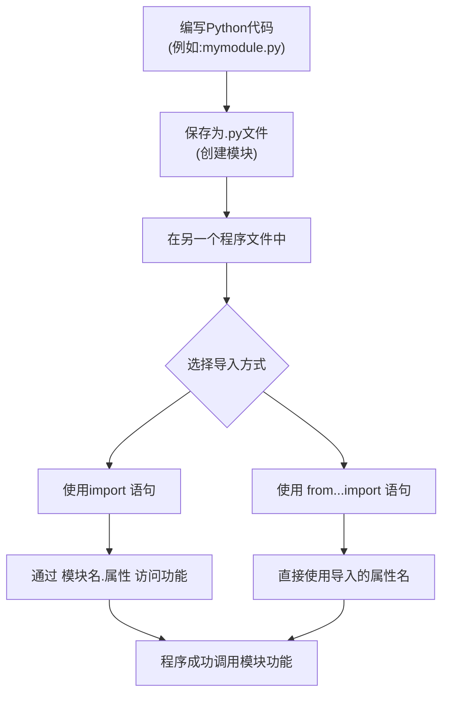

理解并熟练运用模块、包以及pip工具，是构建可维护、可扩展Python项目的基础。它让你能够站在巨人的肩膀上，利用社区已有的优秀代码，同时也能将自己的代码有效地组织起来。

### 3.3 面向对象

**面向对象编程**（Object-Oriented Programming，`OOP`）是一种以"对象"为核心的编程范式，它将数据和操作数据的方法封装在一起，形成一个独立的实体。Python 从设计之初就是一门支持面向对象的语言，它通过类和对象来实现 `OOP`的核心概念。理解面向对象编程，能够帮助你构建更模块化、可复用和易于维护的代码。

**类与对象**是面向对象编程的两个基本概念。类（Class）可以看作是一个蓝图或模板，它定义了一类对象共有的属性（数据）和方法（行为）。例如，"汽车"这个类可以定义颜色、品牌等属性，以及启动、加速等方法。对象（Object）则是根据类这个蓝图创建出来的具体实例。根据"汽车"类，我们可以创建出"我的红色丰田汽车"和"你的黑色宝马汽车"这两个具体的对象。每个对象都拥有类中定义的属性和方法，但各自属性的值可以不同。在Python中，使用`class`关键字来定义一个类。类名通常采用大驼峰命名法（如`MyCar`）。类的内部可以定义属性和方法。方法是定义在类中的函数，第一个参数通常命名为`self`，它代表对象实例本身，用于访问该实例的属性和其他方法。创建一个对象的过程称为实例化，通过类名后加括号即可完成，例如

```python
my_car = Car()
```

为了更好地理解类和对象的关系，以及实例化的过程，我们可以用以下类图来表示一个简单的"汽车"类及其对象实例的创建逻辑。该图展示了类的结构以及从类到对象的生成关系。

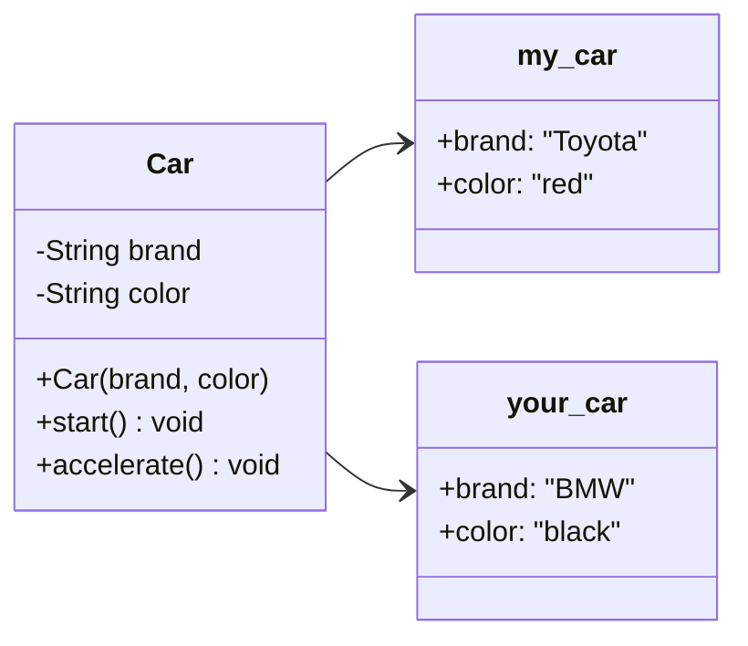

**继承与多态**是面向对象编程中实现代码复用和接口统一的两个强大特性。继承允许我们定义一个继承自另一个类（父类或基类）的新类（子类或派生类）。子类会自动获得父类的所有属性和方法，并且可以添加自己新的属性和方法，或者重写父类的方法以适应特殊需求。例如，我们可以定义一个"电动汽车"类来继承"汽车"类。"电动汽车"除了拥有汽车的所有特性外，还可能增加"电池容量"属性和"充电"方法。多态则意味着"多种形态"。在继承的背景下，它指的是子类对象可以被当作父类对象来使用，并且同一个方法在不同的子类中可以有不同实现。当我们调用一个在父类中定义的方法时，实际执行的是子类中重写后的版本。这使得我们可以编写出更通用、更灵活的代码。

例如，我们有一个函数`drive(vehicle)`，它接收一个"车辆"对象并调用其`start()`方法。我们可以传入一个`Car`对象，也可以传入一个`ElectricCar`对象。只要这些对象都有`start()`方法，函数就能正常工作，但具体执行的是各自类中定义的`start()`逻辑，这就是多态的体现。

综上所述，面向对象编程通过类和对象组织代码，利用封装将细节隐藏，通过继承扩展功能，并借助多态提高代码的灵活性。掌握这些基础概念是运用Python进行中大型项目开发的关键一步。在后续的学习中，你还会接触到更多高级特性，如魔术方法、属性装饰器、多重继承和混入类等，它们都建立在这些核心概念之上。

## 4. 进阶与应用实例

### 4.1 文件操作

文件操作是Python编程中处理数据持久化存储的核心技能。在Python中，文件被视为一种数据流，程序可以通过内置的`open()`函数与文件进行交互，实现数据的读取、写入和追加等操作。理解文件操作的基本流程是至关重要的，这通常包括打开文件、执行读写操作以及最后关闭文件以释放系统资源。一个典型的文件处理流程如下图所示，它清晰地展示了从打开到关闭的完整生命周期。

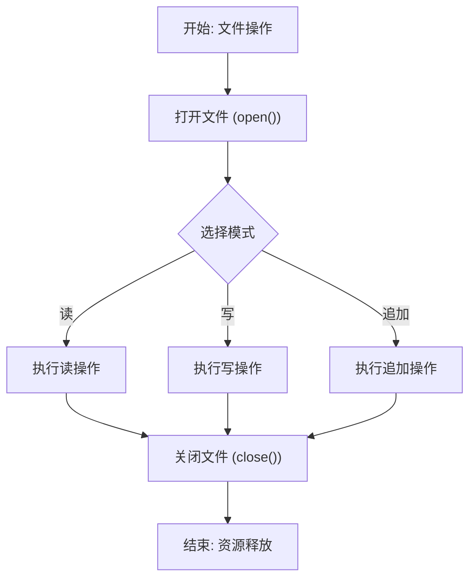

文件的打开是第一步，通过`open(file,mode)`函数实现。`file`参数指定文件的路径（可以是相对路径或绝对路径），`mode`参数则决定了文件的打开模式。常用的模式包括：`'r'`（只读，默认模式）、`'w'`（写入，会覆盖已有文件）、`'a'`（追加，在文件末尾添加内容）以及`'b'`（二进制模式，常与其它模式组合使用，如`'rb'`或`'wb'`）。

例如，`open('data.txt','r')`将以只读方式打开当前目录下的`data.txt`文件。需要注意的是，以写入模式（`'w'`）打开一个不存在的文件会创建它，但如果文件已存在，其原有内容将被清空，因此使用时需谨慎。成功打开文件并获得文件对象后，就可以进行读写操作了。

对于文本文件，常用的读取方法有`.read()`、`.readline()`和`.readlines()`。`.read()`方法一次性读取文件的全部内容并返回一个字符串；`.readline()`每次读取一行内容；而`.readlines()`则读取所有行，并返回一个由每行字符串组成的列表。在写入方面，`.write(string)`方法用于将字符串写入文件，而`.writelines(list_of_strings)`方法则可以将一个字符串列表写入文件，但注意它不会自动在每行末尾添加换行符，需要手动添加`\n`。

在所有操作执行完毕后，必须调用文件对象的`.close()`方法来关闭文件。这是一个非常重要的步骤，因为关闭文件会确保缓冲区中的数据被完全写入磁盘，并释放该文件占用的系统资源。忘记关闭文件可能会导致数据丢失或资源泄露。为了简化这一过程并确保文件总能被正确关闭，Python提供了`with`语句（上下文管理器）。其语法为`withopen(...) as file:`，在`with`代码块内对文件进行操作，当代码块执行完毕或发生异常时，文件会自动关闭，这是一种推荐的最佳实践。例如：

```python
with open('example.txt', 'w') as f: 
	f.write('Hello, Python!')
```

除了处理普通的文本文件，Python也擅长处理结构化数据文件。对于`CSV`（逗号分隔值）文件，可以使用内置的`csv`模块来高效地读取和写入。该模块提供了`reader`和`writer`对象，能很好地处理字段间的逗号和换行符等细节。对于`JSON`（JavaScript对象表示法）文件，则可以使用内置的`json`模块。`json.load()`和`json.dump()`方法可以非常方便地在Python数据结构（如字典、列表）和`JSON`格式字符串之间进行转换，是实现数据序列化和反序列化的强大工具。掌握这些文件操作技能，是进行数据分析和应用开发的基础。

### 4.2 异常处理

在Python编程中，异常处理是保证程序健壮性的关键机制。程序运行过程中，难免会遇到各种预期之外的情况，例如文件不存在、网络连接中断、除零错误或用户输入格式错误等。这些情况如果未被妥善处理，将导致程序崩溃并抛出错误信息，影响用户体验。Python通过`try`、`except`、`else`和`finally`等关键字提供了一套结构化的异常处理方案，允许开发者预见并优雅地处理这些错误，使程序能够从异常中恢复或进行有意义的退出。

最基本的异常处理结构是`try-except`块。其工作原理是：将可能引发异常的代码放在`try`子句中执行；如果`try`块中的代码抛出了异常，程序会立即跳转到对应的`except`子句，执行异常处理逻辑，而不会继续执行`try`块中剩余的代码。一个`try`语句可以搭配多个`except`子句，用以捕获不同类型的异常。例如，可以分别捕获`ValueError`（值错误）和`FileNotFoundError`（文件未找到错误），并针对每种错误类型采取不同的处理措施。还可以使用一个通用的`except Exception:`来捕获所有继承自`Exception`基类的异常，但这通常建议在明确知道如何处理所有异常时才使用，以避免掩盖未知的程序错误。
为了更好地理解异常处理的流程，我们可以通过一个流程图来展示其基本控制流。

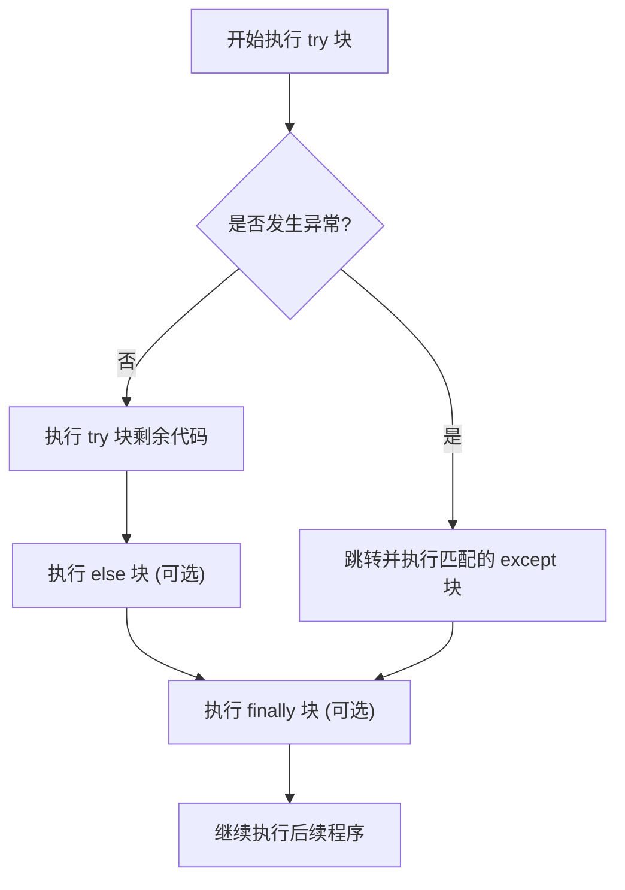

除了捕获异常，有时我们还需要无论是否发生异常都执行一些清理操作，例如关闭文件或释放网络资源。这时就需要用到`finally`子句。`finally`块中的代码无论`try`块中是否发生异常、无论异常是否被捕获、甚至如果在`try`或`except`块中使用了`return`语句，都会被执行。这确保了资源的正确释放，避免了资源泄漏。此外，Python允许我们使用`raise`语句主动抛出异常，还可以通过继承`Exception`类来创建自定义的异常类型，以便更精确地描述程序中特定的错误状态。例如，在开发一个银行账户系统时，可以定义一个`InsufficientBalanceError`异常，当取款金额超过余额时抛出，使得业务逻辑的错误处理更加清晰和模块化。

综合运用这些机制，我们可以构建出健壮的程序。一个良好的实践是：在`try`块中编写可能出错的业务代码，在`except`块中进行针对性的错误处理和用户提示，在`else`块中放置当没有异常发生时需要执行的代码（这可以使逻辑更清晰），最后在`finally`块中进行必不可少的清理工作。通过这种结构化的方式处理异常，能够显著提升程序的可靠性和可维护性。

### 4.4 学习路径建议

Python学习路径建议旨在为完成本教程基础学习的开发者提供一个清晰的进阶方向。Python语言以其简洁的语法和强大的生态体系，在多个领域都有广泛应用。掌握基础语法和核心概念后，学习者可以根据个人兴趣和职业规划，选择深入特定的技术栈。

本节将简要介绍Python的主要生态体系构成，并推荐几个常见的进阶方向。

Python的生态体系庞大且成熟，可以形象地理解为一个以Python语言为核心，向外辐射的多个应用领域圈层。最内层是Python解释器与核心语法，这是所有应用的基础。向外一层是标准库，提供了文件处理、系统操作、数据序列化等基础功能模块。再外层是包管理工具pip和庞大的第三方库生态系统，这是Python强大生产力的源泉。最外层则是具体的应用领域，如Web开发、数据科学、自动化运维、人工智能等。这些领域通过调用特定的第三方库来实现其功能。理解这个分层结构有助于我们系统地学习，而不是盲目地收集库名。

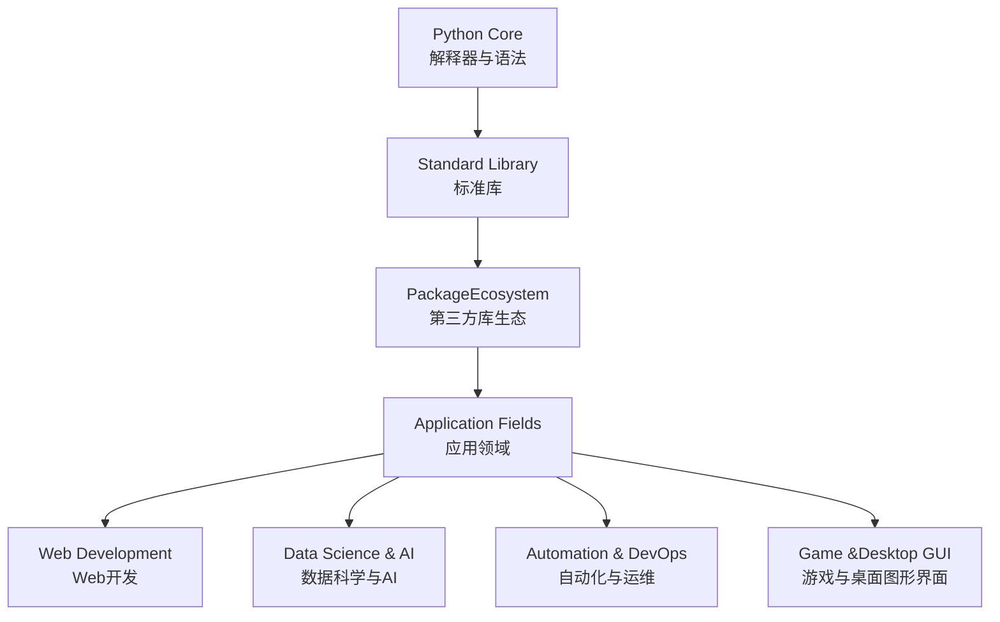

基于上述生态体系，以下是一些主流的Python进阶方向推荐。

**（1）Web服务开发。**对于希望从事Web后端开发的学者，建议深入学习`Django`或 `Flask`框架。`Django`是一个"大而全"的高层框架，内置了`ORM`、管理员界面、表单处理等功能，适合快速构建复杂、内容驱动的网站。Flask则是一个"微内核"框架，更加轻量和灵活，允许开发者自由选择组件，适合构建`API`服务或中小型应用。学习这两个框架时，需要同步掌握数据库知识（如`PostgreSQL/MySQL`）、`RESTful API`设计原则以及基本的`Web`安全知识。

**（2）数据分析和机器学习。**对于数据分析、机器学习或人工智能方向，`NumPy`和`Pandas`是处理数据的基石库，必须熟练掌握。`SciPy`用于科学计算，`Matplotlib`和`Seaborn`用于数据可视化。在机器学习领域，`Scikit-learn`提供了丰富的经典机器学习算法实现。当进入深度学习时，`TensorFlow`或`PyTorch`是当前的主流框架。这个方向要求学习者具备良好的数学基础，特别是线性代数、概率论和微积分知识。
如果你对自动化脚本、网络爬虫或运维开发感兴趣，可以深入学习操作系统接口、网络编程和多线程/多进程编程。Requests库是处理HTTP请求的利器，`BeautifulSoup`和`Scrapy`是网络爬虫的核心框架。对于系统运维和自动化，需要熟悉`Ansible`、`SaltStack`等自动化工具的原理，并能使用`Python`编写脚本进行系统监控、日志分析和任务调度。

**（3）桌面应用**。桌面应用开发可以使用`Tkinter`（内置）`PyQt`或`wxPython`；游戏开发可以尝试`Pygame`。无论选择哪个方向，持续实践是关键。

建议通过参与开源项目、在`GitHub`上创建自己的代码仓库、解决实际工作中的问题等方式来巩固和提升技能。同时，养成良好的代码风格，阅读`PEP8`规范，并学习使用调试（debug）工具和单元测试框架（如`pytest`），这些习惯将使你成为一名更专业的`Python`开发者。

##  5. Hello Flask

### 5.1 目录结构

接下来，将进行第一个 Web项目的实战，可以体会到 Web 项目的基本技能。项目的目录结构如下所示

```shell
flask_app/
│
├── app.py              # 主应用文件
├── templates/          # HTML模板目录
│   └── index.html      # 主页模板
└── static/             # 静态文件目录
    ├── css/
    │   └── style.css   # 样式文件
    └── images/         # 图片目录（可选）
```

创建一个文件夹 flask_app，内部有2个文件夹，名称为 templates 和 static，以及一个python文件 app.py。

Windows下的目录和文件请手动创建， Linux下可执行脚本

```sh
# 创建文件夹 flask_app
mkdir flask_app
# 进入文件夹 flask_app
cd flask_app
# 在文件夹 flask_app 下创建2个文件夹 templates static
mkdir templates static
# 在文件夹 static 下创建文件夹 css
mkdir static/css
```

在Windows的控制台(cmd) 或 Linux 的终端(terminal) 中执行，这一步是安装 flask组件，方便启动 Web应用

```sh
# 需连接互联网，会自动下载 flask
pip install flask
```

### 5.2 主要的 Python 文件

在 `flask_app` 目录下创建文件 `app.py`, 使用文本编辑器打开主应用文件 `app.py` ，填写内容如文件**[app.py](./py/flask_app/app.py)** 所示。 

### 5.3 配套的 HTML 文件

**（1）HTML 模板文件**

在flask_app 目录下的 templates目录下，创建文件 index.html ， 文件内容如 **[index.html](./py/flask_app/templates/index.html)** 所示。

**（2）CSS 样式文件。** css（Cascading Style Sheets，级联样式表） 文件决定了页面上用户看到的文本的颜色、字体、位置，表格的边框宽度、颜色等。

在 flask_app 下的 static目录，进入 css 目录， 创建文本文件 style.css,  文件内容如 **[style.css](./py/flask_app/static/css/style.css)** 所示。

整个 `flask_app` 的源代码如 **[flask_app](./py/flask_app)**  所示。

### 5.4 启动程序

执行以下脚本，启动应用， Windows 在 CMD 控制台执行, Linux 在终端(Terminal) 执行。

```sh
# 进入目录 flask_app
cd flask_app
# 解析文件 app.py
python app.py
```

此时将会看到以下信息

```sh

 * Serving Flask app 'app'
 * Debug mode: on
WARNING: This is a development server. Do not use it in a production deployment. Use a production WSGI server instead.
 * Running on http://127.0.0.1:5000
Press CTRL+C to quit
 * Restarting with stat
 * Debugger is active!
 * Debugger PIN: 889-700-896
```

说明web 引用已经启动，监听端口 5000，启动成功。

打开浏览器，输入以下地址[http://localhost:5000](http://localhost:5000/)， 将会看到如下页面

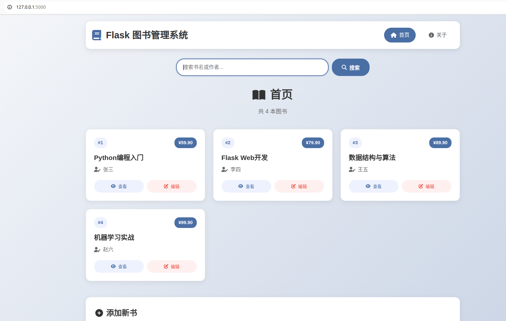

### 5.5 Web项目说明

截至目前，屏幕前的你已经具备了简单 Web 项目的开发技能了。现在对项目的目录结构进行说明

```shell
flask_app/
│
├── app.py              # 主应用文件
├── templates/          # HTML模板目录
│   └── index.html      # 主页模板
└── static/             # 静态文件目录
    ├── css/
    │   └── style.css   # 样式文件
    └── images/         # 图片目录（可选）
```

一般，`flask_app` 这个目录是你的项目的名称，例如你可以叫做 book_manager 等，按照实际功能进行命名。`app.py` 为主要的应用程序文件，当前只有这一个`python`文件，通过这个 `app.py` 以及 通过 `pip install flask` 安装的flask组件（由很多个python文件组成），构成了web应用的主要部分。

**（1）HTML静态页模板。**文件 `templates/index.html` 是一个 HTML 文件，提供了基础的 HTML 页面，但是由于其中包含了部分变量（例如 `index.html` 中的 `{{ title }}`），这些变量是通过 `app.py` 来动态填充的，所以被称为 HTML 模板文件。

**（2）静态资源。**static 文件夹是 flask 默认的加载静态文件的目录，默认不要修改这个文件夹的名称。

1） 样式文件(`.css`文件)。 `css/style.css` 是传统的HTML 页面样式文件，这个不管是通过`python`，还是`Java`、`PHP` 还是 `C#`等其他语言开发的项目，均需要这样的文件，跟编程语言五关，`CSS` 是 `W3C`（World Wide Web Consortium， 万维网联盟，制定 Web 标准的国际组织）的重要组成部分。

2）`JS`脚本文件(`.js` 文件, javascript 文件)。有时候， 在static 文件夹下也会有 .js 文件。js 可以给页面添加一些动态效果，例如点击哪个按钮应该触发什么动作。

**（3）相互关系。**

`HTML` 和 `CSS` ,`JS`的关系可以这样形容， 如果把我们看到的页面比做一件衣服，那么各个部分的功能如下。

1） `HTML` 提供的是衣服袖子，扣子等基本功能部件；

2）`CSS` 则提供的是衣服的颜色，扣子的颜色、翻领的大小、扣子的颜色等外观；

3）javaScript脚本（`.js` 文件，以及 html 文件中\<script\>\</script\>包含的部分） 提供的是衣服的智能功能，按下某个纽扣可让衣服领子发光或变色，衣服袖子可以自动卷起/放下，衣服能根据天气自动调整厚度。

注意， `JavaScript` 事实上跟 `Java`编程语言一点关系也没有，只是名称感觉挺像的，这个是由于历史原因造成的， 是 Web 开发中最大的**命名误解**之一。1995年网景公司（Netscape）创造了 LiveScript，由于当时 Java 非常火爆，为了蹭热度改名为 JavaScript。就跟好莱坞和宝莱坞一样。

## 6. Hello AI Chat

### 6.1 目录结构

接下来，将通过 Flask，接入大语言模型（LLM）API，开发一个AI 聊天机器人。项目的目录结构如下所示

```shell
ai_chat_app/
│
├── app.py              # 主应用文件
├── templates/          # HTML模板目录
│   └── index.html      # 主页模板
└── static/             # 静态文件目录
    ├── css/
    │   └── style.css   # 样式文件
    └── images/         # 图片目录（可选）
```

创建一个文件夹 ai_chat_app，内部有2个文件夹，名称为 templates 和 static，以及一个python文件 app.py。 Linux 下执行

Windows下的目录和文件请手动创建， Linux下可执行脚本

```sh
# 创建文件夹 flask_app
mkdir ai_chat_app
# 进入文件夹 flask_app
cd ai_chat_app
# 在文件夹 flask_app 下创建2个文件夹 templates static
mkdir templates static
# 在文件夹 static 下创建文件夹 css
mkdir static/css
```

### 6.2 主要的 python 文件

app.py 内容如  **[app.py](./py/ai_chat_app/app.py)** 所示。 

### 6.3 配套的 HTML 文件

templates 目录下的 index.html 内容如  **[index.html](./py/ai_chat_app/templates/index.html)** 所示。static目录下的 css 目录下的文件 style.css 内容如  **[style.css](./py/ai_chat_app/static/css/style.css)** 所示。

整个 `ai_chat_app` 的源代码如 **[ai_chat_app](./py/ai_chat_app)**  所示。

### 6.4 启动程序

在启动程序前，请修改  **[app.py](./py/ai_chat_app/app.py)**  的如下代码部分

```python
API_BASE_URL = os.getenv("LLM_API_BASE_URL", "https://api.deepseek.com/v1")
API_KEY = os.getenv("LLM_API_KEY", "sk_you_api_key")
MODEL_NAME = os.getenv("LLM_MODEL_NAME", "deepseek-chat")
```

分别将 "https://api.deepseek.com/v1" , "sk_you_api_key" , "deepseek-chat" 替换成真实的 API 信息， LLM API 信息需要充值各个大语言模型的账号才可获得， deepseek 官网的获取方法详见 https://platform.deepseek.com/， 注册账号并充值后即可获得相应的 API_KEY。

完成以上修改后，执行以下脚本启动应用， Windows 在 `CMD` 控制台执行, Linux 在终端(Terminal) 执行。

```sh
# 进入目录 flask_app
cd ai_chat_app
# 解析文件 app.py
python app.py
```

此时将会看

```sh
python app.py 
 * Serving Flask app 'app'
 * Debug mode: on
WARNING: This is a development server. Do not use it in a production deployment. Use a production WSGI server instead.
 * Running on all addresses (0.0.0.0)
 * Running on http://127.0.0.1:5000
Press CTRL+C to quit
 * Restarting with stat
 * Debugger is active!
 * Debugger PIN: 343-196-857

```

说明启动成功，打开浏览器访问：`http://localhost:5000`，将看到如下的界面

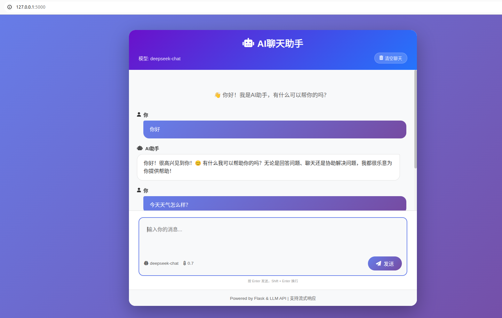

have fun ！

## 7. 其他注意事项

### 7.1 文件头

python文件一般前两行内容如下：

```python
#!/usr/bin/env python3
# -*- coding: utf-8 -*-
```

文件第一行`#!/usr/bin/env python3` 为shebang 行，指定该文件应该使用的解释器。文件第2行 `# -*- coding: utf-8 -*-`设置文件编码。告诉python 解释器应采用UTF-8编码格式读取文件，增加文件的跨操作系统的适应性。

### 7.2 重要的命令

**（1）重新强制安装损坏的包**。 有时候，已经 `pip install `了某个包，可是无法使用，可能是某个包损坏了。这时候重新强制安装即可。

```sh
# 强制重新安装，会忽略目前已安装的对应组件，直接覆盖
pip install --force-reinstall module
# 卸载组件
pip uninstall module
# 卸载1.txt里列出的所有组件
pip uninstall -r ./requirements.txt
# 安装requirements.txt 中的组件清单
pip install -r ./requirements.txt
```

**（2）安装指定版本的组件**。 对于部分组件，可能会报版本冲突等错误，此时可能需要安装指定的版本，可执行如下命令。

```sh
# 命令格式为 pip install model_name==version_numer
pip install numpy==1.26.2
```

**（3）查看某个组件版本号** 。 如果需要查看某个已经安装的组件的确切版本号，执行以下命令。

```sh
pip show numpy
```

**（4）Python Image Library(`PIL`)**。  `PIL` 也叫Pillow， 是 Python 中最常用的图像处理库，功能强大且易于使用，适合各种图片处理需求，从简单的格式转换到复杂的图像处理都能胜任。

```sh
pip install pillow | more
```

 **（5）requirements.txt** 。 一般在发布自己的python项目时，需要在项目根目录下生成一个依赖包的清单，这样方便他人在使用这个项目时，安装相关的依赖，可以在自己的项目根目录下执行下面的命令生成。

 ```sh
pip freeze > requirements.txt
 ```

### 7.3 虚拟环境

构建虚拟环境，可以使每个环境（python 项目）下的包与其他环境隔离，方便在不同的环境下进行不同的任务，同时不会互相干扰。官方文档详见 https://docs.python.org/3.10/library/venv.html。这里推荐 `virtualenv `命令。

创建虚拟环境的缺点，是如果同时进行多个项目，会导致本地磁盘存储的whl文件 更多。因为不同的项目哪怕使用的是同一个包，也会各自用各自的，无法共用，这也是不可避免的。但总体而已，收益大与损失。

事实上，创建虚拟环境和 `pip freeze > requirements.txt` 需要配套使用，如果不创建虚拟环境，则命令 `pip freeze > requirements.txt` 会将所有已经安装的包都写入这个文件。如果每个python项目都单独创建了虚拟环境，那么执行命令 `pip freeze > requirements.txt` 则只包含当前项目所依赖的包。 

**（1）创建**。  通过创建虚拟环境， 使得自己的某个项目下通过 pip install 安装的包下载至指定的目录，同时也可以使使用的 python 命令指向特定的目录。

```sh
# 安装指令
sudo apt-get install virtualenv
pip install virtualenv
# 创建虚拟环境 llm_py_env, 会在当前目录下创建一个名称为 llm_py_env 的新目录
virtualenv llm_py_env
pwd
/home/rd/workspace

```

**（2）激活。** 创建虚拟环境后，需要激活才能生效。一般来说，激活后再执行 `pip install xxx`命令来安装其他依赖包。

```sh
rd@rd-tpd:~/workspace
# 启用虚拟环境，会看到在用户名称前多了一个 “(llm_py_env) ”
source ./llm_py_env/bin/activate
pwd
/home/rd/workspace
(llm_py_env) rd@rd-tpd:~/workspace/$
```

激活虚拟环境之后，再通过pip 安装包时，新安装的包就会存储在虚拟环境的目录下。

**（3）退出**。进入虚拟环境后，如果切换python项目，则可以退出。退出虚拟环境后，如果不再需求，可以直接删除。

```sh
# 退出虚拟环境
deactivate llm_py_env
# 删除虚拟环境， 首先进入创建的虚拟环境目录的父目录，然后执行删除
cd parent_dir
rm -fr llm_py_env
```

### 7.4 jupyter

如果进行数据处理、数据挖掘等数据相关工作，那么 `jupyter` 是一个不错的选择，`jupyter` 是一个轻量级的进行数据处理的图形用户界面开发和运维系统。

```sh
# setup
pip install jupyter notebook
# run
jupyter notebook
```

但是，如下场景则不适用于 `juypyter`，生产环境`python`项目部署（直接部署`.py`文件即可）、大型项目开发（用`PyCharm`/`VSCode`）、Web应用开发（用专业`IDE`）、需要版本控制的大项目（`jupyter` 的 `.ipynb`文件`diff`困难）。

### 7.5 pip镜像源

 pip镜像源会定期从 `PyPI`（Python Package Index）官方服务器同步所有包文件。当使用 `pip install xxx` 时， pip 会默认从某个官方的数据源头下载`whl` 包，如果我们想指定特定的某个数据源（例如，速度更快、内网无法上等等场景），则可以通过以下命令来完成。

```sh
# for temporary case
pip install some_package -i https://pypi.tuna.tsinghua.edu.cn/simple
# for permanent
pip config set global.index-url https://pypi.tuna.tsinghua.edu.cn/simple
# 企业内部自建的
pip3 install some_package -i http://your_private_domain/root/pypi/+simple --trusted-host your_private_domain
```

### 7.6 离线安装pip 包

在一些需要进行离线开发、部署、打包的环境下，可以通过在线下载，离线安装的模式进行依赖包的安装。

```sh
# 进入到储存whl package的 目录下
cd my_whl_dir
# 在有网络的环境下事先下载你的whl包,例如,下载 torch相关的whl， 必须确保离线和有线环境下的python pip版本号完全一致
pip download torch

#离线安装
pip install torch --no-cache-dir --no-index --find-links=/a/b/c/my_whl_dir
```

### 7.7 本地镜像源搭建

todo：尚未验证

```sh
方法2：使用local-pypi-server
local-pypi-server是一个轻量级的本地pypi服务器，它可以帮助你管理本地Python包。

安装local-pypi-server：

pip install local-pypi-server

启动服务器：

local-pypi-server --port 8000 --repo /path/to/your/packages
这里--repo参数指定了你的包存储位置。你可以将需要发布的包放在这个目录下。

方法3：使用devpi
devpi是一个更高级的pypi服务器，支持更多的功能和配置选项。

安装devpi-server和devpi-client：

pip install devpi-server devpi-client

启动devpi-server：

devpi-server --host 127.0.0.1 --port 3141 --start

使用devpi-client创建用户和索引：

devpi use http://127.0.0.1:3141/root/pypi
devpi user -cX --password=mypass root
devpi login root --password=mypass
devpi index -c

上传包：

devpi upload /path/to/your/package/dist/*.whl

```

### 7.8 IDE

pycharm 历史版本

https://www.jetbrains.com.cn/pycharm/download/other.html

### 7.9 数据库驱动

**（1）MySQL**。 `MySQL` 为常用的关系型数据库，使用需要安装如下组件。

```sh
pip install pymysql
```

**（2）Oracle**。使用Oracle数据库，需要安装组件如下所示。

```
pip install oracledb
```

oracledb 是 Oracle 官方推出的新版（原 cx_Oracle 的重命名升级版），推荐使用新库。oracledb 默认使用纯 Python 实现的 "Thin模式"，无需安装 Oracle 客户端。oracledb 的 Thin 模式性能更好，且支持原生 JSON 等新特性，同时保留兼容旧版的 "Thick模式"（需客户端）。oracledb 完全兼容 cx_Oracle 的 API，通常只需修改 `import` 语句即可迁移。

##  8. `Django`

`Django` 是一个基于 Python 的高级 Web 应用程序框架，它的核心目标是让开发者能够快速、简洁、干净地构建复杂的、数据库驱动的网站。

如果将开发Web工程比喻成建造房屋，那么 `Django` 就是 “工具包”和“脚手架”、水泥预制板、已经做的好的门窗骨架等。开发人员无需从零开始制造砖块、水泥和设计承重结构，`Django` 已经为你准备好了这些基础且关键的部件，让你能专注于设计房屋的独特布局和装修。

`Django` 相关功能的介绍，详见其官网 https://www.djangoproject.com/。
